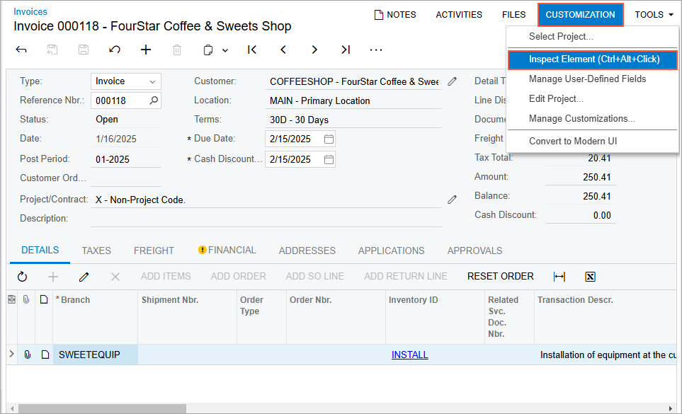
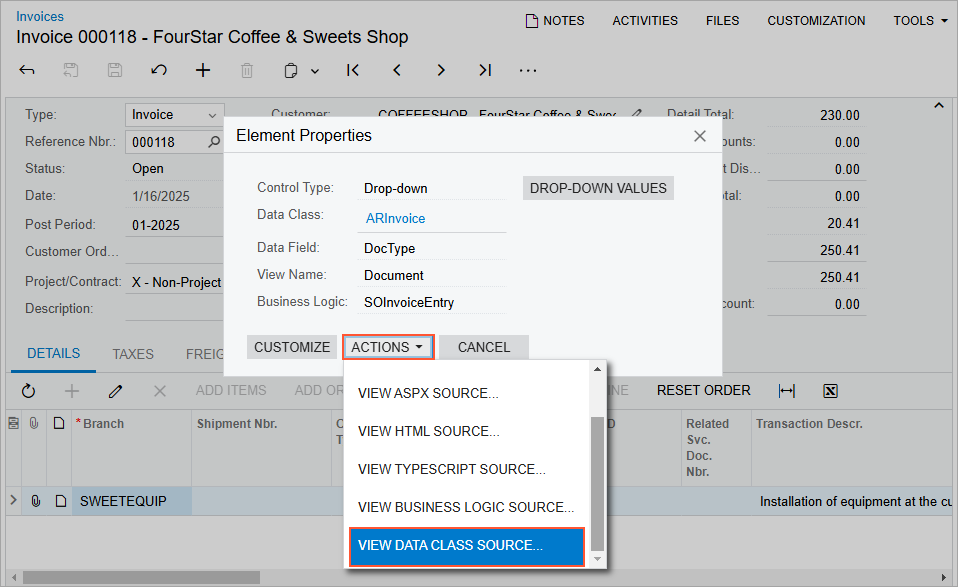
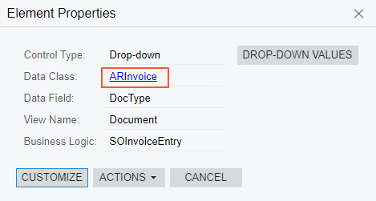

# To Explore the C\# Code of a DAC {#_e7fcfc0a-10d9-4b2c-a328-ac7c1d3c62c4 .concept}

If you need to customize the attributes of a data field for an existing control or create a new field for a custom control on a form, you may need to explore the original source code of the appropriate DAC.

You can view the source code of a DAC in the following ways:

-   On the [Source Code](../UserGuide/SM_20_45_70.md) \(SM204570\) form
-   In the [DAC Schema Browser](../UserGuide/DAC_Schema_Browser_Reference.md)

## To Explore the Source Code on the Source Code Form { .section}

To view the source code of a DAC on the [Source Code](../UserGuide/SM_20_45_70.md) \(SM204570\) form, perform the following actions:

1.  Open the form for which you want to view the DAC source code. On the form title bar, click **Customization** &gt; **Inspect Element**, as shown in the following screenshot, to activate the [Element Inspector](../UserGuide/AU_ElementInspector.md).

    

2.  Click a control or an area of the form to open the **Element Properties** dialog box for the control or area. \(For details, see [Element Properties Dialog Box](../UserGuide/AU_ElementInspector.md#_8ce780b0-243f-480c-8b4c-ed6431116e3f).\)
3.  In the dialog box, click **Actions** &gt; **View Data Class Source**, as shown in the following screenshot.

    

4.  On the **Data Access** tab of the [Source Code](../UserGuide/SM_20_45_70.md) form, which opens for the DAC, view the data field declarations in the Source Code pane.

Also, you can open the original DAC code in the Source Code browser in the following ways:

-   From the [Data Class](../UserGuide/AU_DataClassEditor.md), by clicking **View Source** on the page toolbar
-   From the [Screen Editor](../UserGuide/AU_20_45_20.md), by clicking **View Source** on the toolbar of the **Attributes** tab

## To Explore the Source Code in the DAC Schema Browser { .section}

To view the source code of a DAC in the DAC Schema Browser, perform the following actions:

1.  Open the **Element Properties** dialog box for the required DAC, as described above.
2.  Click the link in the **Data Class** box \(see the following screenshot\).

    

    The DAC Schema Browser page opens.

3.  In the main information area of the page, click *Source Code*.

    The source code browser for the selected DAC opens.

For details, see [DAC Schema Browser](../UserGuide/DAC_Schema_Browser_Reference.md).

**Parent topic:**[Exploring the Source Code](../CustomizationPlatform/CG_GL_Stages_Explore.md)

