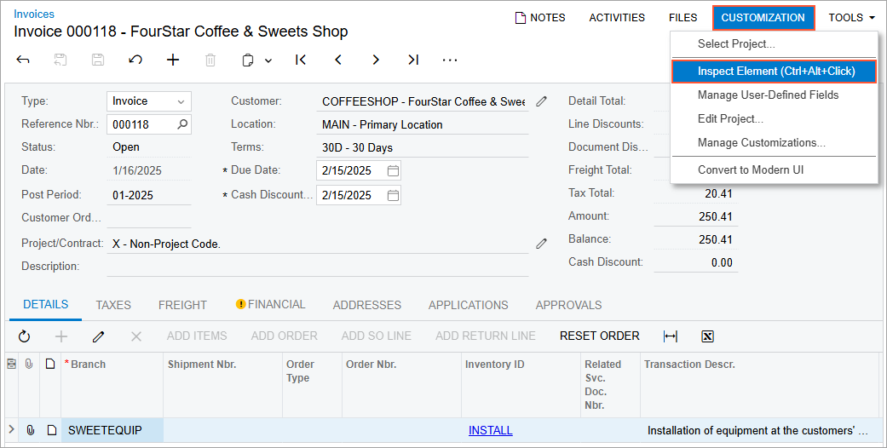
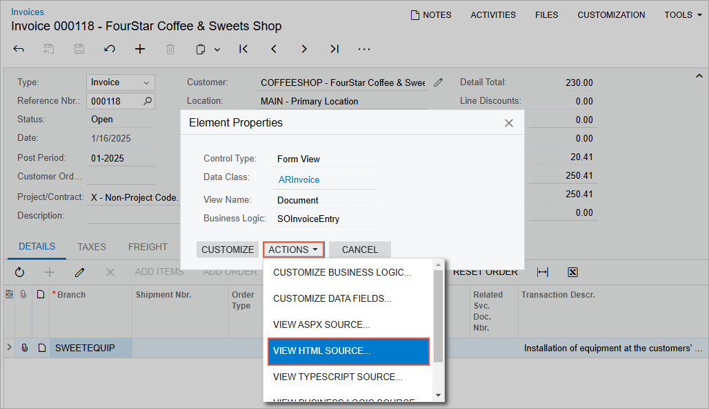

# To Explore the HTML Code of a Form \(Modern UI\) {#_dc88450b-f113-40b0-b621-3b3fbf86b99c .concept}

If you need to look closely at the webpage structure of a form—that is, the layout of the UI elements and the types and properties of the UI controls—you may need to explore the HTML code of the form. For details about the definition of a form's layout in HTML, see [UI Definition in HTML and TypeScript: General Information](../DeveloperGuide/UIDev_UIDefinition_GeneralInfo.md).

To explore this code, perform the following actions:

1.  On the selected form, click **Customization &gt; Inspect Element** on the form title bar, as shown in the following screenshot, to activate the [Element Inspector](../UserGuide/AU_ElementInspector.md).

    

2.  Click a control or an area of the form to open the **Element Properties** dialog box for the control or area. \(For details, see [Element Properties Dialog Box](../UserGuide/AU_ElementInspector.md#_8ce780b0-243f-480c-8b4c-ed6431116e3f).\)
3.  In the dialog box, click **Actions** &gt; **View HTML Source**, as shown in the following screenshot.

    

4.  On the **Screen HTML** tab of the [Source Code](../UserGuide/SM_20_45_70.md) \(SM204570\) form, which opens, view the HTML code of the form in the Source Code pane.

**Tip:** The **Screen HTML** tab of the [Source Code](../UserGuide/SM_20_45_70.md) form shows the combined HTML code for a form that includes the code from all published customizations \(if any\) for the current tenant.

**Parent topic:**[Exploring the Source Code](../CustomizationPlatform/CG_GL_Stages_Explore.md)

