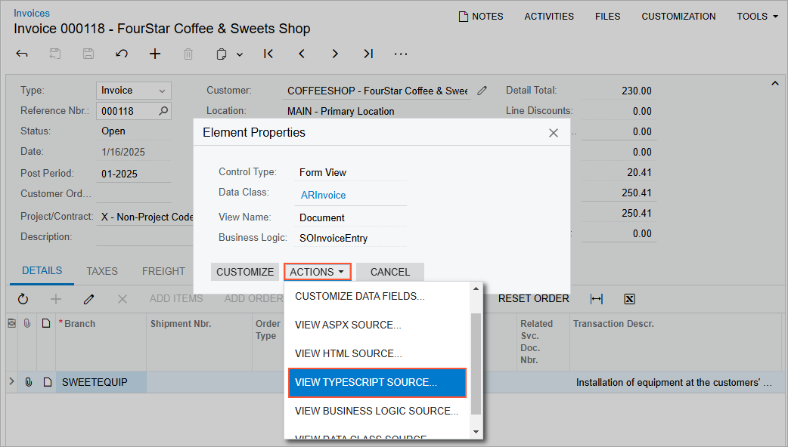

# To Explore the TypeScript Code of a Form \(Modern UI\) {#_72f0e653-8036-4029-ab10-e1dfe406d81a .concept}

If you need to look closely at the presentation logic of a form—that is, the definition of the screen and view classes—you may need to explore the TypeScript code of the form. For details about the definition of the presentation logic in TypeScript, see [UI Definition in HTML and TypeScript: General Information](../DeveloperGuide/UIDev_UIDefinition_GeneralInfo.md).

To explore this code, perform the following actions:

1.  On the selected form, click **Customization &gt; Inspect Element** on the form title bar, as shown in the following screenshot, to activate the [Element Inspector](../UserGuide/AU_ElementInspector.md).

    

2.  Click a control or an area of the form to open the **Element Properties** dialog box for the control or area. \(For details, see [Element Properties Dialog Box](../UserGuide/AU_ElementInspector.md#_8ce780b0-243f-480c-8b4c-ed6431116e3f).\)
3.  In the dialog box, click **Actions** &gt; **View TypeScript Source**, as shown in the following screenshot.

    

4.  On the **Screen TypeScript** tab of the [Source Code](../UserGuide/SM_20_45_70.md) \(SM204570\) form, which opens, view the TypeScript code of the form in the Source Code pane.

**Tip:** The **Screen TypeScript** tab of the [Source Code](../UserGuide/SM_20_45_70.md) form shows the combined TypeScript code for a form that includes the code from all published customizations \(if any\) for the current tenant.

**Parent topic:**[Exploring the Source Code](../CustomizationPlatform/CG_GL_Stages_Explore.md)

