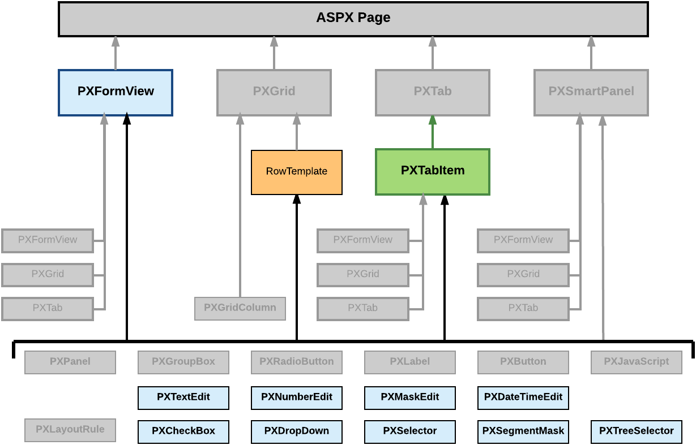

# Box \(Control for a Data Field\) {#_c26bf6db-2dbd-4e3e-98f5-edf78a174e2e .concept}

You can use a control for a data field, also referred as a *box*, to display and edit the value of the field on a form.

The Acumatica Customization Platform supports the following types of boxes.

|Object|Description|
|------|-----------|
|PXTextEdit|A text box to display and edit the value of a string field.|
|PXNumberEdit|A box to display and edit the value of a decimal or int field.|
|PXMaskEdit|A text box to display and edit the value of a string field that has the format specified in the data access class.|
|PXDateTimeEdit|A box to display and select the value of a datetime field.|
|PXCheckBox|A check box to display and select the value of a bool field.|
|PXDropDown|A combo box to display, edit, and select the value of a field with a list attribute, such as PXStringList, PXIntList, or PXDecimalList.|
|PXSelector|A lookup control to display, search for, and select the value of a field with the PXSelector attribute.|
|PXSegmentMask|A lookup control with a specified segmented key value that identifies a data record and consists of one segment or multiple segments, where the list of possible values is defined for each segment.|
|PXTreeSelector|A lookup control to select a value for a field with a PXTreeSelector attribute from a tree control.|

A box, as the diagram below shows, can be immediately added to the following types of containers:

-   PXFormView
-   RowTeplate
-   PXTabItem

To create a box in a container, follow the instructions described in [To Add a Box for a Data Field](CG_GL_UI_PXForm_AddBox.md).

To delete a box from a container, follow the instructions described in [To Delete a Child UI Element](CG_GL_UI_PXForm_DeleteControl.md).

For detailed information on customizing a box, see the following topics:

-   [To Select a Box in the Screen Editor](CG_GL_UI_Box_Opening.md)
-   [To Set a Box Property](CG_GL_UI_Box_SetProperty.md)
-   [To Change the Type of a Box](CG_GL_Forms_CustControl_ChangingType.md)

-   **[To Select a Box in the Screen Editor](../CustomizationPlatform/CG_GL_UI_Box_Opening.md)**  

-   **[To Set a Box Property](../CustomizationPlatform/CG_GL_UI_Box_SetProperty.md)**  

-   **[To Change the Type of a Box](../CustomizationPlatform/CG_GL_Forms_CustControl_ChangingType.md)**  

**Parent topic:**[Customizing Elements of the User Interface](../CustomizationPlatform/CG_GL_UI.md)

