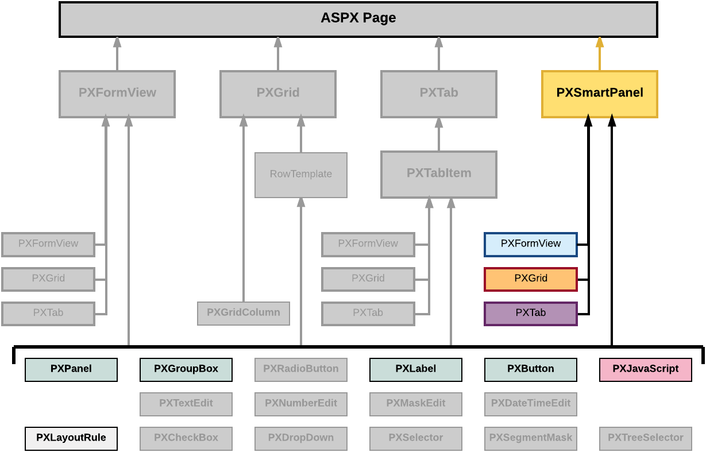

# Dialog Box \(PXSmartPanel\) {#_2fe4a5bb-c249-4d30-b117-af8d1671a589 .concept}

PXSmartPanel is a UI container control that renders a dialog box.

A PXSmartPanel container does not have the DataMember property; therefore, it cannot contain a UI element for a data field. To add a box for a data field to a dialog box, in the appropriate PXSmartPanel container, you have to include the data-bound container that can contain the required data field.

However without binding a data view, you can create, for example, a message box with the controls that contain all required data in the ASPX code.

A PXSmartPanel container can include multiple ASPX objects of the following types \(see the diagram below\):

-   A data-bound UI container control: PXFormView, PXGrid, and PXTab
-   A layout rule: PXLayoutRule
-   Another control: PXPanel, PXGroupBox, PXLabel, PXButton, and PXJavaScript

**Note:** A box for a data field cannot be added immediately to a dialog box because this type of container cannot be bound to a data view.

To create a new dialog box in a form, follow the instructions described in [To Add a Dialog Box](CG_GL_Forms_CustForm_AddCustomDialogBox.md).

To delete a dialog box from a form, follow the instructions described in [To Delete a Container](CG_GL_Forms_CustForm_DeleteContainer.md).

In Acumatica ERP, a dialog box usually contains a container for data fields and a PXPanel container with PXButton elements to get a response from the user. See [Panel \(PXPanel\)](CG_GL_UI_Panels.md) and [To Use a Button in a Dialog Box](CG_GL_UI_PXButton_InSmartPanel.md) for details.

For detailed information on working with the content of a dialog box, see the [To Open a Smart Panel in the Screen Editor](CG_GL_Forms_CustForm_CustomizingDialogBox.md) topic in this section. You will find additional information in the following topics:

-   [To Set a Container Property](CG_GL_UI_PXForm_Properties.md)
-   [To Add a Nested Container](CG_GL_UI_PXForm_AddNested.md)
-   [To Add Another Supported Control](CG_GL_UI_PXForm_AddStControl.md)
-   [To Reorder Child UI Elements](CG_GL_UI_PXForm_ReorderChild.md)
-   [To Delete a Child UI Element](CG_GL_UI_PXForm_DeleteControl.md)

-   **[To Open a Smart Panel in the Screen Editor](../CustomizationPlatform/CG_GL_Forms_CustForm_CustomizingDialogBox.md)**  

**Parent topic:**[Customizing Elements of the User Interface](../CustomizationPlatform/CG_GL_UI.md)

