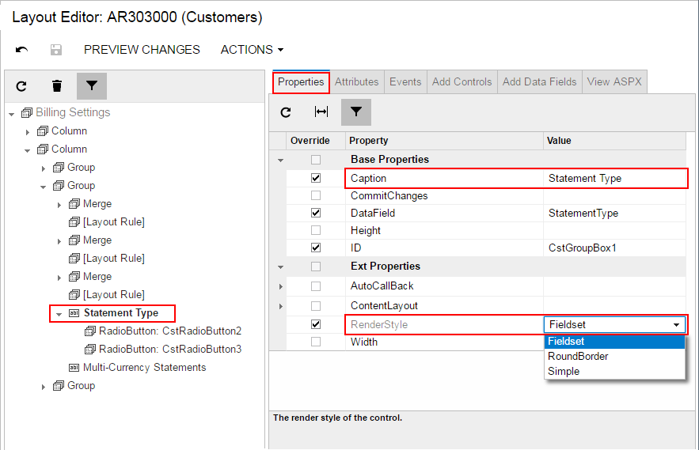

# To Create a Group Box for a Drop-Down Field {#_662d314e-1678-46dc-90d6-8335017c999f .concept}

In Acumatica ERP, the PXDropDown box type is generally used to display on a form a field with a list attribute, such as PXStringList, PXIntList, or PXDecimalList. However if you want to display such a field as a set of radio buttons, where one radio button is used to display and select each single constant value of the field, you can create a PXGroupBox element and include PXRadioButton elements in it.

To create a group box for a drop-down data field in a container, perform the following actions:

1.  Open the container in the Screen Editor, as described in [To Open a Container in the Screen Editor](CG_GL_UI_PXForm_ToOpen.md).
2.  In the container, add a group box, as described in [To Add Another Supported Control](CG_GL_UI_PXForm_AddStControl.md).
3.  For the new group box, specify the DataField property to bind the box to the data field. See [To Set a Group Box Property](CG_GL_UI_GroupBoxes_Property.md) and [Use of the DataField Property of PXGroupBox](../StudioDeveloperGuide/CW__con_GroupBoxes_Property_DataField.md) for details.
4.  If required, specify the Caption and RenderStyle properties of the group box, as the following screenshot shows.

    

    \(See [Use of the Caption Property of PXGroupBox](../StudioDeveloperGuide/CW__con_GroupBoxes_Property_Caption.md) and [Use of the RenderStyle Property of PXGroupBox](../StudioDeveloperGuide/CW__con_GroupBoxes_Property_RenderStyle.md) in the Acumatica Framework Guide for details.\)

5.  For each value defined in the field list, do the following:
    1.  To the group box node of the Control Tree, add a radio button, as described in [To Add Another Supported Control](CG_GL_UI_PXForm_AddStControl.md).
    2.  In the C\# code, find the value \(usually it is an one-symbol value\) in the list.
    3.  On the **Layout Properties** tab item, enter this value in the Value property.
6.  Click **Save** to save changes in the customization project.

For example, as the result of the described actions for the StatementType data field with the *O* and *B* values defined in the list, you might get the following ASPX code.

```

<px:PXGroupBox runat="server" ID="CstGroupBox1" DataField="StatementType"
               Caption="Statement Type" RenderStyle="Fieldset">
  <Template>
    <px:PXRadioButton runat="server" ID="CstRadioButton2" Value="O" />
    <px:PXRadioButton runat="server" ID="CstRadioButton3" Value="B" />
  </Template>
</px:PXGroupBox>

```

**Parent topic:**[Group Box \(PXGroupBox\)](../CustomizationPlatform/CG_GL_UI_GroupBoxes.md)

