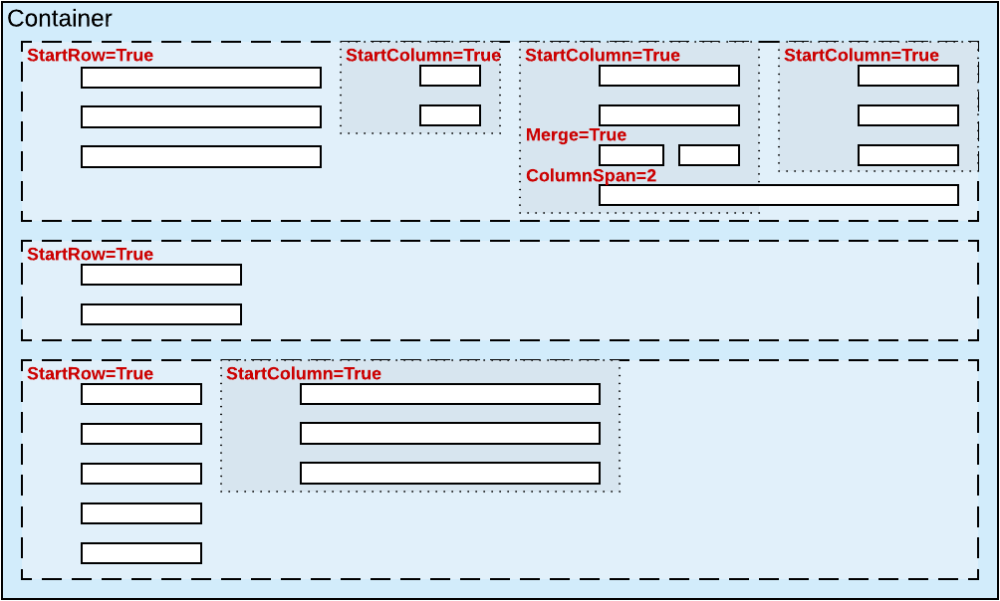
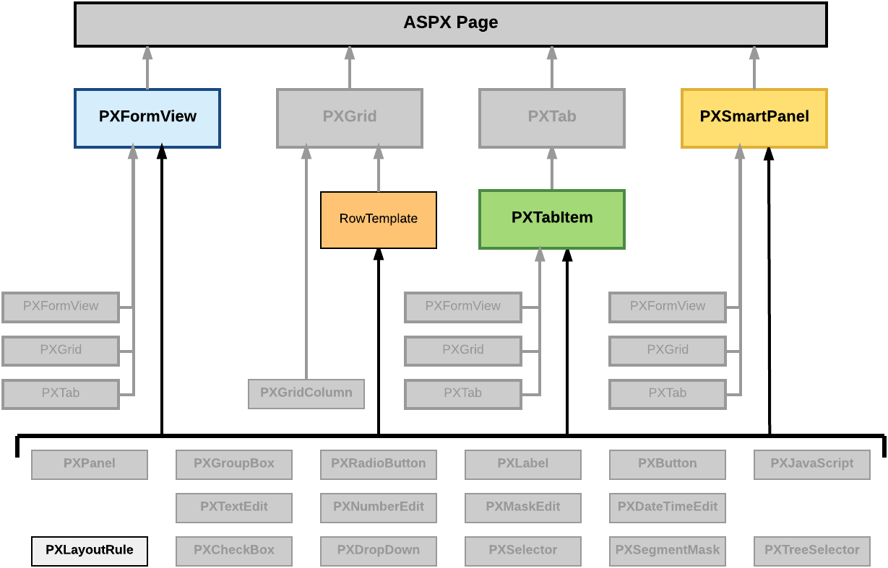

# Layout Rule \(PXLayoutRule\) {#_fd1f3fb5-f5f2-4316-882e-a98232bbfba5 .concept}

The layout of a form is organized into a table of controls, with each control located within a certain column and row. The columns and rows are defined by PXLayoutRule components added to the layout of the form. The properties of the PXLayoutRule component provide the position of the underlying controls and their size and appearance in the UI.

You can use the PXLayoutRule component to do the following to manage the layout of UI elements within a container:

-   Place controls in multiple rows and columns to uniformly distribute them on the form or tab area of a form \(see the diagram below\)
-   Cause controls to span multiple columns
-   Merge controls into one row of the column to align them horizontally
-   Adjust the widths of controls and labels
-   Hide the labels of controls
-   Group controls for users' convenience

A layout rule, as the diagram below shows, can be immediately added to the following types of containers:

-   PXFormView
-   RowTeplate
-   PXTabItem
-   PXSmartPanel

The Acumatica Customization Platform supports the following properties for a PXLayoutRule component.

|Property|Description|
|--------|-----------|
|ColumnSpan|Specifies the number of columns spanned by a control placed below the target PXLayoutRule component. This property applies to a single control that is under the layout rule in the ASPX code. \(See [Use of the ColumnSpan Property of PXLayoutRule](../StudioDeveloperGuide/CW__con_LayoutRules_Properties_ColumnSpan.md) in the Acumatica Framework Guide for details.\)|
|ColumnWidth|Defines the width \(in pixels\) of a column containing controls. You can set the property to a predefined value \(see [Predefined Size Values](../StudioDeveloperGuide/CW__con_LayoutRules_Properties_Predefined.md) in the Acumatica Framework Guide for details\) or to a value in pixels. The specified width is applied to the column and is not changed when the LabelsWidth property value is specified for the same PXLayoutRule component and when the Size, Width, or LabelWidth property value is specified for a control contained within a column. \(See [Use of the ColumnWidth, ControlSize, and LabelsWidth Properties of PXLayoutRule](../StudioDeveloperGuide/CW__con_LayoutRules_Properties_Sizes.md) in the Acumatica Framework Guide for details.\)|
|ControlSize|Defines the width for the controls placed within a column. The ControlSize property value is assigned from the predefined list of items. \(See [Predefined Size Values](../StudioDeveloperGuide/CW__con_LayoutRules_Properties_Predefined.md) in the Acumatica Framework Guide for details.\) The specified size is applied to all controls contained within the column if you do not override the size separately for a control by specifying the Size or Width property values. \(See [Use of the ColumnWidth, ControlSize, and LabelsWidth Properties of PXLayoutRule](../StudioDeveloperGuide/CW__con_LayoutRules_Properties_Sizes.md) in the Acumatica Framework Guide for details.\)|
|GroupCaption|Specifies the caption for the group of controls that is started from the control placed under this rule in the ASPX code. Any rule that has the GroupCaption property value set requires a rule with the EndGroup property value set to *True* below the last control of the group in the code. All controls between the starting and ending group rules are included in the group. \(See [Use of the GroupCaption, StartGroup, and EndGroup Properties of PXLayoutRule](../StudioDeveloperGuide/CW__con_LayoutRules_Properties_Group.md) in the Acumatica Framework Guide for details.\)|
|EndGroup|Indicates that the control above the rule in the ASPX code is the last control in the group that starts from the PXLayoutRule component with a specified GroupCaption property value. \(See [Use of the GroupCaption, StartGroup, and EndGroup Properties of PXLayoutRule](../StudioDeveloperGuide/CW__con_LayoutRules_Properties_Group.md) in the Acumatica Framework Guide for details.\)|
|LabelsWidth|Defines the width \(in pixels\) of the control labels placed within a column. You select the LabelsWidth property value from the predefined list of items \(see [Predefined Size Values](../StudioDeveloperGuide/CW__con_LayoutRules_Properties_Predefined.md) in the Acumatica Framework Guide for details\) or by typing the width in pixels. The specified size is applied to all control labels contained within the column if you do not override the size separately for a control by specifying the LabelWidth property value. \(See [Use of the ColumnWidth, ControlSize, and LabelsWidth Properties of PXLayoutRule](../StudioDeveloperGuide/CW__con_LayoutRules_Properties_Sizes.md) in the Acumatica Framework Guide for details.\)|
|Merge|Is used to merge controls into one row and to horizontally align the controls that are placed under this rule in the ASPX code. The first PXLayoutRule component added under this rule in the code stops the merging, and the next control is placed alone beneath the merged controls as the leftmost control of the current column. To cancel merging for all controls that follow, you must add the PXLayoutRule component without the adjusted property value. \(See [Use of the Merge Property of PXLayoutRule](../StudioDeveloperGuide/CW__con_LayoutRules_Properties_Merge.md) in the Acumatica Framework Guide for details.\)|
|StartGroup|Starts the group of controls from the control placed under this rule in the ASPX code. If the GroupCaption property value is not set to *True*, the group is displayed without a caption. Any rule that has the StartGroup property value set requires a rule with the EndGroup property value set to *True* below the last control of the group in the code. All controls between the starting and ending group rules in the code are included in the group. \(See [Use of the GroupCaption, StartGroup, and EndGroup Properties of PXLayoutRule](../StudioDeveloperGuide/CW__con_LayoutRules_Properties_Group.md) in the Acumatica Framework Guide for details.\)|
|StartRow|If set to *True*, starts a new row for the controls following this rule. \(See [Use of the StartRow and StartColumn Properties of PXLayoutRule](../StudioDeveloperGuide/CW__con_LayoutRules_Properties_StartRowColumn.md) in the Acumatica Framework Guide for details.\)|
|SuppressLabel|Hides all control labels within a column. All control labels placed within the column are hidden if you do not override them separately for a control by specifying a SuppressLabel property value. \(See [Use of the SuppressLabel Property of PXLayoutRule](../StudioDeveloperGuide/CW__con_LayoutRules_Properties_SuppressLabel.md) in the Acumatica Framework Guide for details.\)|

By specifying the values of these properties, you can make a variety of changes to the UI. Some properties affect only the next control under the PXLayoutRule component in the ASPX code. Other properties affect all controls under the rule until the next rule is encountered in the code. Still other properties require a corresponding ending rule. For instance, the rule with the GroupCaption property value specified requires that a corresponding rule be set with the EndGroup property value. All controls in the code between the GroupCaption and EndGroup rules become part of the group.

To create a layout rule in a container, follow the instructions described in [To Add a Layout Rule](CG_GL_UI_PXForm_AddLayoutRule.md).

To delete a layout rule from a container, perform the actions described in [To Delete a Child UI Element](CG_GL_UI_PXForm_DeleteControl.md).

For detailed information on working with the content of a grid container, see the following topics:

-   [To Select a Layout Rule in the Screen Editor](CG_GL_UI_LayoutRules_ToSelect.md)
-   [To Set a Layout Rule Property](CG_GL_UI_LayoutRules_Properties.md)

-   **[To Select a Layout Rule in the Screen Editor](../CustomizationPlatform/CG_GL_UI_LayoutRules_ToSelect.md)**  

-   **[To Set a Layout Rule Property](../CustomizationPlatform/CG_GL_UI_LayoutRules_Properties.md)**  

**Parent topic:**[Customizing Elements of the User Interface](../CustomizationPlatform/CG_GL_UI.md)

