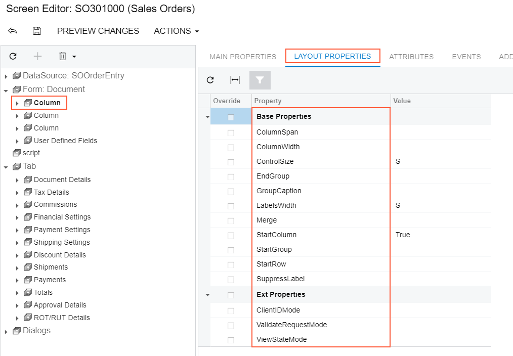

# To Set a Layout Rule Property {#_31e1e86a-36e5-4173-a392-f9c6638131c9 .concept}

To include in a customization project changes to properties of a layout rule, you have to modify the properties by using the [Screen Editor](../UserGuide/AU_20_45_20.md). To start setting the properties of a layout rule, perform the following actions:

1.  Select the layout rule in the Screen Editor, as described in [To Select a Layout Rule in the Screen Editor](CG_GL_UI_LayoutRules_ToSelect.md).
2.  Click the **Layout Properties** tab item to open the list of layout properties for the rule. \(See the following screenshot.\)

    

3.  Specify values for the required properties.
4.  Click **Save** to save changes in the customization project.

The most important properties of the PXLayoutRule component are described in the following topics of the Acumatica Framework Guide:

-   [Use of the StartRow and StartColumn Properties of PXLayoutRule](../StudioDeveloperGuide/CW__con_LayoutRules_Properties_StartRowColumn.md)
-   [Use of the ColumnWidth, ControlSize, and LabelsWidth Properties of PXLayoutRule](../StudioDeveloperGuide/CW__con_LayoutRules_Properties_Sizes.md)
-   [Predefined Size Values](../StudioDeveloperGuide/CW__con_LayoutRules_Properties_Predefined.md)
-   [Use of the ColumnSpan Property of PXLayoutRule](../StudioDeveloperGuide/CW__con_LayoutRules_Properties_ColumnSpan.md)
-   [Use of the Merge Property of PXLayoutRule](../StudioDeveloperGuide/CW__con_LayoutRules_Properties_Merge.md)
-   [Use of the GroupCaption, StartGroup, and EndGroup Properties of PXLayoutRule](../StudioDeveloperGuide/CW__con_LayoutRules_Properties_Group.md)
-   [Use of the SuppressLabel Property of PXLayoutRule](../StudioDeveloperGuide/CW__con_LayoutRules_Properties_SuppressLabel.md)

**Parent topic:**[Layout Rule \(PXLayoutRule\)](../CustomizationPlatform/CG_GL_UI_LayoutRules.md)

