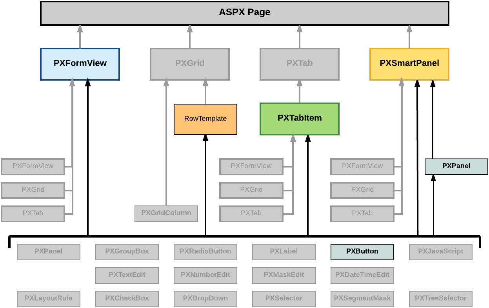

# Button \(PXButton\) {#_54a2a223-b5ee-4e10-96af-a1a0853b6ce6 .concept}

In Acumatica ERP, the PXButton element is used for the following purposes:

-   In a dialog box—to display a button that closes the dialog box and returns a predefined DialogResult value
-   In a container with controls for a single data record \(including a dialog box\) of a form—to display a button that invokes a method defined in the graph, which provides the business logic for the form

The most common use case of the PXButton element is in a dialog box.

A button, as the diagram below shows, can be immediately added to the following types of containers:

-   PXFormView
-   RowTeplate
-   PXTabItem
-   PXSmartPanel
-   PXPanel

To create a button in a container, follow the instructions described in [To Add Another Supported Control](CG_GL_UI_PXForm_AddStControl.md).

To delete a button from a container, follow the instructions described in [To Delete a Child UI Element](CG_GL_UI_PXForm_DeleteControl.md).

For detailed information about using a button, see the following topics:

-   [To Use a Button in a Dialog Box](CG_GL_UI_PXButton_InSmartPanel.md)
-   [To Use a Button to Invoke a Method](CG_GL_UI_PXButton_ForAction.md)

-   **[To Use a Button in a Dialog Box](../CustomizationPlatform/CG_GL_UI_PXButton_InSmartPanel.md)**  

-   **[To Use a Button to Invoke a Method](../CustomizationPlatform/CG_GL_UI_PXButton_ForAction.md)**  

**Parent topic:**[Customizing Elements of the User Interface](../CustomizationPlatform/CG_GL_UI.md)

