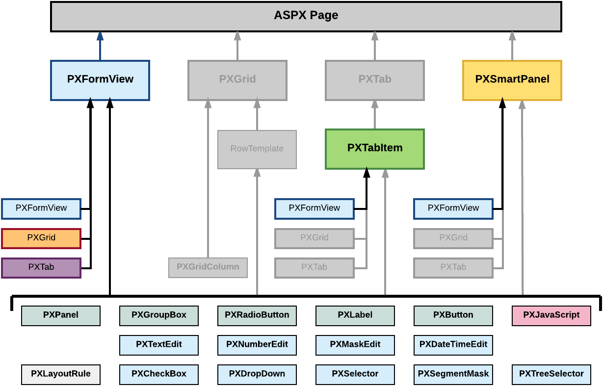

# Form Container \(PXFormView\) {#_d49d0866-5443-4ed8-b85b-62cad5d2ea8a .concept}

PXFormView is a data-bound UI container control that renders a single record from its associated data source.

An ASPX page can contain PXFormView as a main container. A form container, as the diagram below shows, can be also included in the following types of containers:

-   PXFormView
-   PXTabItem
-   PXSmartPanel

A form container can include multiple ASPX objects of the following types:

-   A data-bound UI container control: PXFormView, PXGrid, and PXTab
-   A layout rule: PXLayoutRule
-   A box for a data field: PXTextEdit, PXNumberEdit, PXMaskEdit, PXDateTimeEdit, PXCheckBox, PXDropDown, PXSelector, PXSegmentMask, and PXTreeSelector
-   Another control: PXPanel, PXGroupBox, PXRadioButton, PXLabel, PXButton, and PXJavaScript

A box for a data field can be added to a form container if the container is bound to a data view declared within the graph that provides business logic for the ASPX page. If you want to bind a form container to a data view, you must specify the properties as follows for the appropriate PXFormView object:

-   The DataSourceID property value must be equal to the value of the ID property of the PXDataSource control.
-   The DataMember property must contain the name of the data view that is declared in the graph and provides data for the controls of the form container.

To create a new form container in an ASPX page, follow the instructions described in [To Add a Form Container](CG_GL_Forms_CustForm_AdContainer_Form.md).

To delete a form container from an ASPX page, follow the instructions described in [To Delete a Container](CG_GL_Forms_CustForm_DeleteContainer.md).

For detailed information on working with the content of a form container, see the following topics:

-   [To Open a Container in the Screen Editor](CG_GL_UI_PXForm_ToOpen.md)
-   [To Set a Container Property](CG_GL_UI_PXForm_Properties.md)
-   [To Add a Nested Container](CG_GL_UI_PXForm_AddNested.md)
-   [To Add a Box for a Data Field](CG_GL_UI_PXForm_AddBox.md)
-   [To Add a Layout Rule](CG_GL_UI_PXForm_AddLayoutRule.md)
-   [To Add Another Supported Control](CG_GL_UI_PXForm_AddStControl.md)
-   [To Reorder Child UI Elements](CG_GL_UI_PXForm_ReorderChild.md)
-   [To Delete a Child UI Element](CG_GL_UI_PXForm_DeleteControl.md)

-   **[To Open a Container in the Screen Editor](../CustomizationPlatform/CG_GL_UI_PXForm_ToOpen.md)**  

-   **[To Set a Container Property](../CustomizationPlatform/CG_GL_UI_PXForm_Properties.md)**  

-   **[To Add a Nested Container](../CustomizationPlatform/CG_GL_UI_PXForm_AddNested.md)**  

-   **[To Add a Box for a Data Field](../CustomizationPlatform/CG_GL_UI_PXForm_AddBox.md)**  

-   **[To Add a Layout Rule](../CustomizationPlatform/CG_GL_UI_PXForm_AddLayoutRule.md)**  

-   **[To Add Another Supported Control](../CustomizationPlatform/CG_GL_UI_PXForm_AddStControl.md)**  

-   **[To Reorder Child UI Elements](../CustomizationPlatform/CG_GL_UI_PXForm_ReorderChild.md)**  

-   **[To Delete a Child UI Element](../CustomizationPlatform/CG_GL_UI_PXForm_DeleteControl.md)**  

**Parent topic:**[Customizing Elements of the User Interface](../CustomizationPlatform/CG_GL_UI.md)

