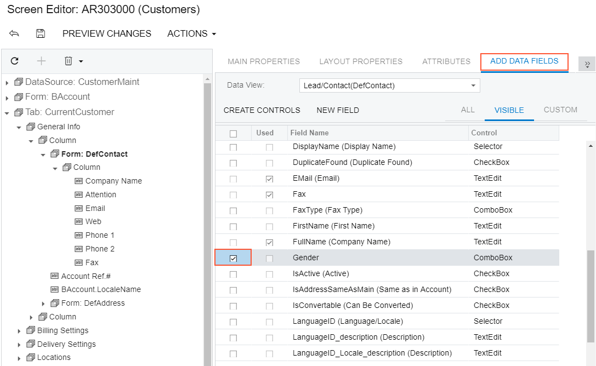

# To Add a Box for a Data Field {#_e1a82e2a-4528-48fb-b425-a50209377b6d .concept}

The Acumatica Customization Platform supports the following types of boxes for data fields:

-   PXTextEdit
-   PXNumberEdit
-   PXMaskEdit
-   PXDateTimeEdit
-   PXCheckBox
-   PXDropDown
-   PXSelector
-   PXSegmentMask
-   PXTreeSelector

\(See the table in [Customizing Elements of the User Interface](CG_GL_UI.md) for field type descriptions.\)

You can add a box for a data field without restrictions immediately to a PXFormView or PXTabItem element that has the DataMember property defined. Also, you can add a box for a data field to a PXPanel or PXGroupBox container that has the DataMember property inherited from the parent container.

Also, you can add a box for a data field to a RowTemplate element of a PXGrid container that is bound to a data view whose BQL statement refers to the data access class that contains the field declaration.

To add a box for a data field to a container that is bound to a data view, perform the following actions:

1.  Open the parent container in the Screen Editor, as described in [To Open a Container in the Screen Editor](CG_GL_UI_PXForm_ToOpen.md).
2.  Ensure that the container node is selected in the Control Tree of the editor. Click the arrow left of the node to expand the node if needed.
3.  Click the **Add Data Fields** tab item \(see the screenshot below\).
4.  If you need to create a control for a data field that is not accessible through the data view specified for the container in the DataMember property but is accessible through another data view of the same graph, and if the **Data View** box is available, select the needed data view in this box. \(For details, see [Use of Multiple Data Views for Boxes in Containers](../StudioDeveloperGuide/CW__con_PXForm_AddBox_DataViews.md) in the Acumatica Framework Guide.\)

    **Note:** On the **Add Data Fields** tab item of the Screen Editor, if you change the predefined data view in the **Data View** box and create a control for a data field from the field list for the selected data view, the editor concatenates the data view name with the field name in the DataField property of the created control.

5.  On the tab item, click the **All**, **Visible**, or **Custom** filter for the fields provided by the data view to view the appropriate field list.

    **Note:** You can create a custom field immediately on the **Add Data Fields** tab item by clicking the **New Field** action and then using the [Create New Field Dialog Box](../UserGuide/AU_DataClassEditor.md#_cdaebe06-9e8d-43fc-8dda-6850986501b6).

6.  Find the required data field in the list, and if the field is not used \(the check box in the **Used** column is cleared for the field\), select the check box for the field in the first \(unlabeled\) column, as the following screenshot shows.

    

    **Note:** You can select multiple data fields to create multiple boxes simultaneously.

7.  On the list toolbar, click **Create Controls**.

    The platform creates a box for the selected data field and adds a node for the box to the Control Tree.

8.  Click **Save** to save the changes in the customization project.

You can change the location of a control in a container. See [To Reorder Child UI Elements](CG_GL_UI_PXForm_ReorderChild.md) for details.

For more information about boxes, see [Box \(Control for a Data Field\)](CG_GL_UI_Box.md).

**Parent topic:**[Form Container \(PXFormView\)](../CustomizationPlatform/CG_GL_UI_PXForm.md)

