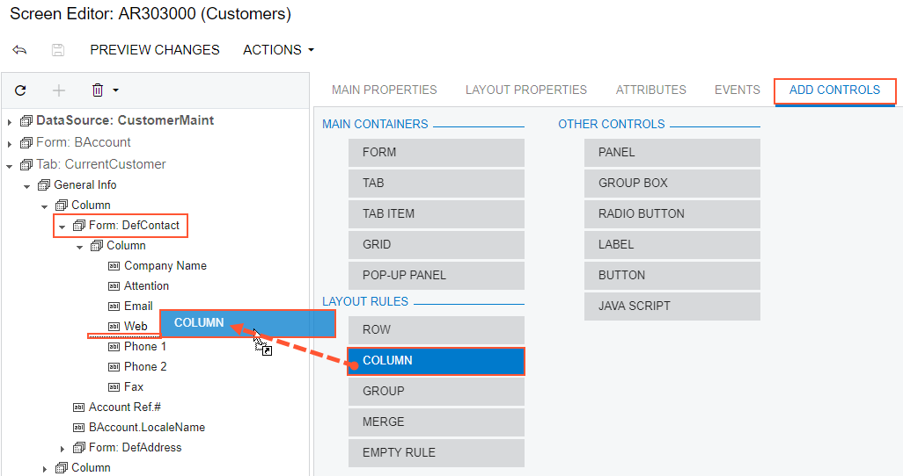

# To Add a Layout Rule {#_dfbe0e68-a4fd-438e-8ce1-cb89cc5d004f .concept}

In a container with multiple controls, the PXLayoutRule component is used to provide the following UI customization capabilities:

-   Placing controls in multiple rows to uniformly distribute them on the form or tab area of a form
-   Placing controls in multiple columns in a row
-   Spanning controls across multiple columns in a row
-   Merging controls into one row to align them horizontally
-   Adjusting the widths of controls and labels in a column
-   Hiding the labels of controls
-   Grouping controls for users' convenience

The [Screen Editor](../UserGuide/AU_20_45_20.md) supports the following types of the PXLayoutRule component \(with the respective predefined properties noted\):

-   **Row**: A layout rule with the StartRow property, which is set to *True*
-   **Column**: A layout rule with the StartColumn property, which is set to *True*
-   **Group**: A layout rule with the StartGroup property, which is set to *True*
-   **Merge**: A layout rule with the Merge property, which is set to *True*
-   **Empty Rule**: A layout rule without predefined properties

To add a layout rule to a container, perform the following actions:

1.  Open the container in the Screen Editor, as described in [To Open a Container in the Screen Editor](CG_GL_UI_PXForm_ToOpen.md).
2.  Ensure that the container node is selected in the Control Tree of the editor. Click the arrow left of the node to expand the node if needed.
3.  Click the **Add Controls** tab item \(see the screenshot below\).
4.  From the **Layout Rules** group, drag the required type of the rule to the needed location in the Control Tree within the container, as shown in the following screenshot.

    

    **Tip:** A layout rule is visible on the customized form only if it contains at least one visible control.

5.  If required, specify properties for the new layout rule.

    **Tip:** In any rule, you can configure any properties that you need. Some properties affect only the next control under the PXLayoutRule component, while other properties affect all controls under the rule until the next rule is encountered. Some properties require a corresponding ending rule. See [To Set a Layout Rule Property](CG_GL_UI_LayoutRules_Properties.md) for details.

6.  Click **Save** to save your changes in the customization project.

If you add a layout rule beneath another layout rule, you can override the properties of the PXLayoutRule component, which apply to the underlying controls. See [Layout Rule \(PXLayoutRule\)](CG_GL_UI_LayoutRules.md) for more information about using layout rules.

**Parent topic:**[Form Container \(PXFormView\)](../CustomizationPlatform/CG_GL_UI_PXForm.md)

