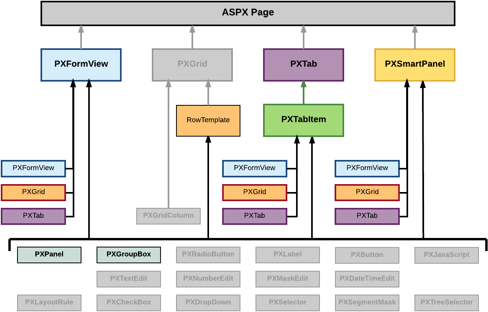
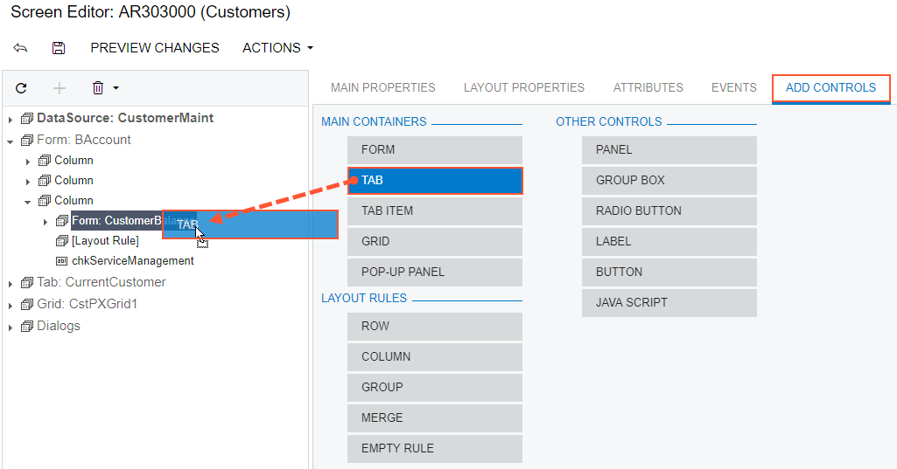

# To Add a Nested Container {#_b21381a3-a589-4aa6-b9fb-a4f87afab758 .concept}

A PXGrid container cannot include a nested container. A PXTab container can include only PXTabItem containers. You can add any container as a nested container to a PXFormView, PXTabItem, or PXSmartPanel container, as the following diagram shows.

You can include the PXPanel and PXGroupBox container controls in the PXFormView, RowTemplate, PXTabItem, and PXSmartPanel containers.

To add a nested container to a parent container, perform the following actions:

1.  Open the parent container in the Screen Editor, as described in [To Open a Container in the Screen Editor](CG_GL_UI_PXForm_ToOpen.md).
2.  Ensure that the container node is selected in the Control Tree of the editor. Click the arrow left of the node to expand the node if needed.
3.  Click the **Add Controls** tab item \(see the screenshot below\).
4.  From the **Main Containers** or **Other Controls** group, drag the required type of the nested container into the parent container in the Control Tree, as shown in the following screenshot.

    

    **Note:** A nested container is visible on the customized form only if it contains at least one visible control.

5.  If required, specify properties for the new container, as described in [To Set a Container Property](CG_GL_UI_PXForm_Properties.md).
6.  Click **Save** to save changes in the customization project.

**Parent topic:**[Form Container \(PXFormView\)](../CustomizationPlatform/CG_GL_UI_PXForm.md)

