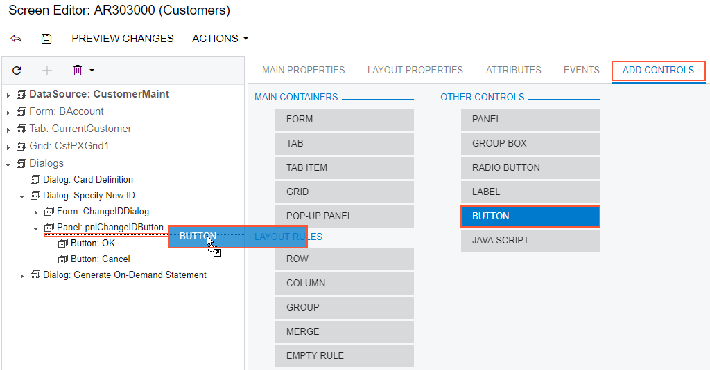

# To Add Another Supported Control {#_db3af871-a97f-4d59-b662-aafd486e4c2d .concept}

You use the [Screen Editor](../UserGuide/AU_20_45_20.md) to add to a container a control of any of the following types, which are supported in the Acumatica Customization Platform \(listed under **Other Controls** on the **Add Controls** tab item\):

-   [Panel \(PXPanel\)](CG_GL_UI_Panels.md)
-   [Group Box \(PXGroupBox\)](CG_GL_UI_GroupBoxes.md)
-   [Label \(PXLabel\)](CG_GL_UI_Labels.md)
-   [Radio Button \(PXRadioButton\)](CG_GL_UI_Radio.md)
-   [Button \(PXButton\)](CG_GL_UI_PXButton.md)
-   [Java Script \(PXJavaScript\)](CG_GL_UI_PXJavaScript.md)

We recommend that you not include a PXRadioButton control in a container that neither is bound to a data view nor inherits the DataMember property from the parent container.

You can nest a control of the listed types in a PXPanel or PXGroupBox container. However the PXGroupBox control type is especially designed to be used as a radio button container to render a drop-down field as a set of radio buttons. It contains scripts with the logic to support a nested radio button for each value of a drop-down field. So we recommend that you use PXGroupBox exclusively to include radio buttons.

To add a control of one of the listed types to a container, perform the following actions:

1.  Open the container in the Screen Editor, as described in [To Open a Container in the Screen Editor](CG_GL_UI_PXForm_ToOpen.md).
2.  Ensure that the container node is selected in the Control Tree of the editor. Click the arrow left of the node to expand the node if needed.
3.  Click the **Add Controls** tab item \(see the screenshot below\).
4.  From the **Other Controls** group, drag the required control type to the needed location in the Control Tree within the container, as shown in the following screenshot.

    

5.  If required, specify properties for the new control.
6.  Click **Save** to save your changes in the customization project.

**Parent topic:**[Form Container \(PXFormView\)](../CustomizationPlatform/CG_GL_UI_PXForm.md)

