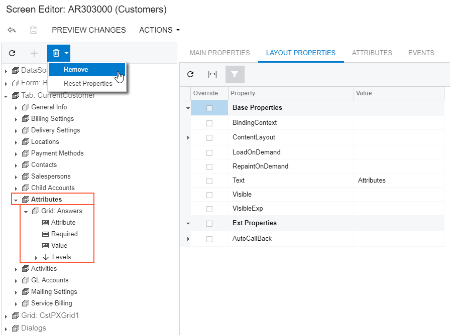

# To Delete a Child UI Element {#_36ecc137-64ed-4252-be08-8263522dc60a .concept}

You can delete a child UI element from a container. To do this, perform the following actions:

1.  Open the container in the Screen Editor, as described in [To Open a Container in the Screen Editor](CG_GL_UI_PXForm_ToOpen.md).
2.  In the Control Tree of the editor, click the arrow left of the container node to expand the node.
3.  Select the UI element to be deleted.
4.  On the toolbar of the Control Tree, click **Remove &gt; Remove**, as the following screenshot shows.

    

    The platform deletes all child elements of the deleted object.

    **Attention:** If you delete a PXLayoutRule component, all the controls under this layout rule are deleted too.

5.  Click **Save** on the toolbar of the Screen Editor to save your changes to the customization project.

**Parent topic:**[Form Container \(PXFormView\)](../CustomizationPlatform/CG_GL_UI_PXForm.md)

