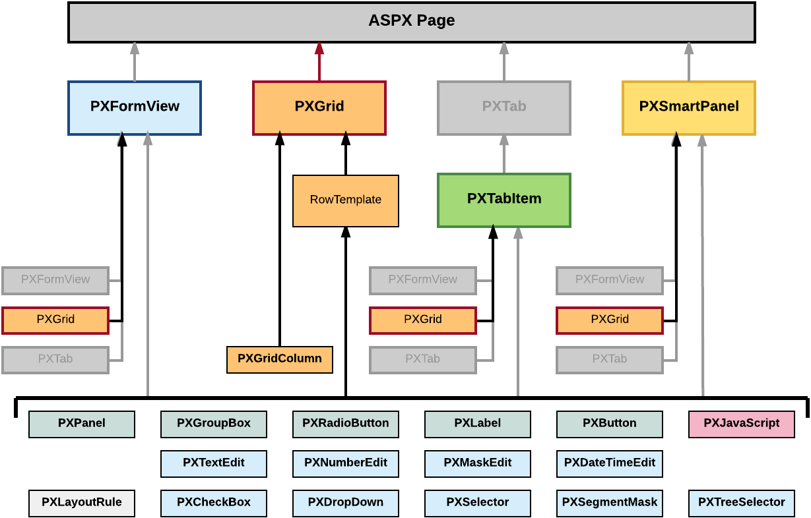

# Grid Container \(PXGrid\) {#_439986fd-e616-43a0-84ca-f6e72a9c74a1 .concept}

PXGrid is a data-bound UI container control that renders a table with multiple records from its associated data source. For a single record, the object can be displayed in form view mode, which provides navigation buttons to move between records. For form view mode to be defined, PXGrid must include the RowTemplate element, which can contain controls for the record fields and layout rules for these controls.

An ASPX page can contain PXGrid as a main container that is included immediately in the page. A grid container, as the diagram below shows, can also be included in the following types of containers:

-   PXFormView
-   PXTabItem
-   PXSmartPanel



A grid container can include multiple PXGridColumn objects and a single RowTemplate element. In the ASPX code, grid columns are included in the Columns element, whereas controls for the form view of the grid belong to the RowTemplate element, as the following code snippet shows.

```
<px:PXGrid ID="grid" ... DataSourceID="ds" ...>
  ...
    <Columns>
      ...
      <px:PXGridColumn DataField="Qty" TextAlign="Right" Width="81px" AutoCallBack="True" />
      ...
    </Columns>
    <RowTemplate>
      ...
      <px:PXNumberEdit ID="edQty" runat="server" DataField="Qty" />
      ...
    </RowTemplate>
  ...
</px:PXGrid>

```

In this code, you can see descriptions of both a grid column and a box for the same `Qty` data field.

To create a new grid in an ASPX page, follow the instructions described in [To Add a Grid Container](CG_GL_Forms_CustForm_AdContainer_Grid.md).

To delete a grid from an ASPX page, follow the instructions described in [To Delete a Container](CG_GL_Forms_CustForm_DeleteContainer.md).

For detailed information on working with the content of a grid container, see the following topics in this section:

-   [To Add a Column for a Data Field](CG_GL_UI_PXGrid_AddColumn.md)
-   [To Add a Control to the Form View of a Grid](CG_GL_UI_PXGrid_AddBox2RowTemplate.md)
-   [To Provide Hyperlinks for a Grid Column](CG_GL_Forms_Hyperlinks.md)

The following topics may also be useful as you work with a grid container:

-   [To Open a Container in the Screen Editor](CG_GL_UI_PXForm_ToOpen.md)
-   [To Set a Container Property](CG_GL_UI_PXForm_Properties.md)
-   [To Reorder Child UI Elements](CG_GL_UI_PXForm_ReorderChild.md)
-   [To Delete a Child UI Element](CG_GL_UI_PXForm_DeleteControl.md)

-   **[To Add a Column for a Data Field](../CustomizationPlatform/CG_GL_UI_PXGrid_AddColumn.md)**  

-   **[To Add a Control to the Form View of a Grid](../CustomizationPlatform/CG_GL_UI_PXGrid_AddBox2RowTemplate.md)**  

-   **[To Provide Hyperlinks for a Grid Column](../CustomizationPlatform/CG_GL_Forms_Hyperlinks.md)**  


**Parent topic:**[Customizing Elements of the User Interface](../CustomizationPlatform/CG_GL_UI.md)

