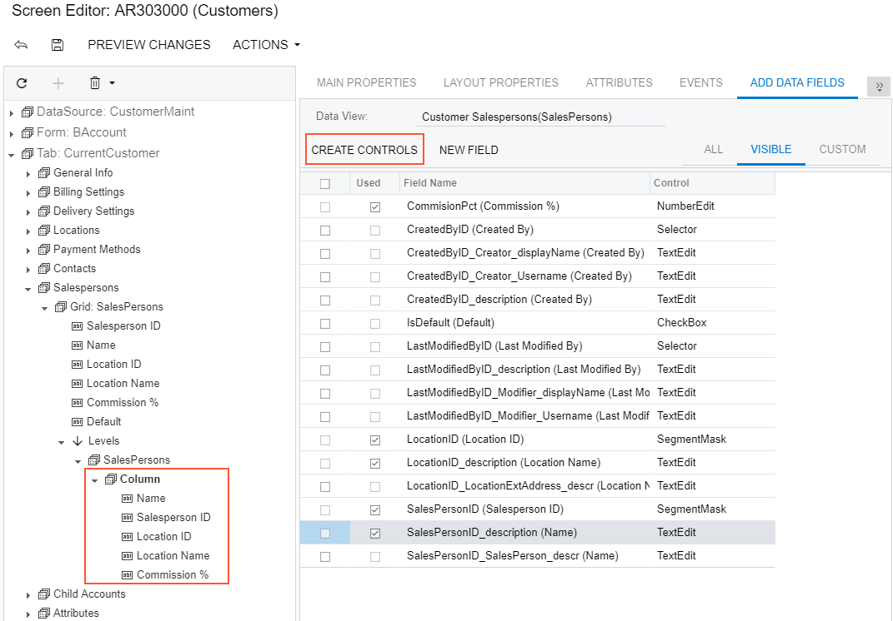

# To Add a Control to the Form View of a Grid {#_adcb6fe5-1b28-4865-82f5-57d9e6c498c1 .concept}

If the AllowFormEdit property of a grid is set to *True*, the user can switch the grid to form view mode to display the grid columns as controls on the form. This mode gives you the capability to edit a single record selected in the grid.

Therefore, to add a box for a data field to the form view of a grid, you have to add the box to the RowTemplate element in the ASPX code. To do this in the [Screen Editor](../UserGuide/AU_20_45_20.md), perform the following actions:

1.  Open the grid container in the Screen Editor, as described in [To Open a Container in the Screen Editor](CG_GL_UI_PXForm_ToOpen.md).
2.  In the Control Tree of the editor, click the arrow left of the node to expand the node.
3.  Click the arrow left of the **Levels** node to expand the node, and then expand the node that appears, which has the same name as the grid does.

    **Tip:** In the Control Tree, the Screen Editor assigns to a grid node the *Grid:&lt;DataMember&gt;* name, where the *&lt;DataMember&gt;* is the value of the DataMember property of the grid container. To the node that corresponds to the RowTemplate element of the grid, the editor assigns the same *&lt;DataMember&gt;* name.

4.  If the expanded node contains other expandable nodes, such as *Columns* nodes, expand them to see which boxes are currently included in the form view of the grid.

    **Tip:** The RowTemplate element can contain layout rules, which are used to arrange controls in the form view of the grid. Also, you can use this element to provide specific properties of columns in the grid.

5.  If you need to place the new box in a position below some existing box, select the node of this box in the Control Tree before you add a new control. \(In the screenshot below, the *Mailing ID* node is currently selected in the tree.\)
6.  In the editor, click the **Add Data Fields** tab item.
7.  On the tab item, click the **All**, **Visible**, or **Custom** filter for the data fields provided by the data view to open the appropriate field list.

    **Tip:** You can create a custom field immediately on the **Add Data Fields** tab item by using the [Create New Field Dialog Box](../UserGuide/AU_DataClassEditor.md#_cdaebe06-9e8d-43fc-8dda-6850986501b6).

8.  Find the required data field in the list, and if the field is not used \(that is, if the check box in the **Used** column is cleared for the field\), select the check box for the field in the first column, as the following screenshot shows.

    

    **Tip:** You can select multiple data fields to create multiple columns simultaneously.

9.  On the list toolbar, click **Create Controls**.

    The platform creates a box for the selected data field and adds a node for the box to the appropriate position in the Control Tree. At any time, you can change the position of a column in a grid. See [To Reorder Child UI Elements](CG_GL_UI_PXForm_ReorderChild.md) for details.

10. If needed, specify properties for the new control.

    **Tip:** If you need to provide hyperlinks to redirect the user from a column cell to another Acumatica ERP form, follow the recommendations described in [To Provide Hyperlinks for a Grid Column](CG_GL_Forms_Hyperlinks.md).

11. Click **Save** to save your changes to the customization project.

**Parent topic:**[Grid Container \(PXGrid\)](../CustomizationPlatform/CG_GL_UI_PXGrid.md)

