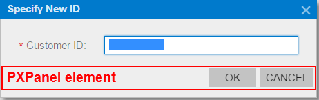
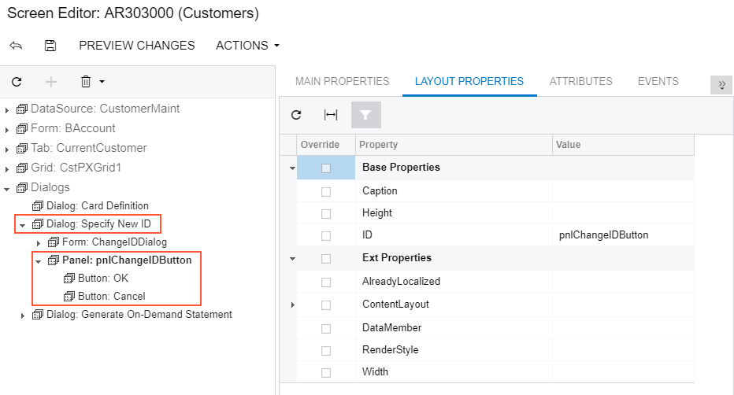

# Panel \(PXPanel\) {#_9bdb434b-cf85-4fef-b051-5ac4d5196ab1 .concept}

In a container with controls for a single data record, you can use a PXPanel element as a container with a caption to group controls. However we recommend that you use the PXLayoutRule component for this purpose. \(See [Layout Rule \(PXLayoutRule\)](CG_GL_UI_LayoutRules.md) for details.\)

In Acumatica ERP, a panel is used as a container to display a horizontal row of buttons with right alignment in a dialog box \(see [Dialog Box \(PXSmartPanel\)](CG_GL_UI_Dialogs.md) for details\), as the following screenshot shows.

If you open the dialog box displayed in the screenshot above in the Screen Editor, you can see that the panel is located below a form container and contains two buttons.

You can add the PXPanel element to a dialog box and buttons to this element, as described in [To Add Another Supported Control](CG_GL_UI_PXForm_AddStControl.md) and [To Use a Button in a Dialog Box](CG_GL_UI_PXButton_InSmartPanel.md). In a panel, to arrange buttons in a horizontal row with right alignment, you can specify the SkinID property of the PXPanel element, as described in [Use of the SkinID Property of Containers](../StudioDeveloperGuide/CW__con_PXForm_Properties_SkinID.md) in the Acumatica Framework Guide.

**Parent topic:**[Customizing Elements of the User Interface](../CustomizationPlatform/CG_GL_UI.md)

