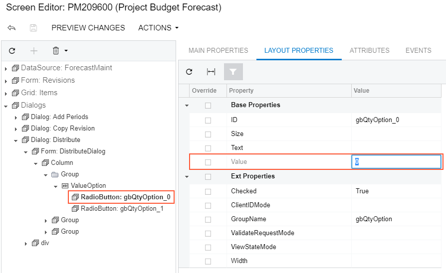

# To Bind a Radio Button to a Value in the List of a Data Field {#_4ec17ddb-0099-43d2-901a-f960f423f5e5 .concept}

In the parent group box, to bind a radio button to a value in the list of a drop-down data field that is bound to this group box, perform the following actions:

1.  Open the group box in the Screen Editor, as described in [To Open a Group Box in the Screen Editor](CG_GL_UI_GroupBoxes_Open.md).
2.  In the Control Tree, select the node of the radio button.
3.  Click the **Layout Properties** tab item to open the list of properties for the radio button.
4.  Set the Value property to an appropriate value \(usually it is a one-symbol value\) of the list defined in the C\# code, as the following screenshot shows.

    

5.  Click **Save** to save your changes to the customization project.

**Parent topic:**[Radio Button \(PXRadioButton\)](../CustomizationPlatform/CG_GL_UI_Radio.md)

