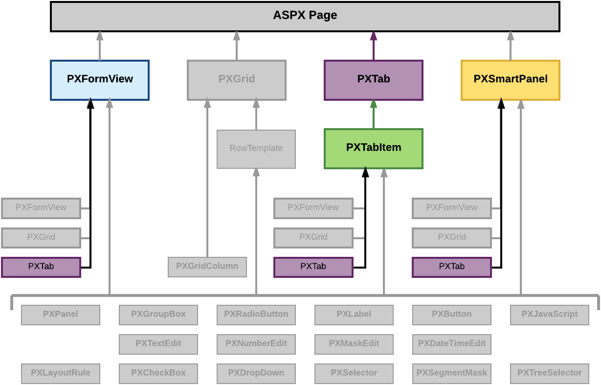

# Tab Container \(PXTab\) {#_2be5d728-90d6-4b63-8655-5b6ebfd636ee .concept}

PXTab is a data-bound UI container control that renders tabs defined by child PXTabItem containers.

An ASPX page can contain PXTab as a main container. A tab container, as the diagram below shows, can be also included in the following types of containers:

-   PXFormView
-   PXTabItem
-   PXSmartPanel

A tab container can include only PXTabItem container controls.

A box for a data field can be added immediately to a child PXTabItem container if the parent PXTab container is bound to a data view declared within the graph that provides business logic for the ASPX page. To bind a tab container to a data view, you must specify the properties as follows for the appropriate PXTab object:

-   The DataSourceID property value must be equal to the value of the ID property of the PXDataSource control.
-   The DataMember property must contain the name of the data view that is declared in the graph and provides data for the controls of a child container that is not a data-bound UI container.

To create a new tab container in an ASPX page, follow the instructions described in [To Add a Tab Container](CG_GL_Forms_CustForm_AdContainer_Tab.md).

To delete a tab container from an ASPX page, follow the instructions described in [To Delete a Container](CG_GL_Forms_CustForm_DeleteContainer.md).

For detailed information about the PXTabItem container control, see [Tab Item Container \(PXTabItem\)](CG_GL_UI_TabItem.md).

**Parent topic:**[Customizing Elements of the User Interface](../CustomizationPlatform/CG_GL_UI.md)

