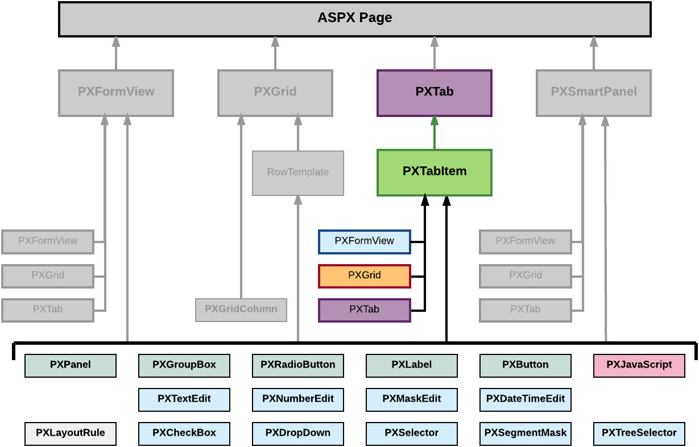

# Tab Item Container \(PXTabItem\) {#_035033e1-6d29-46d4-bdf9-55a1d7219349 .concept}

PXTabItem is a container control that can be used to render a single record from the data source specified for the parent PXTab container.

A tab item container, as the diagram below shows, can be included only in a PXTab container.

A tab item container can include multiple ASPX objects of the following types:

-   A data-bound UI container control: PXFormView, PXGrid, and PXTab
-   A layout rule: PXLayoutRule
-   A box for a data field: PXTextEdit, PXNumberEdit, PXMaskEdit, PXDateTimeEdit, PXCheckBox, PXDropDown, PXSelector, PXSegmentMask, and PXTreeSelector
-   Another control: PXPanel, PXGroupBox, PXRadioButton, PXLabel, PXButton, and PXJavaScript

A box for a data field can be added to a tab item container if the parent PXTab container is bound to a data view declared within the graph that provides business logic for the ASPX page.

To create a new tab item container in a tab container in an ASPX page, follow the instructions described in [To Add a Nested Container](CG_GL_UI_PXForm_AddNested.md).

To delete a tab item container from an ASPX page, follow the instructions described in [To Delete a Child UI Element](CG_GL_UI_PXForm_DeleteControl.md).

For specific information on working with a tab item container, see the [Conditional Hiding of a Tab Item](../StudioDeveloperGuide/CW__con_PXTabItem_Properties_VisibleExp.md) topic in this section. You will find additional information in the following topics:

-   [To Open a Container in the Screen Editor](CG_GL_UI_PXForm_ToOpen.md)
-   [To Set a Container Property](CG_GL_UI_PXForm_Properties.md)
-   [To Add a Nested Container](CG_GL_UI_PXForm_AddNested.md)
-   [To Add a Box for a Data Field](CG_GL_UI_PXForm_AddBox.md)
-   [To Add a Layout Rule](CG_GL_UI_PXForm_AddLayoutRule.md)
-   [To Add Another Supported Control](CG_GL_UI_PXForm_AddStControl.md)
-   [To Reorder Child UI Elements](CG_GL_UI_PXForm_ReorderChild.md)
-   [To Delete a Child UI Element](CG_GL_UI_PXForm_DeleteControl.md)

**Parent topic:**[Customizing Elements of the User Interface](../CustomizationPlatform/CG_GL_UI.md)

