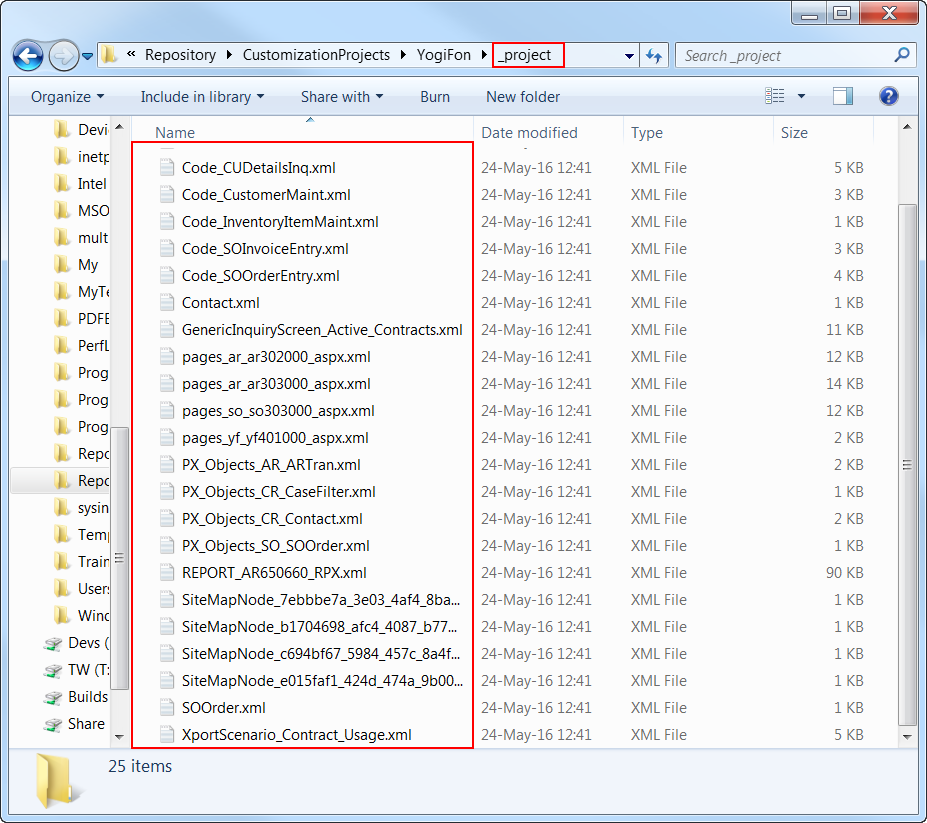
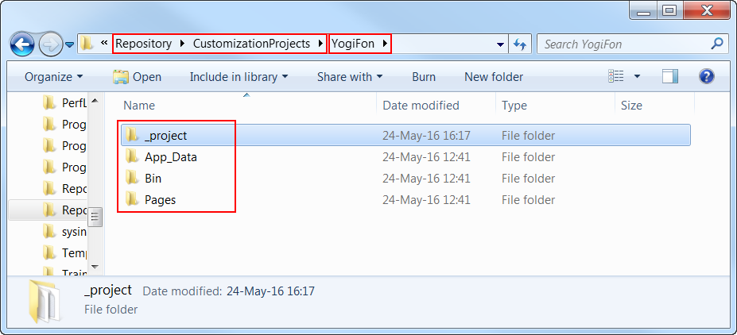

# To Save a Project to a Local Folder {#_71f286e1-1c11-49ca-9aaa-590e5a308568 .concept}

You can save a customization project as set of files to a local folder that can be used for integration with a source control system. To do this, perform the following actions:

1.  Open the project in the [Customization Project Editor](../UserGuide/SM_20_45_10.md).
2.  On the editor menu, click **Source Control** &gt; **Save Project to Folder**.
3.  In the **Save Project to Folder** dialog box, which opens, do the following:
    1.  In the **Parent Folder** selector, select the parent folder.
    2.  In the **Project Name** box, specify the name of the new folder to be used as the project storage.
4.  Click **OK**.

Within the selected parent folder, the platform creates the folder with the project name that you have specified. This folder includes at least the `_project` subfolder that contains an XML file for each item of the project, as the following screenshot shows.

If the customization project contains custom files, the platform keeps the paths to these files. Therefore, the project folder includes the corresponding folders for these custom files, as shown in the following screenshot.

**Parent topic:**[Integrating the Project Editor with a Version Control System](../CustomizationPlatform/CG_GL_VCS.md)

