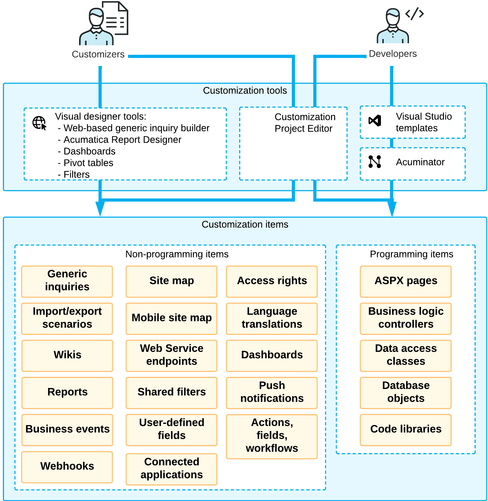

# Introduction {#_e3e48af1-d660-4bc8-9dcb-5014f6901292 .concept}

By using the tools and capabilities of the Acumatica Customization Platform, you can change the user interface and business logic of Acumatica ERP, as well as extend the functionality of the system. The following diagram illustrates the different types of changes that you can make to the system within the scope of the customization process and the tools and capabilities you can use.

As a value-added reseller \(VAR\), you can deliver end-user customization that might be very specific to each particular customer. At this level, you might want to add custom reports and data filters, and configure generic inquiries for users. These changes do not involve programming unless you also want to modify the business logic and the user interface of the application. For more information on the web-based Generic Inquiry builder and the Acumatica Report Designer, see [Managing Generic Inquiries](../UserGuide/SM__MNG_Managing_Generic_Inquiry.md) and [Acumatica Report Designer Guide](../UserGuide/ReportDesigner_Main.md#).

As an independent software vendor \(ISV\), you can develop vertical solutions and add-ons to the core functionality of the system. At this level, you might want to modify the business logic and the UI of the application, which you can do by using the [Acumatica Customization Platform](CG_Platform.md). To develop custom application modules, you can use the API that is provided by the Acumatica Framework.

As an original equipment manufacturer \(OEM\), you can build your own cloud ERP products based on high-level application objects of Acumatica ERP and the underlying Acumatica Framework technology. This type of customization may involve intensive changes at all levels of the system: modifications of the business logic and UI, development of custom modules, and report building.

