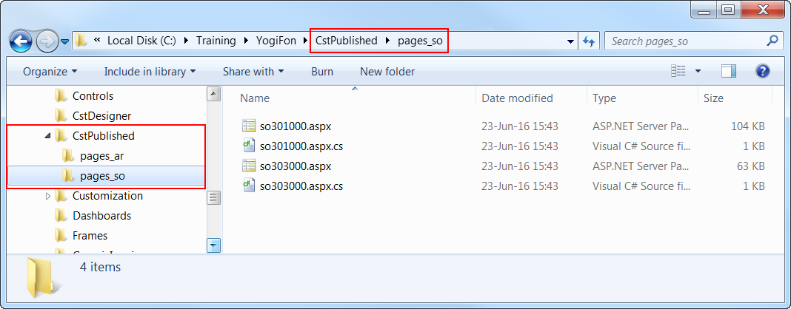

# Changes in Webpages \(ASPX\) {#_56a4a87c-291d-43d1-827e-d413c3d6a3f1 .concept}

To customize the look and behavior of an Acumatica ERP form, you need to change the ASPX code of the form. Because you need to include all the changes in a customization project, you have to perform the form customization by using the [Screen Editor](../UserGuide/AU_20_45_20.md) of the Customization Project Editor.

To collect all the changes that you make while you customize a form, the Screen Editor creates a *Page* item with a name that corresponds to the form ID, and includes the item in the currently selected customization project. This item contains XML code with instructions that have to be applied to the ASPX code of the form during the publication of the project.

For example, the following fragment of a *Page* item contains the XML code with the `<AddItem>` tag used to add the UsrSIMCardID field as a column to the Transactions grid.

```

<PXGridLevel DataMember="Transactions"
             ParentId="phG_tab_Items#0_grid_Levels#0"
             TypeFullName="PX.Web.UI.PXGridLevel">
  <Children Key="Columns">
    <AddItem>
      <PXGridColumn TypeFullName="PX.Web.UI.PXGridColumn">
        <Prop Key="DataField" Value="UsrSIMCardID" />
        <Prop Key="Width" Value="160" />
      </PXGridColumn>
    </AddItem>
  </Children>
</PXGridLevel>

```

In the XML code above, note that the `<Prop>` tag is used to set the Width property of the column to *160*.

With the Screen Editor, you can customize any object in the ASPX code of an Acumatica ERP form and save the resulting changeset to the customization project. To apply the customization to the website, you have to publish the project.

For example, at the publication process, the platform transforms the XML code fragment above to the following fragment of ASPX code.

```
<px:PXGridColumn DataField="UsrSIMCardID" Width="160" />
```

During the publication of the project, the platform applies the XML changeset to the appropriate form to create a customized version of the `.aspx` file with the same name in the `pages_xx` subfolder of the `CstPublished` folder of the website. If the form ID contains the *SO* prefix, the customized ASPX code is located in the `\CstPublished\pages_so` folder, as the following screenshot shows.



After the project has been published, when Acumatica ERP has to display a form, first it tries to find the `.aspx` file of the form in the `CstPublished` folder. If it finds it, Acumatica ERP opens the customized version of the form instead of the original one.

Any customization of Acumatica ERP can be unpublished. If you unpublish a form customization, the platform deletes the corresponding file in the `CstPublished` folder of the website.

**Parent topic:**[Customization Framework](../CustomizationPlatform/CG_Platform_Framework.md)

