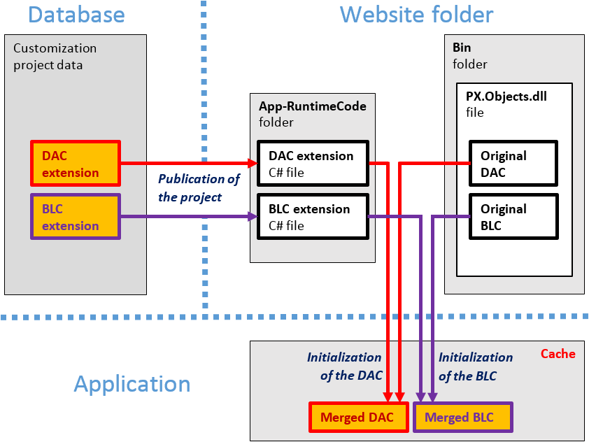
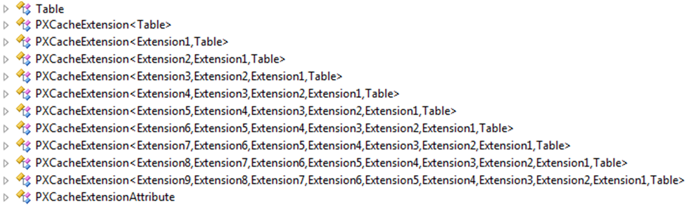
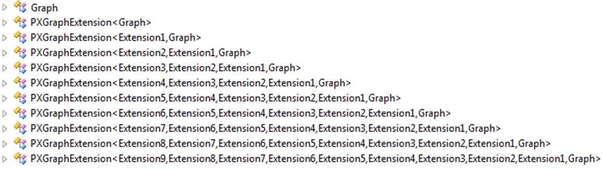
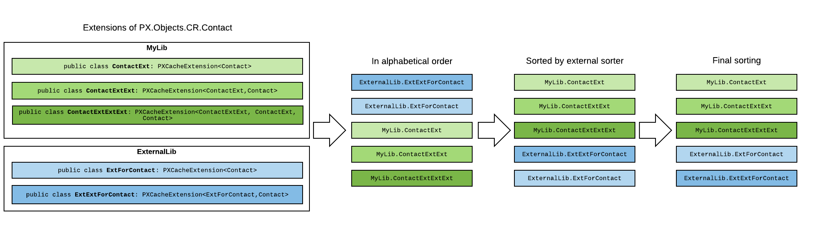

# Changes in the Application Code \(C\#\) {#_91f755b8-885c-458a-bcb9-748c5cc03360 .concept}

In this section, you can find information about the customization of the application functionality, which is provided by the application business logic \(implemented in C\# code\) of data access classes and business logic controllers.

## BLC and DAC Extensions { .section}

To give you the ability to customize the functionality or behavior of a form, the Acumatica Customization Platform uses technology based on extension models. When you are resolving a typical customization task, you generally create extensions for original data access classes and business logic controllers.

An extension for a business logic controller \(BLC, also referred to as *graph*\) or a data access class \(DAC\) is a class derived from a generic class defined in the PX.Data assembly of Acumatica ERP. To declare an extension for a DAC, you derive a class from the PXCacheExtension&lt;T&gt; generic class. To declare an extension of a BLC, you derive a class from the PXGraphExtension&lt;T&gt; generic class. Both types of extensions must be declared with the `public` access modifier to be correctly recognized by the Acumatica Customization Platform.

If you have created an extension for a BLC or DAC in a customization project and published the project, the platform applies the extension to the base class at run time. During publication of the project, all the code extensions created for an instance of Acumatica ERP in the project are saved as C\# source code files in the `App_RuntimeCode` folder of the application instance \(see the diagram below\).



At run time, during the first initialization of a base class, the Acumatica Customization Platform automatically finds the extension for the class and applies the customization by replacing the base class with the merged result of the base class and the extension it found.

When you unpublish all customization projects, the platform deletes all the code files from the `App_RuntimeCode` folder. As a result, the platform has no custom code to merge at run time.

## Multilevel Extensions { .section}

The Acumatica Customization Platform supports multilevel extensions, which are required when you develop off-the-shelf software that is distributed in multiple editions. Precompiled extensions provide a measure of protection for your source code and intellectual property.

The figure below illustrates the DAC extension model.



The figure below illustrates the BLC extension model.



You can use multilevel extensions to develop applications that extend the functionality of Acumatica ERP or other software based on Acumatica Framework in multiple markets \(that is, specified categories of potential client organizations\). You may have a base extension that contains the solution common to all markets as well as multiple market-specific extensions. Every market-specific solution is deployed along with the base extension. Moreover, you can later customize deployed extensions for the end user by using DAC and graph extensions.

**Tip:** When extensions can be deployed separately, the application developer should use multiple extension levels. Otherwise, we recommend using a single extension level.

## The Order in Which Extensions Are Loaded {#_225856fd-aa53-4aa4-8466-45266ec95b96 .section}

For each DAC or graph type, the system loads and applies extensions at run time as follows:

1.  The system collects extensions for the DAC or graph type.
2.  The system sorts the list of extensions in alphabetical order.
3.  If there is a subscriber to the PX.Data.PXBuildManager.SortExtentions event, the system passes the list of extensions in alphabetical order to this subscriber, which can sort extensions in a custom way. A sample implementation of the subscriber is shown in the following code.

    **Tip:** Make sure you use a stable sorting method as the following example does.

    ```
    using System;
    using System.Collections.Generic;
    using System.Linq;
    using System.Web.Compilation;
    using Autofac;
    using PX.Data.DependencyInjection;
    
    namespace MyLib
    {
      public class ServiceRegistration : Module
      {
        protected override void Load(ContainerBuilder builder)
        {
          builder.ActivateOnApplicationStart<ExtensionSorting>();
        }
        private class ExtensionSorting
        {
          private static readonly Dictionary<Type, int> _order = new Dictionary<Type, int>
          {
            { typeof(MultiCurrency), 4 },
            { typeof(SalesPrice), 3 },
            { typeof(Discount), 2 },
            { typeof(SalesTax), 1 },
    
            { typeof(MyGraphExt1), -1 },
            { typeof(MyGraphExt2), -2 },
          };
    
          public ExtensionSorting()
          {
            PXBuildManager.SortExtensions += StableSort;
          }
          private static void StableSort(List<Type> list)
          {
            if (list?.Count > 1)
            {
              var stableSortedList = list.OrderByDescending(item =>
                    _order.ContainsKey(item) ? _order[item] : 0).ToList();
              list.Clear();
              list.AddRange(stableSortedList);
            }
          }
        }
      }
    }  
    ```

4.  The system changes the order of dependent extensions \(such as `Dac1Ext: PXCacheExtension<Dac1>` and `Dac1ExtExt: PXCacheExtension<Dac1Ext, Dac1>`\) so that the higher-level extensions have higher priorities during the merge operation.

Suppose that the website folder contains five extensions of the Contact DAC that are available in the `MyLib` and `ExternalLib` namespaces, and the customization project includes an external sorter, which sorts the extensions in a custom way. The following diagram shows how these extensions are sorted. As a result of the sorting in this example, the first extension that is applied is `MyLib.ContactExt`. The `ExternalLib.ExtExtForContact` class has the highest priority during the merge operation.



-   **[DAC Extensions](../CustomizationPlatform/CG_Platform_Framework_CS_DACExt.md)**  

-   **[Graph Extensions](../CustomizationPlatform/CG_Platform_TO_Code_CS_GraphExtensions.md)**  

-   **[Run-Time Compilation](../CustomizationPlatform/CG_Platform_TO_Code_RunTime.md)**  

-   **[Extension Library](../CustomizationPlatform/CG_Platform_TO_Code_CS_ExtLibrary.md)**  


**Parent topic:**[Customization Framework](../CustomizationPlatform/CG_Platform_Framework.md)

