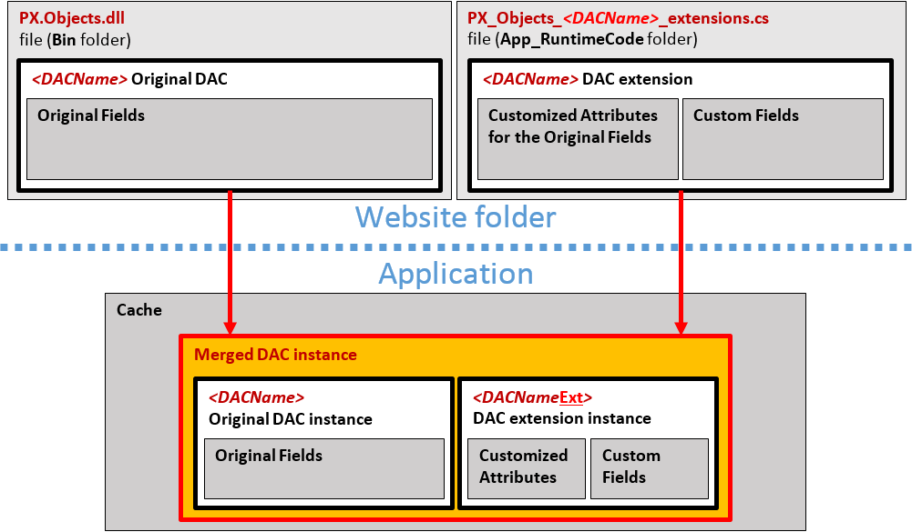

# Access to a Custom Field {#_3500f338-2d3c-4a7a-bcc2-b66da393c131 .concept}

You can customize a data access class \(DAC\) in either of the following ways \(see the diagram below\):

-   By altering the attributes of existing fields. You can use an altered field just as you would any other existing field.
-   By declaring new \(custom\) fields.

Every custom field is declared within the code of a DAC extension; therefore, at run time, the custom field is accessible only through the DAC extension instance of the cache object.

You can access a custom field:

-   [From a Method](CG_Platform_Framework_CS_DACExt_Access_Methods.md)
-   [From a BQL Statement](CG_Platform_Framework_CS_DACExt_Access_BQL.md)
-   [From a Field Attribute](CG_Platform_Framework_CS_DACExt_Access_FieldAttr.md)

-   **[From a Method](../CustomizationPlatform/CG_Platform_Framework_CS_DACExt_Access_Methods.md)**  

-   **[From a BQL Statement](../CustomizationPlatform/CG_Platform_Framework_CS_DACExt_Access_BQL.md)**  

-   **[From a Field Attribute](../CustomizationPlatform/CG_Platform_Framework_CS_DACExt_Access_FieldAttr.md)**  

**Parent topic:**[DAC Extensions](../CustomizationPlatform/CG_Platform_Framework_CS_DACExt.md)

