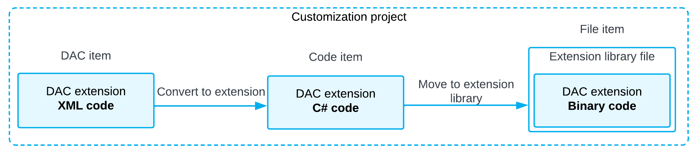

# Supported DAC Extension Formats {#_bbdc9242-e39a-49bc-bda3-558e27bd21d0 .concept}

You can keep a DAC customization in a customization project in any of the following ways:

-   As a *DAC* item of a customization project in XML format. When you publish the project, the platform creates the DAC extension source code and saves the code in the `<DACItemName>_extensions.cs` file in the `App_RuntimeCode` folder of the website.

    **Tip:** The system creates the file name based on the item name by replacing all symbols except letters and digits with the *\_* symbol and adding the *\_extensions* suffix. For example, the extension code file for the PX.Objects.CR.Contact *DAC* item has the name `PX_Objects_CR_Contact_extensions.cs`.

-   As a *Code* item of a customization project that is the C\# code of the DAC extension wrapped in XML format. When you publish the project, the platform saves the code in the `<CodeItemName>.cs` file in the `App_RuntimeCode` folder of the website.
-   As a `.dll` file of the extension library in the `Bin` folder of the website. The library contains the binary code of the DAC extension. To deploy the extension library to the production environment along with a customization project, you include the extension library in the project as a *File* item. See [Extension Library](CG_Platform_TO_Code_CS_ExtLibrary.md) for details.

By using the [Customization Project Editor](../UserGuide/SM_20_45_10.md), you can:

-   Convert a *DAC* item to a *Code* item.

    **Tip:** The system creates the *Code* name based on the *DAC* item name by using the last word of the name and adding the *Extensions* suffix. For example, the PX.Objects.CR.Contact *DAC* item is converted to the ContactExtensions *Code* item.

-   Move a *Code* item to the extension library included in the customization project as a *File* item.

If you have a customized data access class that is added to the project as a *DAC* item, then you can click **Convert to Extension** on the page toolbar of the Customized Data Classes page to convert the class changes into the class extension code used to complete the extension development in either the Code Editor or Microsoft Visual Studio \(see the diagram below\).

For a *Code* item included in a customization project, if you want to move the code to an extension library to compile it into a `.dll` file, you can click the **Move to Ext. Library** button on the page toolbar of the [Code Editor](../UserGuide/AU_20_40_00_CodeEditor.md). After the operation is complete, the *Code* item that is currently displayed in the work area of the Code Editor is removed from the customization project. The file with the same source code is appended to the extension library that is bound to the customization project. If the *Code* item name was CodeItemName, the name of the created file will be `CodeItemName.cs`.

**Parent topic:**[DAC Extensions](../CustomizationPlatform/CG_Platform_Framework_CS_DACExt.md)

