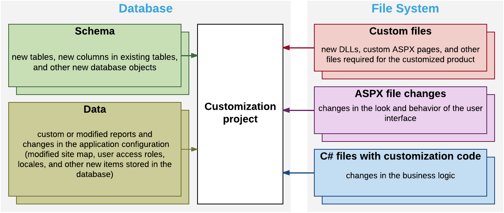

# Customization Project {#_0463a7f0-b67f-4a75-a976-583a2ad8b3d2 .concept}

When you use the tools provided by the Acumatica Customization Platform, the platform uses a customization project as a container that holds each change you make during the customization.

A customization project is a set of changes to the user interface, configuration data, and functionality of Acumatica ERP. As the following diagram shows, a customization project might include any of the following:

-   New custom forms and modifications to the existing forms of Acumatica ERP
-   Custom C\# code
-   Custom database scripts
-   Custom or modified reports \(Acumatica Report Designer reports, generic inquiries, and analytical reports\)
-   Changes in the application configuration \(site map changes, new system locales, integration scenarios, shared reusable filters, access rights of roles to forms, changes of wikis\) that are saved in the database for the current tenant
-   Additional files that you need for Acumatica ERP customization

You develop and maintain customization projects by using the tools of the Acumatica Customization Platform \(see [Customization Tools](CG_Platform_Tools.md) for details\). This platform provides the mechanisms to develop, upgrade, publish, unpublish \(that is, cancel publication\), export, and import a customization project. The content of a customization project is stored in the database of the Acumatica ERP instance.

To perform any customization of the UI or to extend the business logic, you have to create a new customization project or modify an existing one.

Once you have selected a customization project for development, the customizations you perform will be added to this project. The customization project holds each change you make during the customization; however before the project is published, the changes exist only in the project and are not yet applied to the product. To apply the content of a customization project to Acumatica ERP, you have to publish the project.

When you need to apply the developed customization to a target environment, you should add all the changes and additional files to the customization project and export the project as a deployment package—a complete redistributable customization package. Then in the target environment, you import the package and publish the project.

You can create as many customization projects as you need and independently develop and maintain each customization project for a specific customization task.

-   **[Types of Items in a Customization Project](../CustomizationPlatform/CG_Platform_Project_ItemTypes.md)**  

-   **[Deployment of a Customization Result](../CustomizationPlatform/CG_Platform_Project_Deployment.md)**  

-   **[Publication of Customization Projects in a Multitenant Site](../CustomizationPlatform/CG_Platform_Project_MultiCompany.md)**  

**Parent topic:**[Acumatica Customization Platform](../CustomizationPlatform/CG_Platform.md)

