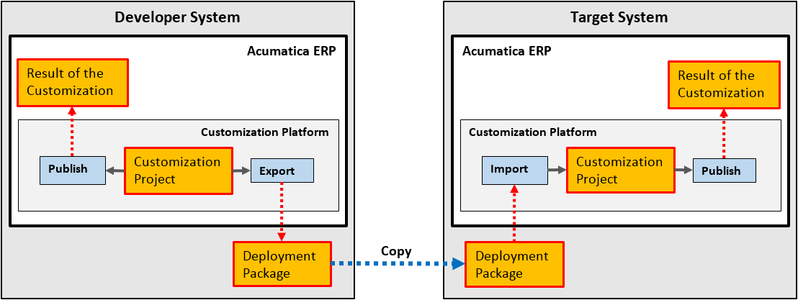

# Deployment of a Customization Result {#_2724d9c3-d60e-4e3d-8e54-f2613c343ed6 .concept}

Once you’ve finished a customization project, you can export the project as a deployment package that can then be imported and published as a customization project in any Acumatica ERP instance.

The following diagram shows the deployment of the result of customization to a target system.

A deployment package is a redistributable `.zip` file that includes the full content of a customization project. A deployment package consists of the `project.xml` file and any custom files that you have added to the project, such as external assemblies and custom ASPX pages. You can manually edit the `project.xml` file in an XML Editor in the file system. However we recommend that you modify the project items in the easiest and most reliable way: by using the [Customization Project Editor](../UserGuide/SM_20_45_10.md).

When the project is finished, you can download the deployment package to deploy the customization to the target system \(see [To Export a Project](CG_GL_Projects_Deploying_Exporting.md) for details\). If you have finished the project, we recommend that you publish the project and test the customization before downloading the deployment package, to ensure that you have no issues. Also, you can download the package to have a backup copy of the customization project you are working on.

You can import a deployment package to work with the customization project or to publish the final customization on the target website \(see [Project Publication: To Deploy a Customization Project](CustomizationProjects_PublishingProjects_Activity_DeployProject.md) for details\).

**Tip:** In MySQL, the maximum size of one packet that can be transmitted to or from a server is 4MB by default. If you use MySQL and want to manage a customization project with the size that is larger than the default maximum value, you have to increase the max\_allowed\_packet variable in the server. The largest possible packet size is 1GB.

**Parent topic:**[Customization Project](../CustomizationPlatform/CG_Platform_Project.md)

