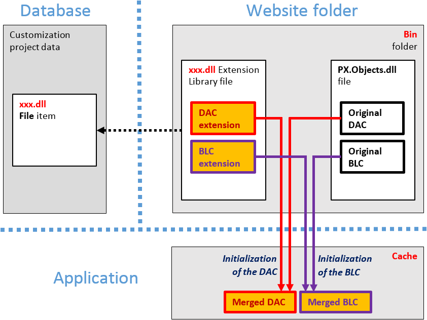

# Extension Library {#_a3278167-2285-4c92-8404-367952b42d9e .concept}

An extension library is a Microsoft Visual Studio project that contains customization code and can be individually developed and tested.

To move your code from your customization project to an extension library, you should first create an extension library and then move desired *Code* and *DAC* items to the extension library. After that you can develop your extension library in Visual Studio. See the following topics for details:

-   [To Create an Extension Library](cg_platform_tocreateextensionlib.md)
-   [To Move a DAC Item to an Extension Library](cg_platform_toconverdacto.md)
-   [To Move a Code Item to the Extension Library](CG_GL_Items_Code_MovingToLib.md)

If you need to deploy the customization code of an extension library to another system, you have to add the library to a customization project as a *File* item to include it in a customization package. See [To Add a Custom File to a Project](CG_GL_Items_Files_Adding.md) for details.

Extension library `.dll` files must be located in the website’s `Bin` folder. At runtime during website initialization, all `.dll` files in this folder are loaded into server memory for use by Acumatica ERP, making all code extensions in the library accessible from Acumatica ERP.

During the first initialization of a base class, the Acumatica Customization Platform automatically discovers extensions for the class in memory and applies these extensions by replacing the base class with the merged result of the base class and the discovered extensions.

The use of extension libraries that are precompiled provides a measure of protection for your source code and intellectual property.

-   **[Extension Library \(DLL\) Versus Code in a Customization Project](../CustomizationPlatform/CG_Platform_TO_Code_ExtLib_vsCode.md)**  

**Parent topic:**[Changes in the Application Code \(C\#\)](../CustomizationPlatform/CG_Platform_Framework_CS.md)

