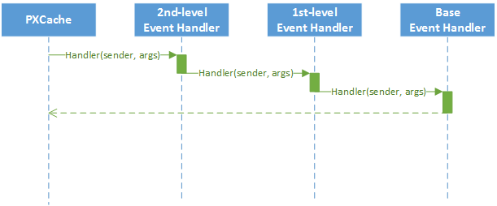
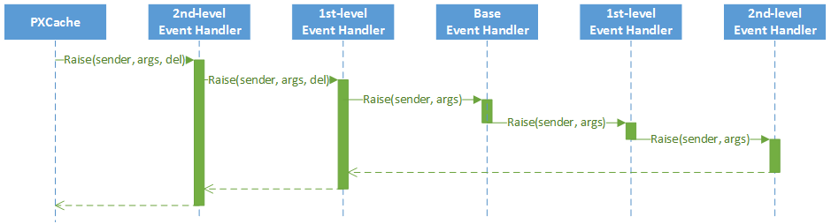
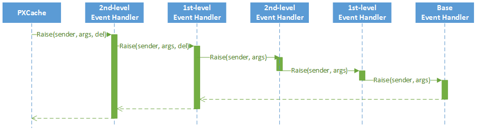

# Event Handlers {#_914dbe80-719b-4f1c-8630-4519ffdefc44 .concept}

The business logic associated with data modifications is implemented through event handlers. Event handlers are methods that are executed when the PXCache objects of a particular data access class \(DAC\) raise data manipulation events.

Every business logic controller \(BLC, also referred to as *graph*\) instance has a collection of event handlers for each type of data manipulation event. Every collection is filled automatically with event subscribers that are declared within the base \(original\) BLC and that meet the naming conventions of Acumatica Framework event handlers.

With Acumatica Customization Platform, you can define new event handlers within BLC extensions. You can define an event handler in two possible ways:

-   You define the event handler in the same way as it is defined in the base BLC. As a result, the event handler is added to the appropriate event handler collection. Depending on the event type, the event handler is added to either the end of the collection or the start of it. When the event occurs, all event handlers in the collection are executed, from the first to the last one.
-   You define the event handler with an additional parameter, which represents the delegate for one of the following:

    -   The event handler with an additional parameter from the extension of the previous level, if such an event handler exists.
    -   The first item in the collection of event handlers, if no handlers with additional parameters declared within lower-level extensions exist. The collection contains event handlers without the additional parameter from extensions discovered at all levels.
    In either case, you can decide whether to invoke the delegate.

    **Important:** The `CacheAttached()` event handler declared in the highest-level BLC extension is used to replace base DAC field attributes. Attributes attached to the CacheAttached\(\) event handlers within the base BLC or its extensions are attached to the PXCache object. Each time, these attributes completely replace the previous ones, from the base BLC to the highest extension discovered. This is the framework’s default behavior when:

    -   The [PXMergeAttributes](https://help.acumatica.com/Help?ScreenId=ShowWiki&pageid=dce254b6-4fff-887a-4d0c-914284b2ad8b) attribute isn’t declared on the CacheAttached\(\) event handler.
    -   PXMergeAttributes is declared, but the value of the corresponding MergeMethod enum is set to Replace.
    We recommend that you:

    -   Always explicitly declare the PXMergeAttributes attribute on CacheAttached\(\) event handlers
    -   Avoid replacing the entire set of the original attributes of a DAC field in a CacheAttached\(\) event handler
    We make these recommendations because you usually copy the replacing set of attributes from the DAC field and the set of attributes declared on the DAC field may be updated in the future. When that happens, the set of attributes on the CacheAttached\(\) event handler won’t be consistent with the attributes declared on the DAC field. This can lead to bugs in your code. For details, see [Overriding Attributes of a DAC Field in the Graph](cg_gl_modifyingattributesofadacfield.md).


## Event Handler Added to the End of the Collection { .section}

The following event handlers are added to the end of the collection:

-   `FieldUpdated(PXCache sender, PXFieldUpdatedEventArgs e)`
-   `RowSelecting(PXCache sender, PXRowSelectingEventArgs e)`
-   `RowSelected(PXCache sender, PXRowSelectedEventArgs e)`
-   `RowInserted(PXCache sender, PXRowInsertedEventArgs e)`
-   `RowUpdated(PXCache sender, PXRowUpdatedEventArgs e)`
-   `RowDeleted(PXCache sender, PXRowDeletedEventArgs e)`
-   `RowPersisted(PXCache sender, PXRowPersistedEventArgs e)`

The system executes event handlers from the base \(original\) event handler up to the highest extension level \(referred to as the *bubbling strategy*\). The lower the BLC extension's level of declaration, the earlier the event subscriber is called. The figure below illustrates this principle.


## Event Handlers Added to the Beginning of the Collection { .section}

The following event handlers are added to the beginning of the collection:

-   `FieldSelecting(PXCache sender, PXFieldSelectingEventArgs e)`
-   `FieldDefaulting(PXCache sender, PXFieldDefaultingEventArgs e)`
-   `FieldUpdating(PXCache sender, PXFieldUpdatingEventArgs e)`
-   `FieldVerifying(PXCache sender, PXFieldVerifyingEventArgs e)`
-   `RowInserting(PXCache sender, PXRowInsertingEventArgs e)`
-   `RowUpdating(PXCache sender, PXRowUpdatingEventArgs e)`
-   `RowDeleting(PXCache sender, PXRowDeletingEventArgs e)`
-   `RowPersisting(PXCache sender, PXRowPersistingEventArgs e)`
-   `CommandPreparing(PXCache sender, PXCommandPreparingEventArgs e)`
-   `ExceptionHandling(PXCache sender, PXExceptionHandlingEventArgs e)`

Event handlers are added by the system to the beginning of the collection by using the *tunneling strategy*. The system executes event handlers from the highest extension level down to the base event handler. The higher the BLC extension's level of declaration, the earlier the event subscriber is called. The figure below illustrates this principle.



## Event Handlers with an Additional Parameter { .section}

The event handler with an additional parameter replaces the base BLC event handler collection. When the event is raised, the system calls the event handler with an additional parameter of the highest-level BLC extension. The system passes a link to the event handler with an additional parameter from the extension of the previous level, if such an event handler exists, or to the first item in the event handler collection. You use a delegate as an additional parameter to encapsulate the appropriate event handler.

The Acumatica Framework provides the following delegates to encapsulate event handlers:

-   `PXFieldSelecting(PXCache sender, PXFieldSelectingEventArgs e)`
-   `PXFieldDefaulting(PXCache sender, PXFieldDefaultingEventArgs e)`
-   `PXFieldUpdating(PXCache sender, PXFieldUpdatingEventArgs e)`
-   `PXFieldVerifying(PXCache sender, PXFieldVerifyingEventArgs e)`
-   `PXFieldUpdated(PXCache sender, PXFieldUpdatedEventArgs e)`
-   `PXRowSelecting(PXCache sender, PXRowSelectingEventArgs e)`
-   `PXRowSelected(PXCache sender, PXRowSelectedEventArgs e)`
-   `PXRowInserting(PXCache sender, PXRowInsertingEventArgs e)`
-   `PXRowInserted(PXCache sender, PXRowInsertedEventArgs e)`
-   `PXRowUpdating(PXCache sender, PXRowUpdatingEventArgs e)`
-   `PXRowUpdated(PXCache sender, PXRowUpdatedEventArgs e)`
-   `PXRowDeleting(PXCache sender, PXRowDeletingEventArgs e)`
-   `PXRowDeleted(PXCache sender, PXRowDeletedEventArgs e)`
-   `PXRowPersisting(PXCache sender, PXRowPersistingEventArgs e)`
-   `PXRowPersisted(PXCache sender, PXRowPersistedEventArgs e)`
-   `PXCommandPreparing(PXCache sender, PXCommandPreparingEventArgs e)`
-   `PXExceptionHandling(PXCache sender, PXExceptionHandlingEventArgs e)`

For example, for the FieldVerifying event, the event handler with an additional parameter looks like `FieldVerifying(PXCache sender, PXFieldVerifyingEventArgs e, PXFieldVerifying del)`.

You can execute `del()` to invoke the event handler to which `del` points, or you can decide not to invoke it. When `del()` points to the base BLC event handler collection, its invocation causes the execution of the whole collection. All other event handlers in the collection are invoked sequentially after the first handler is executed.

Suppose that you have declared event handlers as follows.

```

public class BaseBLC : PXGraph<BaseBLC, DAC>
{
    protected void DAC_RowUpdated(PXCache cache, PXRowUpdatedEventArgs e)
    {
        
    }

    protected void DAC_Field_FieldVerifying(PXCache sender, PXFieldVerifyingEventArgs e)
    {
        
    }
}

public class BaseBLCExt : PXGraphExtension<BaseBLC>
{
    protected void DAC_RowUpdated(PXCache cache, PXRowUpdatedEventArgs e)
    {
        
    }

    protected void DAC_Field_FieldVerifying(PXCache sender, PXFieldVerifyingEventArgs e)
    {
        
    }

    protected void DAC_RowUpdated(PXCache cache, PXRowUpdatedEventArgs e, PXRowUpdated del)
    {
        if (del != null)
            del(sender, e);
    }

    protected void DAC_Field_FieldVerifying(PXCache sender, PXFieldVerifyingEventArgs e, PXFieldVerifying del)
    {
        if (del != null)
            del(sender, e);
    }
}

public class BaseBLCExtOnExt : PXGraphExtension<BaseBLCExt, BaseBLC>
{
    protected void DAC_RowUpdated(PXCache cache, PXRowUpdatedEventArgs e)
    {
        
    }

    protected void DAC_Field_FieldVerifying(PXCache sender, PXFieldVerifyingEventArgs e)
    {
        
    }

    protected void DAC_RowUpdated(PXCache cache, PXRowUpdatedEventArgs e, PXRowUpdated del)
    {
        if (del != null)
            del(sender, e);
    }

    protected void DAC_Field_FieldVerifying(PXCache sender, PXFieldVerifyingEventArgs e, PXFieldVerifying del)
    {
        if (del != null)
            del(sender, e);
    }
}
```

In this case, the RowUpdated and FieldVerifying event handlers are invoked in the appropriate sequences, explained below.

The following figure illustrates the order in which the RowUpdated events are invoked.



The following figure illustrates the order in which the FieldVerifying events are invoked.



**Parent topic:**[Graph Extensions](../CustomizationPlatform/CG_Platform_TO_Code_CS_GraphExtensions.md)

