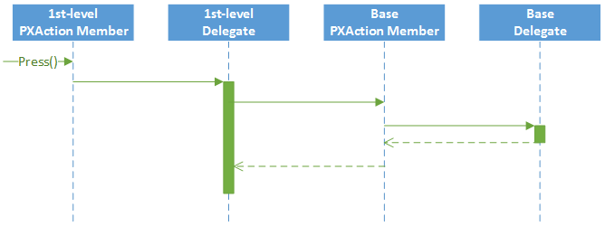
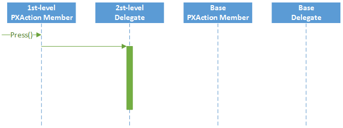

# Customization of an Action {#_828d4d7a-597c-4fc6-896b-b6bb1b88266f .concept}

The platform provides a way to alter or extend an action defined in a business logic controller \(BLC, also referred as *graph*\).

**Tip:** An *action* is a BLC member of the PXAction type. An action always has the delegate defined. Every action is represented by the PXAction object and placed in the *Actions* collection of the appropriate BLC. To construct an instance of the PXAction class, you use a BLC member of the PXAction type and a delegate from the highest-level extension discovered.

Suppose that you have declared the Objects data view and the ValidateObjects action within the base BLC, as shown below.

```

 public class BaseBLC : PXGraph<BaseBLC, DAC>
{
    public PXSelect<DAC> Objects;
 
    public PXAction<DAC> ValidateObjects;
    [PXButton]
    [PXUIField(DisplayName = "Validate Objects")]
    protected virtual void validateObjects()
    {
    }
}
```

You can alter actions within BLC extensions in the following ways:

-   By overriding action attributes within a BLC extension.

    To override action attributes in a BLC extension, you should declare both the BLC member of the PXAction type and the delegate. You should attach a new set of attributes to the action delegate. Also, you need to invoke the Press method on the base BLC action. Having redeclared the member of `PXAction<>`, you prevent the action delegate execution from an infinite loop. Consider the following example of a first-level BLC extension.

    ```
    
     public class BaseBLCExt : PXGraphExtension<BaseBLC>
    {
        public PXAction<DAC> ValidateObjects;
        [PXButton]
        [PXUIField(DisplayName = "Validate All Objects")]
        protected void validateObjects()
        {
            Base.ValidateObjects.Press();
        }
    }
    ```

    The *Actions* collection of a BLC instance contains the ValidateObjects action, which consists of the `PXAction` type member and the delegate, both of which were declared within the first-level extension \(see the following figure\).

    **Tip:** When overriding an action delegate within a BLC extension, you completely redeclare the attributes attached to the action. Every action delegate must have PXButtonAttribute \(or the derived attribute\) and PXUIFieldAttribute attached.

    

-   By overriding the action delegate within the BLC extension.

    The new delegate is used by the appropriate action. Consider the following example of a second-level BLC extension.

    ```
    
     public class BaseBLCExtOnExt : PXGraphExtension<BaseBLCExt, BaseBLC>
    {
        [PXButton]
        [PXUIField(DisplayName = "Validate Objects")]
        protected void validateObjects()
        {
        }
    }
    ```

    The *Actions* collection of a BLC instance contains the ValidateObjects action, which consists of the `PXAction<>` type member declared within the first-level extension and the delegate declared within the second-level extension. To use an action declared within the base BLC or the lower-level extension from the action delegate, you should redeclare the action within a BLC extension. You do not need to redeclare an action when it is not meant to be used from the action delegate.

    

    **Tip:** To modify the same member of the base BLC or any BLC extension, you should use extensions of higher levels.


**Parent topic:**[Graph Extensions](../CustomizationPlatform/CG_Platform_TO_Code_CS_GraphExtensions.md)

