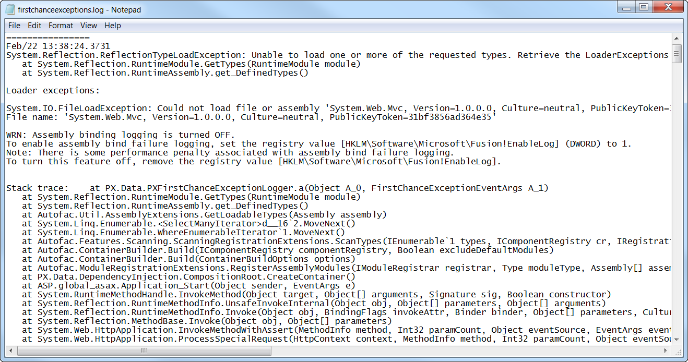

# To Log All Exceptions to a File {#_c9abc50f-4b48-4527-bdd4-0e2111176f14 .concept}

Acumatica ERP provides a mechanism you can use for catching and logging all exceptions in the system. \(See the *First-Chance Exception Log* section of [Using Logs](../UserGuide/CON_Troubleshooting_Tools_Logs.md) for details.\) If you have been assigned the *Administrator* role, you can activate this mechanism and specify the name of the log file. To do this, perform the following actions:

1.  In the file system, open in a text editor the `web.config` file located in the website folder.
2.  Within the &lt;appSettings&gt; tag of the file, turn on the EnableFirstChanceExceptionsLogging key, as follows.

    ```
    <add key="EnableFirstChanceExceptionsLogging" value="True" />
    ```

3.  If you need to change the log file name, which is `firstchanceexceptions.log` by default, you can specify the needed name in the FirstChanceExceptionsLogFileName key, as follows.

    ```
    <add key="FirstChanceExceptionsLogFileName" value="MyLog.log" />
    ```

    **Note:** By default, the first-chance exception log file is saved in the `App_Data` folder of the website.


You can open the log file in a text editor to view the content of the first-change exception log, as the following screenshot shows.



**Parent topic:**[Troubleshooting Customization](../CustomizationPlatform/CG_Troubleshooting.md)

