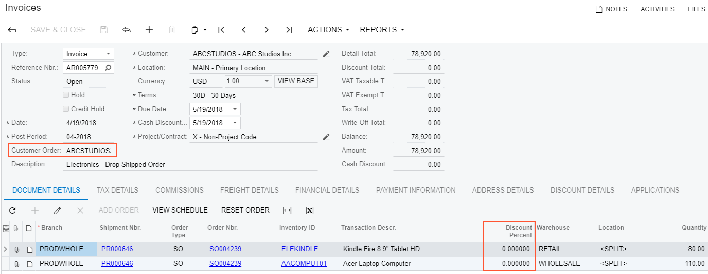
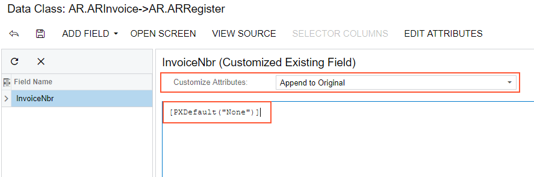
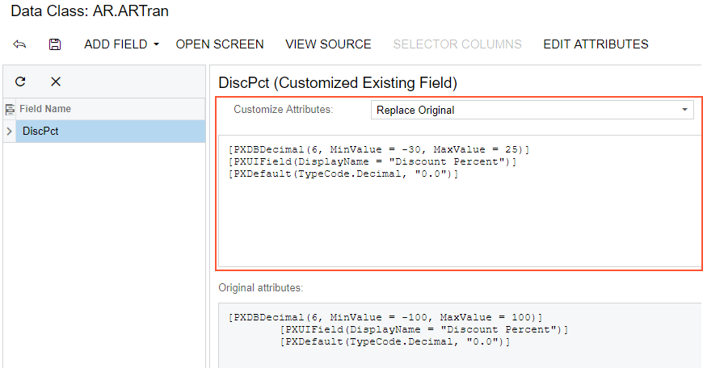

# Customizing DAC Attributes {#_6d084bb2-7346-4d9b-8a65-ce06137c1632 .concept}

To modify or extend the behavior that is defined within a data access class \(DAC\), you should append or override the field attributes declared within the DAC.

Suppose that you have a customization task to modify the Invoices \(SO303000\) form, and that this task consists of the following requirements:

1.  The **Customer Order** data field on the form area \(see the screenshot below\) must have the *None* value when the user has not specified the reference number of the customer.
2.  The values of the **Discount Percent** column must be limited to a range of -30 to 25 percent instead of the original range of -100 to 100 percent.



To begin implementing the first requirement, inspect the properties of the **Customer Order** UI control. To do this, on the **Customization** menu, select **Inspect Element** and click the box or label of the control on the form. The system should retrieve the following information of the control that will display in the **Element Properties** dialog box:

-   **Control Type**: *Text Edit*. The type of the UI control.
-   **Data Class**: *ARInvoice*. The data access class that contains the inspected field.
-   **Data Field**: *InvoiceNbr*. The field that is represented by the **Customer Order** control on the form.
-   **Business Logic**: *SOInvoiceEntry*. The business logic controller \(BLC, also referred to as *graph*\) that provides the logic executed on the *Invoices* form.

To modify attributes of the DAC field, select **Actions** &gt; **Customize Data Fields** in the **Element Properties** dialog box. In the **Select Customization Project** dialog box, specify the project to which you want to add the customization item for the data field and click **OK**.

The Data Class Editor opens for customization of the `InvoiceNbr` field of the `ARInvoice` data access class.

Suppose that you decided to append an attribute to the DAC field to specify the default value for the field. Do it as follows:

1.  In the **Customize Attributes** box select *Append to Original*.
2.  In the text area, type `[PXDefault("None")]`.
3.  Save your changes in the Data Class Editor.

**Note:** Acumatica Framework 2026 R1 provides advanced possibilities to control the field customization by using additional attributes in the DAC extension. See the [Customization of Field Attributes in DAC Extensions](CG_Platform_Framework_CS_DACExt_FieldAttributes.md) for details.



The system adds the customized data access class to the **Data Access** list of project items. For more information, see [Customized Data Classes](CG_GL_Items_DACs.md).

To view the changes applied to the Invoices form, publish the customization project and add a new document on the Invoices form. When you add a new document, the system will insert the *None* default value into the **Customer Order** box as you have specified with the `PXDefault` attribute.

To implement the second requirement of the task, inspect the **Discount Percent** column on the **Document Details** tab of the Invoices form. To do this, on the **Customization** menu, select **Inspect Element** and click the area of the **Discount Percent** column header. The system should retrieve the following information of the control that will display in the **Element Properties** dialog box:

-   **Control Type**: *Grid Column*. The type of the UI control.
-   **Data Class**: *ARTran*. The data access class that contains the inspected field.
-   **Data Field**: *DiscPct*. The field that is represented by the **Discount Percent** column in the table.
-   **Business Logic**: *SOInvoiceEntry*. The business logic controller \(BLC, also referred to as *graph*\) that provides the logic executed on the *Invoices* form.

To modify attributes of the DAC field, select **Actions** &gt; **Customize Data Fields** in the **Element Properties** dialog box. In the **Select Customization Project** dialog box, specify the project to which you want to add the customization item for the data field and click **OK**.

The Data Class Editor opens for customization of the `DiscPct` field of the `ARTran` data access class.

The `PXDBDecimal` attribute specifies the range of valid values for the field. According to the customization task, you have to modify the minimum and maximum values specified in the attribute. To do this, you have to replace the original attributes with the custom ones as follows:

1.  In the **Customize Attributes** box, select *Replace Original*. The original attributes will be copied to the text area where you enter custom attributes.
2.  For the `PXDBDecimal` attribute, change the minimum and maximum values, as listed below.

    ```
    [PXDBDecimal(6, MinValue = -30, MaxValue = 25)]
    [PXUIField(DisplayName = "Discount Percent")]
    [PXDefault(TypeCode.Decimal, "0.0")]
    ```

3.  Click **Save** in the Data Class Editor to save the changes.

**Note:** If you replace attributes, you have to repeat all attributes that you want to remain on the data field.



The system adds the customized data access class to the **Data Access** list of project items. For more information, see [Customized Data Classes](CG_GL_Items_DACs.md).

To test the result of the customization, publish the customization project, open the Invoices form, insert a new document, and add a record to the details table, as shown in the screenshot below. If you try to specify a value in the **Discount** column greater than 25 percent or less than -30 percent, the system will automatically correct the value to the maximum 25 or minimum -30, respectively.

**Parent topic:**[Examples of Functional Customization](../CustomizationPlatform/ACECustHow.md)

