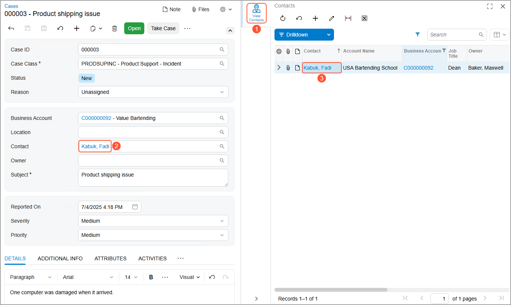

# Actions on Forms: To Add a Side Panel {#_9593c68b-e75d-4af2-8b40-b343872dd05d .task}

The following activity will walk you through the process of adding to a form an action that opens a side panel for the record selected on a form. For the selected record, this side panel will display related information.

## Story { .section}

Suppose that management has determined that Acumatica ERP would better fit the needs of your company if employees could view the contacts of the business account selected for a case on the [Cases](../UserGuide/CR_30_60_00.md) \(CR306000\) form. You need to add to the form the side panel that displays this information.

## Process Overview { .section}

On the [Screens](../UserGuide/AU_20_10_00.md) page, you will add the [Cases](../UserGuide/CR_30_60_00.md) \(CR306000\) form so that it can be customized. On the [Actions](../UserGuide/AU_20_10_50.md) page, you will add a new action that opens a side panel with the contacts of the business account selected for the case. You will then publish the customization project. Finally, you will test the added action.

## System Preparation { .section}

Before you begin performing the steps of this activity, do the following:

1.  Prepare an Acumatica ERP instance by performing the [Customization Projects: To Deploy an Instance](CustomizationProjects_GettingStarted_Activity_CreateInstance.md) prerequisite activity.
2.  Create the *Yogifon* customization project by performing the [Customization Projects: To Create a Customization Project](CustomizationProjects_GettingStarted_Activity_CreateProject.md) prerequisite activity.

## Step 1: Modifying the List of Customized Screens { .section}

To add an action to the [Cases](../UserGuide/CR_30_60_00.md) \(CR306000\) form, you first need to add the form \(screen\) to the list of customized screens. In the Customization Project Editor for the *Yogifon* project, do the following:

1.  In the navigation pane, click **Screens**.

    The [Screens](../UserGuide/AU_20_10_00.md) page opens.

2.  On the page toolbar, click **Customize Existing Screen**.

    The **Customize Existing Screen** dialog box opens.

3.  In the **Select Screen** box of the dialog box, click the magnifier button. In the lookup table, type `CR306000` in the Search box and double-click the *Cases* form.
4.  Click **OK** to close the dialog box.

    The [Cases](../UserGuide/CR_30_60_00.md) form is added to the list of forms on the [Screens](../UserGuide/AU_20_10_00.md) page, and the Screen Editor: CR306000 \(Cases\) page opens.

## Step 2: Adding the Action { .section}

To add the action to the [Cases](../UserGuide/CR_30_60_00.md) \(CR306000\) form, perform the following instructions:

1.  In the navigation pane of the Customization Project Editor, click **Screens** &gt; **CR306000** &gt; **Actions**.

    The CR306000 \(Cases\) Actions page opens.

2.  On the page toolbar, click **Add New Action**.
3.  In the **Action Properties** dialog box, which opens, specify the following settings:
    -   **Action Name**: `ViewContacts`

        **Attention:** This box does not contain the name that is displayed on the UI; it contains the internal name of the action that will be used in the automatically generated code of the action. The name should not be the same as the name of any existing action and should not contain spaces or the *@* symbol.

    -   **Display Name**: `View Contacts`

        This is the name of the action that will be displayed on the form.

    -   **Action Type**: *Navigation: Side Panel*

        This type of action opens a side panel.

    -   **Destination Screen**: *CR3020PL*

        This is the screen that should open when the action is invoked.

    -   **Icon**: *helmet*

        This is the icon that will be displayed for the side panel.

4.  On the **Navigation Parameters** tab, add a row with the following settings:

    -   **Active**: Selected
    -   **Parameter Name**: *Business Account*
    -   **Value**: *\[Business Account\]*
    -   **From Schema**: Cleared
    These settings indicate that the side panel should display the contacts of the business account that is selected for the case.

5.  Click **Save** to close the dialog box.

    Notice that the new action has been added to the list of actions, and that its status is *New* \(which means that this action is not inherited from a predefined action, but is instead created from scratch\).

6.  To apply the changes to the instance, on the main menu of the Customization Project Editor, click **Publish** &gt; **Publish Current Project**.
7.  Wait until the *Website updated* row appears in the **Compilation** pane, and click **Close Compilation Pane**.

## Step 3: Testing the New Action { .section}

In Acumatica ERP, test your changes on the [Cases](../UserGuide/CR_30_60_00.md) \(CR306000\) form as follows:

1.  Create a case with the following settings:
    -   **Case Class**: *PRODSUPINC*
    -   **Business Account**: *C000000092*
    -   **Contact**: *Kabuk, Fadi* \(inserted automatically\)
    -   **Subject**: `Product shipping issue`
2.  On the form toolbar, click **Save**.
3.  Click the **View Contacts** icon on the side panel \(see Item 1 in the following screenshot\), and verify that the system displays information about the contacts of the business account that you selected for the case \(Items 2 and 3\).

    

**Parent topic:**[Adding Actions to Forms](../CustomizationPlatform/CustomizationProjects_AddingActions_Mapref.md)

