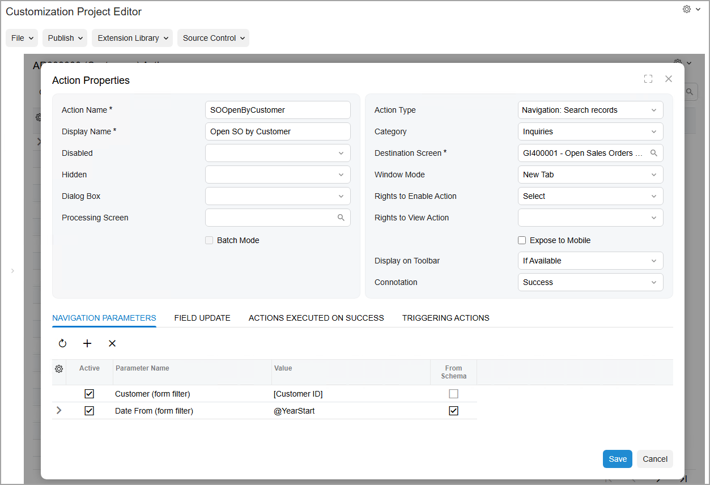
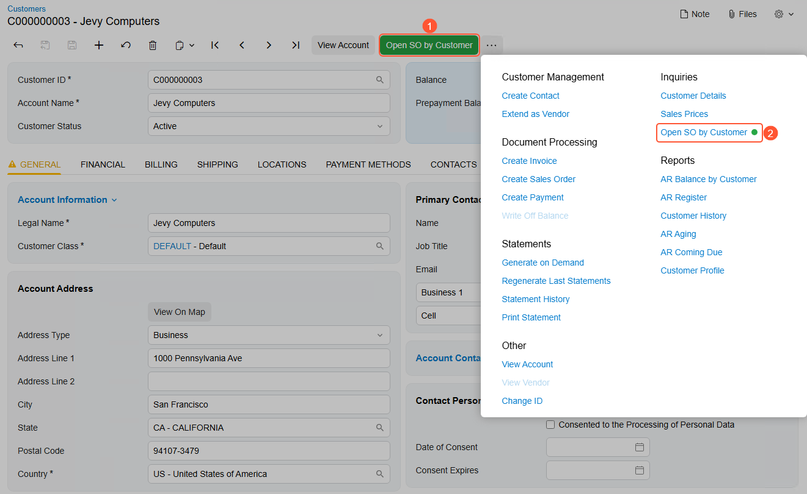

# Actions on Forms: To Add an Action to Open a Form {#_6cc01f14-b820-4ec9-b403-e049485746fa .task}

The following activity will walk you through the process of adding to a form an action that opens another form.

## Story { .section}

Suppose that management has determined that Acumatica ERP would better fit the needs of your company if from the [Customers](../UserGuide/AR_30_30_00.md) \(AR303000\) form, employees could quickly view the Open Sales Orders by Customer \(GI400001\) generic inquiry form for the selected customer. You need to add to the form the action that opens this generic inquiry.

## Process Overview { .section}

By using the [Actions](../UserGuide/AU_20_10_50.md) page of the Customization Project Editor, you will add a new action for the [Customers](../UserGuide/AR_30_30_00.md) \(AR303000\) form. You will then publish the customization project. Finally, you will test the added action on the form.

## System Preparation { .section}

Before you begin performing the steps of this activity, do the following:

1.  Prepare an Acumatica ERP instance by performing the [Customization Projects: To Deploy an Instance](CustomizationProjects_GettingStarted_Activity_CreateInstance.md) prerequisite activity.
2.  Create the *Yogifon* customization project by performing the [Customization Projects: To Create a Customization Project](CustomizationProjects_GettingStarted_Activity_CreateProject.md) prerequisite activity.
3.  Import the generic inquiry from the [SO-OpenByCustomer.xml](Files/SO-OpenByCustomer.xml) file to your instance as follows:
    1.  Open the [Generic Inquiry](../UserGuide/SM_20_80_00.md) \(SM208000\) form.
    2.  On the form toolbar, click **Clipboard** &gt; **Import from XML**.
    3.  In the **Upload XML File** dialog box, select the `SO-OpenByCustomer.xml` file.
    4.  Click **Upload**.
4.  On the More menu \(under **Other**\), click **Publish to the UI**.
5.  In the **Access Rights** section of the **Publish to the UI**, which opens, select **Set to Granted for All Roles** to make the system set the access rights for this generic inquiry to *Granted* for all user roles in the system.
6.  Click **Publish**.

## Step 1: Modifying the List of Customized Screens { .section}

To add a new tab on the [Customers](../UserGuide/AR_30_30_00.md) \(AR303000\) form, you first need to add the form to the list of customized screens. Do the following:

1.  On the [Customization Projects](../UserGuide/SM_20_45_05.md) \(SM204505\) form, click *Yogifon* to open the Customization Project Editor for this customization project.
2.  In the navigation pane of the Customization Project Editor, click **Screens**.

    The [Screens](../UserGuide/AU_20_10_00.md) page opens.

3.  On the page toolbar, click **Customize Existing Screen**.

    The **Customize Existing Screen** dialog box opens.

4.  In the **Select Screen** box of the dialog box, click the magnifier button. In the lookup table, type `AR303000` in the Search box, and double-click the *Customers* form.
5.  Click **OK** to close the dialog box.

    The [Customers](../UserGuide/AR_30_30_00.md) form is added to the list of forms on the [Screens](../UserGuide/AU_20_10_00.md) page, and the Screen Editor: AR303000 \(Customers\) page opens.

## Step 2: Adding an Action to the Customers Form { .section}

To add an action to the [Customers](../UserGuide/AR_30_30_00.md) \(AR303000\) form that opens a generic inquiry form, do the following in the Customization Project Editor for the *Yogifon* project:

1.  In the navigation pane, click **Screens** &gt; **AR303000** &gt; **Actions**. The [Actions](../UserGuide/AU_20_10_50.md) page opens.

    **Tip:** Notice that in the name that appears on the [Actions](../UserGuide/AU_20_10_50.md) page, *AR303000 \(Customers\) Actions*, *Actions* is preceded by the form ID and then the form name in parentheses.

2.  On the page toolbar, click **Add New Action**.
3.  In the **Action Properties** dialog box, which opens, specify the following values, as shown in the screenshot below:
    -   **Action Name**: `SOOpenByCustomer`

        **Attention:** This box does not contain the name that is displayed on the UI; it contains the internal name of the action that will be used in the automatically generated code of the action. The name should not be the same as the name of any existing action and should not contain spaces or the *@* symbol.

    -   **Display Name**: `Open SO by Customer`

        This is the name of the action that will be displayed on the UI.

    -   **Action Type**: *Navigation: Search Records*

        This type of action provides redirection to a form. For details on other types of actions, see [Action Configuration: General Information](../DeveloperGuide/WorkflowUI_Actions_GeneralInfo.md).

    -   **Category**: *Inquiries*

        This setting indicates that the **Open SO by Customer** command is shown under **Inquiries** on the More menu.

    -   **Destination Screen**: *GI400001* \(*Open Sales Orders by Customer*\)

        This is the screen that will open when a user clicks the associated menu command.

    -   **Window Mode**: *New Tab*

        With this setting, if a user clicks the **Open SO by Customer** command on the More menu, the destination generic inquiry form opens in a new browser tab.

    -   **Connotation**: *Success*

        This setting indicates that the system will mark this command on the More menu with a green dot and highlight the associated button on the form toolbar in green.

4.  On the **Navigation Parameters** tab, add two rows with the following settings \(also shown in the following screenshot\).

    |Active|Parameter Name|From Schema|Value|
    |------|--------------|-----------|-----|
    |Selected|*Customer \(form filter\)*|Cleared|*\[Customer ID\]*|
    |Selected|*Date From \(form filter\)*|Selected|*@YearStart*|

    These settings indicate that the Open SO by Customer \(GI400001\) generic inquiry form should be opened for the current customer, and that the date of the sales orders must be January 1 of the current year or later.

    

5.  Click **Save**. The dialog box is closed, and the row for the new action is listed on the [Actions](../UserGuide/AU_20_10_50.md) page.
6.  On the main menu of the Customization Project Editor, click **Publish** &gt; **Publish Current Project**.
7.  Wait until the *Website updated* row appears in the **Compilation** pane, and click **Close Compilation Pane**.

## Step 3: Testing the New Action { .section}

To test the action that you have added, do the following in Acumatica ERP:

1.  On the Company and Branch Selection menu in the top pane of the screen, select the *MyStore* branch.
2.  On the [Customers](../UserGuide/AR_30_30_00.md) \(AR303000\) form, open the record with the *C000000003* customer ID.

    Notice that the **Open SO by Customer** button on the form toolbar is highlighted in green \(see Item 1 below\).

3.  On the More menu \(under **Inquiries**\), click **Open SO by Customer**, which has a green dot to the right of it \(Item 2\).

    

4.  Make sure that the Open Sales Orders by Customer \(GI400001\) generic inquiry form opens in a new browser tab.
5.  In the **Date From** box of the Selection area, select *1/1/2025*.
6.  Make sure that the generic inquiry form displays sales orders for the *C000000003* customer ID with dates starting with January 1, 2025.

**Parent topic:**[Adding Actions to Forms](../CustomizationPlatform/CustomizationProjects_AddingActions_Mapref.md)

