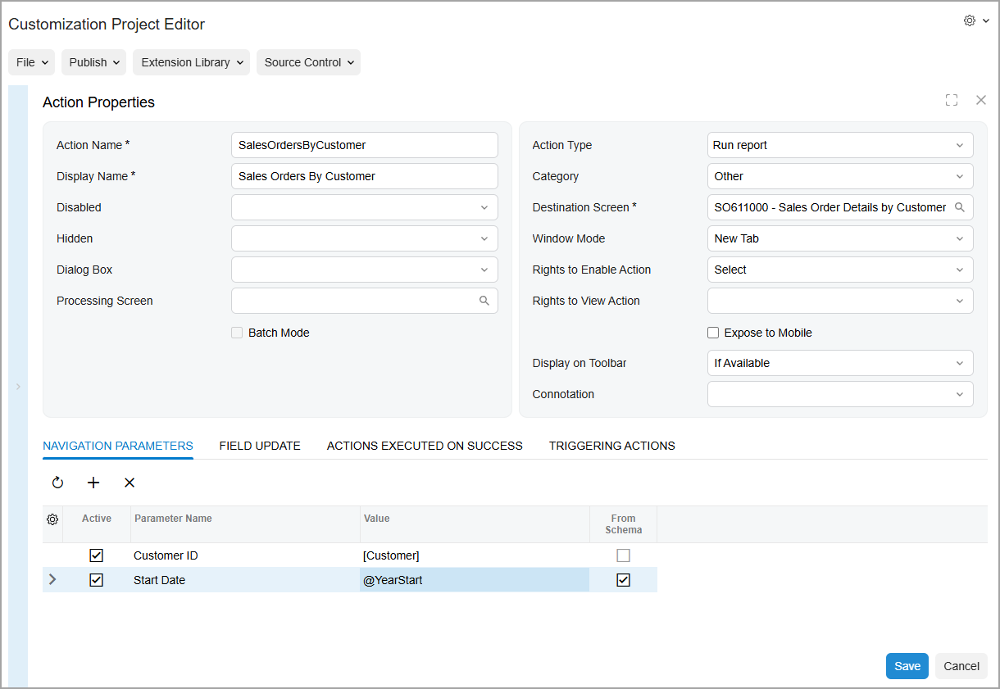

# Actions on Forms: To Add an Action to Run a Report {#_55826d81-4d18-4706-a6f8-0447bf7ed8aa .task}

The following activity will walk you through the process of adding an action that a user can invoke to run a report.

## Story { .section}

Suppose that management has determined that Acumatica ERP would better fit the needs of your company if from the [Sales Orders](../UserGuide/SO_30_10_00.md) \(SO301000\) form, employees could quickly access the [Sales Order Details by Customer](../UserGuide/SO_61_10_00.md) \(SO611000\) report for the selected customer. You need to add to the form the action that runs this report.

## Process Overview { .section}

On the [Screens](../UserGuide/AU_20_10_00.md) page, you will add the [Sales Orders](../UserGuide/SO_30_10_00.md) \(SO301000\) form so that it can be customized. On the [Actions](../UserGuide/AU_20_10_50.md) page, you will add a new action that runs the [Sales Order Details by Customer](../UserGuide/SO_61_10_00.md) \(SO611000\) report. You will then publish the customization project. On the [Sales Orders](../UserGuide/SO_30_10_00.md) form, you will test the added action.

## System Preparation { .section}

Before you begin performing the steps of this activity, do the following:

1.  Prepare an Acumatica ERP instance by performing the [Customization Projects: To Deploy an Instance](CustomizationProjects_GettingStarted_Activity_CreateInstance.md) prerequisite activity.
2.  Create the *Yogifon* customization project by performing the [Customization Projects: To Create a Customization Project](CustomizationProjects_GettingStarted_Activity_CreateProject.md) prerequisite activity.

## Step 1: Modifying the List of Customized Screens { .section}

To add an action to the [Sales Orders](../UserGuide/SO_30_10_00.md) \(SO301000 form, you first need to add the form to the list of customized screens. Do the following:

1.  On the [Customization Projects](../UserGuide/SM_20_45_05.md) \(SM204505\) form, click *Yogifon* to open the Customization Project Editor for this customization project.
2.  In the navigation pane of the Customization Project Editor, click **Screens**.

    The [Screens](../UserGuide/AU_20_10_00.md) page opens.

3.  On the page toolbar, click **Customize Existing Screen**.

    The **Customize Existing Screen** dialog box opens.

4.  In the **Select Screen** box of the dialog box, click the magnifier button. In the lookup table, type `SO301000` in the Search box, and double-click the *Sales Orders* form.
5.  Click **OK** to close the dialog box.

    The [Sales Orders](../UserGuide/SO_30_10_00.md) form is added to the list of forms on the [Screens](../UserGuide/AU_20_10_00.md) page, and the Screen Editor: SO301000 \(Sales Orders\) page opens.

## Step 2: Adding the Action { .section}

To add the action to the [Sales Orders](../UserGuide/SO_30_10_00.md) \(SO301000\) form, perform the following instructions:

1.  In the navigation pane of the Customization Project Editor, click **Screens** &gt; **SO301000** &gt; **Actions**.

    The SO301000 \(Sales Orders\) Actions page opens.

2.  On the page toolbar, click **Add New Action**.
3.  In the **Action Properties** dialog box, which opens, specify the following settings \(see the screenshot below\):
    -   **Action Name**: `SalesOrdersByCustomer`

        **Attention:** This box does not contain the name that is displayed on the UI; it contains the internal name of the action that will be used in the automatically generated code of the action. The name should not be the same as the name of any existing action and should not contain spaces or the *@* symbol.

    -   **Display Name**: `Sales Orders By Customer`

        This is the name of the action that will be displayed on the UI.

    -   **Action Type**: *Run Report*

        This type of action provides redirection to a report. For details on other types of actions, see [Actions on Forms: General Information](CustomizationProjects_AddingActions_GeneralInfo.md).

    -   **Category**: *Other*

        The command associated with the action will be displayed under the **Other** category of the More menu.

    -   **Destination Screen**: *SO611000*

        This is the screen that should open when the action is invoked.

    -   **Window Mode**: *New Tab*

        This setting indicates that if a user clicks the **Sales Orders By Customer** button or menu command, this report opens in a new browser tab.

    -   **Rights to Enable Action**: *Select*

        This setting indicates that a user should have the rights to view the report form that the action will open \([Sales Orders](../UserGuide/SO_30_10_00.md) in this case\) for the action to be available.

    -   **Display on Toolbar**: *If Available*

        With this option selected, the button associated with the action will be displayed on the form toolbar if the action is available for the selected record based on its state \(status\), in addition to the associated menu command being displayed on the More menu.

4.  On the **Navigation Parameters** tab, add two rows with the following settings \(also shown in the following screenshot\).

    |Active|Parameter Name|From Schema|Value|
    |------|--------------|-----------|-----|
    |Selected|*Customer ID*|Cleared|*\[Customer\]*|
    |Selected|*Start Date*|Selected|*@YearStart*|

    These settings indicate that when a user clicks the button or menu command, the report should open for the customer specified in the sales order, and the dates of the sales orders should be January 1 of the current year. \(By default, the report displays the sales orders placed within the current month.\)

    

5.  Click **Save** to close the dialog box.

    Notice that the new action has been added to the list of actions, and that its status is *New* \(which means that this action has not been inherited from a predefined action, but has instead been created from scratch\).

6.  On the main menu of the Customization Project Editor, click **Publish** &gt; **Publish Current Project**.
7.  Wait until the *Website updated* row appears in the **Compilation** pane, and click **Close Compilation Pane**.

## Step 3: Testing the New Action { .section}

In Acumatica ERP, test your changes as follows:

1.  On the Company and Branch Selection menu on the top pane of the Acumatica ERP screen, make sure that the *MyStore* branch is selected.

    If it is not selected, click the selection menu to view the list of branches that you have access to, and then click *MyStore*.

2.  In the info area, in the upper-right corner of the top pane of the Acumatica ERP screen, make sure that the business date in your system is set to *10/31/2025*. If a different date is displayed, click the Business Date menu button, and select *10/31/2025* from the calendar.
3.  On the [Sales Orders](../UserGuide/SO_30_10_00.md) \(SO301000\) form, select the sales order with the *000002* ID. \(It has the *Open* status.\)

    Notice the customer specified for this sales order \(*C00000008*\).

4.  Notice that the form toolbar now contains the **Sales Orders By Customer** button, based on the settings that you have specified for the action. On the More menu, notice that the **Other** category also contains the command associated with this action.
5.  Click the **Sales Orders By Customer** command.

    The [Sales Order Details by Customer](../UserGuide/SO_61_10_00.md) \(SO611000\) report opens for the current customer in a new browser tab.

**Parent topic:**[Adding Actions to Forms](../CustomizationPlatform/CustomizationProjects_AddingActions_Mapref.md)

