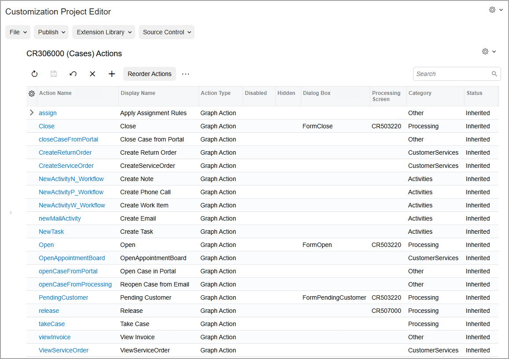

# Actions on Forms: General Information {#_1e2a00c3-f622-4120-b3a8-5beaca58cac3 .concept}

When you customize a form, you may need to add actions that invoke specific operations.

## Learning Objectives { .section}

In this chapter, you will learn how to do the following:

-   Add actions to a form, which appear on the form as buttons on the form toolbar and commands on the More menu
-   Test the buttons and commands associated with the added actions

## Applicable Scenarios { .section}

You add actions to a form in the following cases:

-   The default commands on the More menu and buttons on the form toolbar do not provide the needed functionality
-   You want to give users quick access to operations that they need to perform regularly

## Configuration of Actions for a Form { .section}

Before you start configuring actions for a particular form, you need to make sure that this form has been added to the customization project on the [Screens](../UserGuide/AU_20_10_00.md) page. You can configure the following types of actions:

-   Actions that redirect a user to a different form or report
-   Actions that open a side panel with supplementary information
-   Actions defined in a graph
-   Workflow actions that change the state of the applicable record

In this chapter, you will learn about the configuration of actions of the first two types. You can create graph actions only in the code \(see [Action Customization: General Information](../StudioDeveloperGuide/CodeCustomization_ActionsCustomization_GeneralInfo.md) for details\). For details on how to add actions that perform transitions in a workflow, see topics in the [Configuring Actions](../DeveloperGuide/WorkflowUI_Actions_Mapref.md) and [Implementing Workflow Actions](../DeveloperGuide/WorkflowAPI_Actions_Mapref.md) chapters.

## Use of the Actions Page { .section}

When you want to add an action to a form, you use the [Actions](../UserGuide/AU_20_10_50.md) page of the Customization Project Editor. The following screenshot shows the [Actions](../UserGuide/AU_20_10_50.md) page for the [Cases](../UserGuide/CR_30_60_00.md) \(CR306000\) form. This page contains predefined actions—that is, actions that are defined for the form in the out-of-the box system.

**Tip:** In the name that appears on the page, which is *CR306000 \(Cases\) Actions* in the screenshot, *Actions* is preceded by the form ID and then the form name in parentheses, so that you can always see at a glance which form's actions you are customizing.

## Modification of the Form's Actions { .section}

You modify a form's actions in any of the following ways:

-   Add predefined actions that are not listed on the [Actions](../UserGuide/AU_20_10_50.md) page. These are actions that are predefined in the system for this form but that Acumatica developers have not added to the form's workflow.
-   Add actions that you create to meet your users' specific needs.
-   Modify the properties of any action defined for the form \(and thus listed on the page\), regardless of whether it is predefined or created by a customizer.

To understand which of the listed actions are predefined and which are new, you review the **Status** column for each action. Predefined actions that Acumatica developers have added to this page for this form have the *Inherited* status. All actions that you have added to the [Actions](../UserGuide/AU_20_10_50.md) page \(including existing graph actions\) have the *New* status. If you have modified a predefined action, its status changes to *Modified*.

On the [Actions](../UserGuide/AU_20_10_50.md) page, you add an action by clicking **Add New Action** on the page toolbar, and specifying the action settings in the **Action Properties** dialog box. Depending on the type of the action, you can specify any of the following settings for it:

-   The dialog box that the system should display when a user invokes the action
-   An indication of whether the action is disabled or hidden on the form
-   The category of the More menu in which the menu command associated with the action should be displayed
-   An indication of whether the action should be displayed on the form toolbar as a button
-   The connotation for the action
-   The access rights that a user needs to invoke the action and to be able to view it on the form

Additionally, you can specify the navigation parameters for the action, and the fields that the system should update when the user invokes this action. For the graph actions, on the **Action Parameters** tab, you can specify a set of action parameters and their values; these values should be assigned before the action method is invoked.

**Attention:** The internal name and type of the action cannot be changed after the action is created.

If you add an existing action to the form, some of the boxes in the **Action Properties** dialog box are unavailable for editing.

You can also change the order in which the menu commands associated with the actions are displayed under categories of the More menu, and manage categories of the More menu. If no category is specified for an action, its command will be listed under the **Other** category. For details, see [Action Configuration: General Information](../DeveloperGuide/WorkflowUI_Actions_GeneralInfo.md).

If you have modified any predefined actions, you can view the changes by clicking **View Changes** on the More menu of the [Actions](../UserGuide/AU_20_10_50.md) page. You can also return the action properties to the original predefined state by clicking **Reverse Changes** on the More menu \(under **Changes**\).

## Addition of Actions Defined in the Graph { .section}

For a particular Acumatica ERP form, you can add actions that are defined in the graph that corresponds to the form. To add such action, you click **Add Existing Action** on the More menu of the [Actions](../UserGuide/AU_20_10_50.md) page opened for the form. By default, these actions are displayed on the form according to the properties of the [PXButton](https://help.acumatica.com/(W(124))/Help?ScreenId=ShowWiki&pageid=e1a6f32e-fa9b-010a-b85f-0b2c2ffa0fea) attribute specified for the action, which the *As Configured in Graph* option in the [Action Properties Dialog Box](../UserGuide/AU_20_10_50.md#_aa40d598-72fc-4232-b46b-ef3bc75825d2) indicates.

**Parent topic:**[Adding Actions to Forms](../CustomizationPlatform/CustomizationProjects_AddingActions_Mapref.md)

