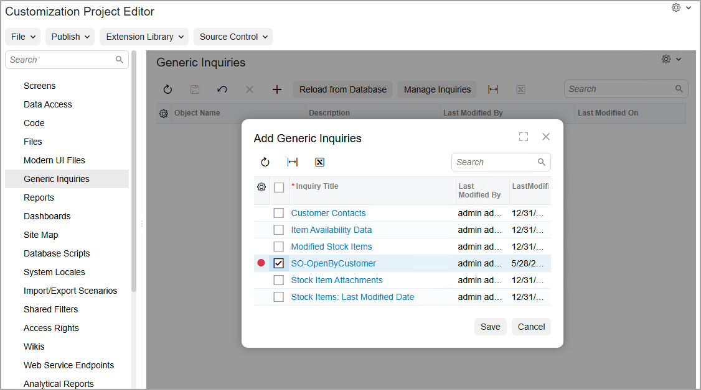
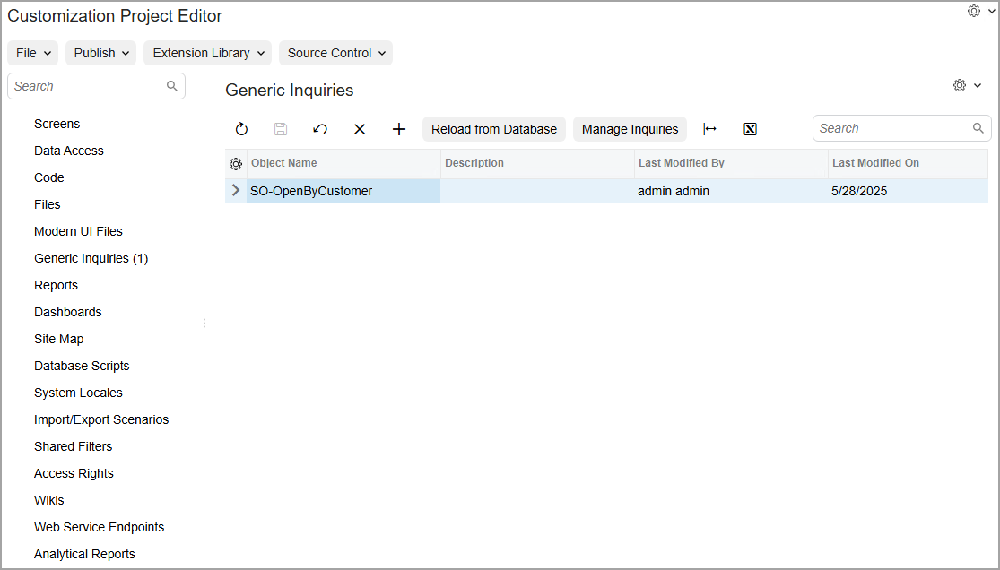
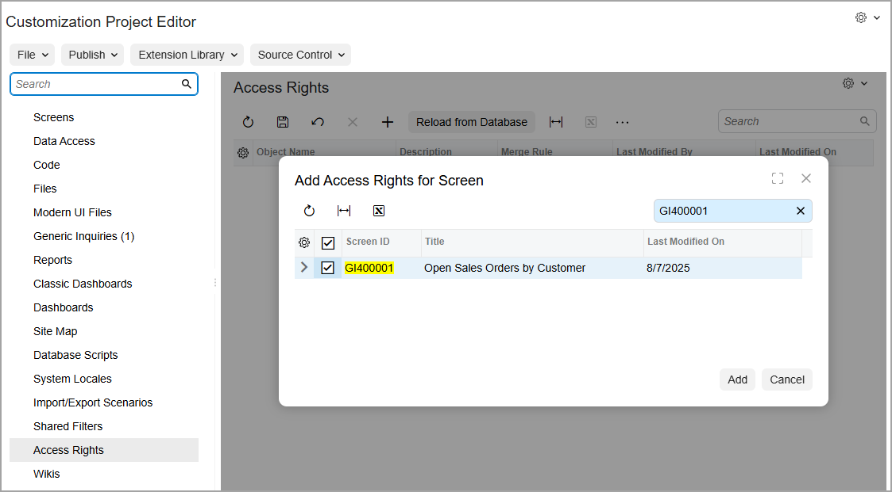
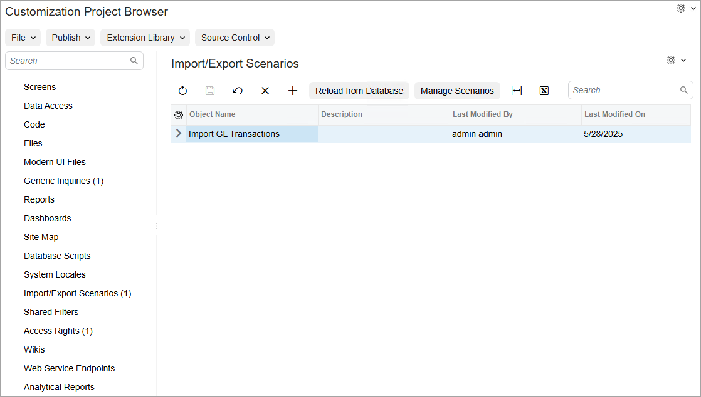

# Customization Items: To Add Items to the Customization Project {#_5b670793-e1d9-4a6f-97ec-65d9c06efa43 .task}

The following activity will walk you through the process of adding a generic inquiry and an import scenario to a customization project.

## Story { .section}

Suppose that the employees of your company often need to review all sales orders of a particular customer, and that you have already prepared a generic inquiry to view this information. You need to include this generic inquiry in the *Yogifon* customization project.

Also, you need to include the *Import GL Transactions* import scenario in the customization project. \(This import scenario, which employees will use to import general ledger transactions into the system, already exists in the instance.\)

## Process Overview { .section}

You will open the customization project in the Customization Project Editor, and use the [Generic Inquiries](../UserGuide/AU_20_60_00.md) and [Import and Export Scenarios](../UserGuide/AU_20_55_00.md) pages to add the needed items. You will also use the [Access Rights](../UserGuide/AU_20_52_00.md) page to add the access rights for one of the added items.

## System Preparation { .section}

Before you begin performing the steps of this activity, do the following:

1.  Prepare an Acumatica ERP instance by performing the [Customization Projects: To Deploy an Instance](CustomizationProjects_GettingStarted_Activity_CreateInstance.md) prerequisite activity.
2.  Create the *Yogifon* customization project by performing the [Customization Projects: To Create a Customization Project](CustomizationProjects_GettingStarted_Activity_CreateProject.md) prerequisite activity.
3.  Import the generic inquiry from the [SO-OpenByCustomer.xml](Files/SO-OpenByCustomer.xml) file to your instance as follows:
    1.  Open the [Generic Inquiry](../UserGuide/SM_20_80_00.md) \(SM208000\) form.
    2.  On the form toolbar, click **Clipboard** &gt; **Import from XML**.
    3.  In the **Upload XML File** dialog box, select the `SO-OpenByCustomer.xml` file.
    4.  Click **Upload**.
4.  On the More menu \(under **Other**\), click **Publish to the UI**.
5.  In the **Publish to the UI** dialog box, which opens, specify the following settings:
    -   **Site Map Title**: `Open Sales Orders by Customer`
    -   **Workspace**: *Receivables*
    -   **Category**: *Reports*
    -   **Screen ID**: *GI.40.00.01* \(inserted automatically\)
6.  In the **Access Rights** section, select the **Set to Granted for All Roles** option button to make the system set the access rights for this generic inquiry to *Granted* for all user roles in the system.
7.  Click **Publish**.

## Step 1: Adding the Imported Generic Inquiry to the Customization Project { .section}

To add the *SO-OpenByCustomer* generic inquiry to the customization project, do the following:

1.  Open the [Customization Projects](../UserGuide/SM_20_45_05.md) \(SM204505\) form.
2.  Click the name of the *Yogifon* customization project.

    The Customization Project Editor opens for this customization project.

3.  In the navigation pane, click **Generic Inquiries**.

    The [Generic Inquiries](../UserGuide/AU_20_60_00.md) page opens.

4.  On the page toolbar, click **Add New Record**.
5.  In the **Add Generic Inquiries** dialog box, which opens, select the unlabeled check box in the row with the *SO-OpenByCustomer* generic inquiry \(see the following screenshot\).

    

6.  Click **Save** to add the generic inquiry to the customization project and return to the [Generic Inquiries](../UserGuide/AU_20_60_00.md) page.

    The generic inquiry is saved as a customization item in the customization project, as shown in the following screenshot. Notice that it is listed on the [Generic Inquiries](../UserGuide/AU_20_60_00.md) page and that in the navigation pane, the system has added *\(1\)* after **Generic Inquiries**, indicating that the customization project now includes one generic inquiry.

    

    **Tip:** You do not need to add the [Generic Inquiry](../UserGuide/SM_20_80_00.md) \(SM208000\) form to the customization project because a generic inquiry is an entity created on this form but the [Generic Inquiry](../UserGuide/SM_20_80_00.md) form itself is not changed.

For more information on generic inquiries, see [Managing Generic Inquiries](../UserGuide/SM__MNG_Managing_Generic_Inquiry.md).

## Step 2: Specifying Access Rights for the Added Generic Inquiry { .section}

To add the access rights for the *SO-OpenByCustomer* generic inquiry to the customization project, do the following:

1.  While you’re still working in the Customization Project Editor, click **Access Rights** in the navigation pane.

    The [Access Rights](../UserGuide/AU_20_52_00.md) page opens.

2.  On the page toolbar, click **Add New Record**.
3.  In the **Add Access Rights for Screen** dialog box, which opens, do the following:
    -   In the Search box, type `GI400001`.

        This is the ID of the *SO-OpenByCustomer* generic inquiry.

    -   In the table, select the Included check box for the row with this inquiry \(see the following screenshot\).

        

    -   Click **Add** to add the access rights to the customization project and return to the [Access Rights](../UserGuide/AU_20_52_00.md) page.
4.  In the **Merge Rule** column of the page, select *Grant All*.

    The system will set the access rights to *Granted* for all user roles in the system.

5.  On the page toolbar, click **Save**.

    The access rights are saved as a customization item in the customization project.

For more information on access rights, see [To Add Access Rights to a Project](CG_GL_Items_AccessRights_Adding.md).

## Step 3: Adding the Import Scenario to the Customization Project { .section}

To add the *Import GL Transactions* scenario to the customization project, do the following:

1.  While you are still working in the Customization Project Editor, in the navigation pane, click **Import/Export Scenarios**.

    The [Import and Export Scenarios](../UserGuide/AU_20_55_00.md) page opens.

2.  On the page toolbar, click **Add New Record**.
3.  In the **Add Import or Export Scenario** dialog box, which opens, select the unlabeled check box in the row with the *Import GL Transactions* scenario.
4.  Click **Save** to close the dialog box and return to the [Import and Export Scenarios](../UserGuide/AU_20_55_00.md) page.
5.  On the page toolbar, click **Save**.

    The system adds the import scenario to the customization project as a customization item \(see the following screenshot\).

    

**Parent topic:**[Adding Customization Items to Customization Projects](../CustomizationPlatform/CustomizationProjects_AddingItems_Mapref.md)

