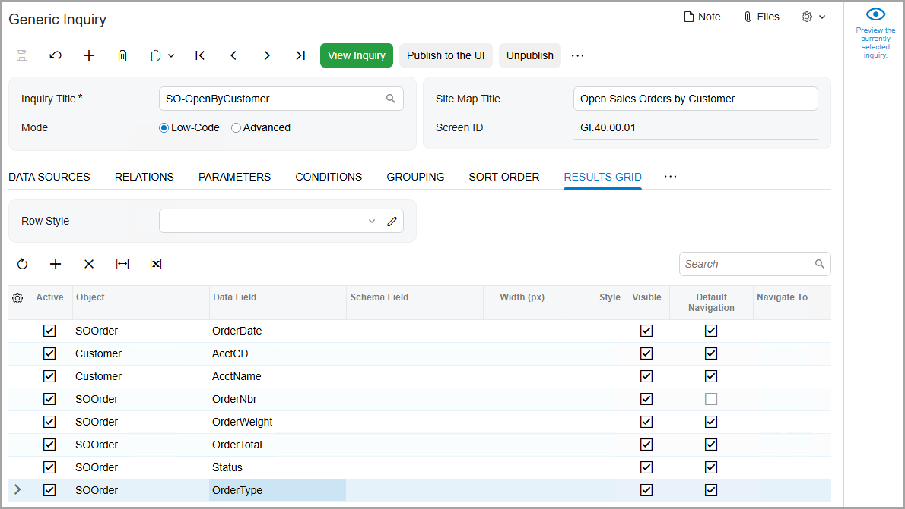
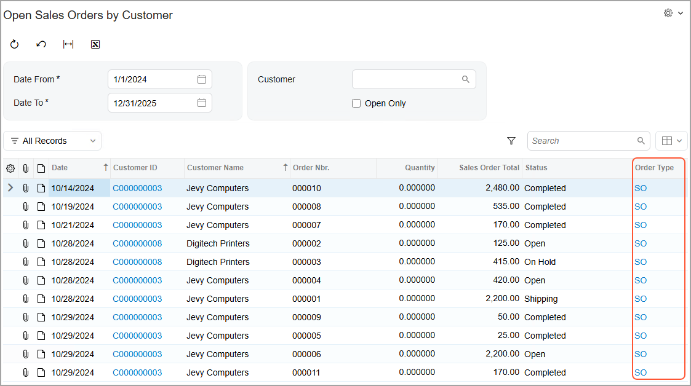

# Customization Items: To Update an Item in the Customization Project {#_1ba0bd68-5552-414f-aa49-0ad225705436 .task}

The following activity will walk you through the process of updating a customization item in the customization project.

## Story { .section}

Suppose that you need to update the *SO-OpenByCustomer* generic inquiry in your Acumatica ERP instance. You need to reflect the changes in the customization project by updating the corresponding customization item.

## Process Overview { .section}

You will modify the generic inquiry on the [Generic Inquiry](../UserGuide/SM_20_80_00.md) \(SM208000\) form of the Acumatica ERP instance and then update the customization item in the customization project.

## System Preparation { .section}

Before you begin performing the steps of this activity, do the following:

1.  Prepare an Acumatica ERP instance by performing the [Customization Projects: To Deploy an Instance](CustomizationProjects_GettingStarted_Activity_CreateInstance.md) prerequisite activity.
2.  Create the *Yogifon* customization project by performing the [Customization Projects: To Create a Customization Project](CustomizationProjects_GettingStarted_Activity_CreateProject.md) prerequisite activity.
3.  Make sure that you have completed the [Customization Items: To Add Items to the Customization Project](CustomizationProjects_AddingItems_Activity_AddItems.md) prerequisite activity.

## Step 1: Modifying the Generic Inquiry { .section}

To modify the *SO-OpenByCustomer* generic inquiry and add a column for the sales order type \(**Order Type**\) to the generic inquiry form, do the following:

1.  In Acumatica ERP, open the [Generic Inquiry](../UserGuide/SM_20_80_00.md) \(SM208000\) form.
2.  In the **Inquiry Title** box of the Summary area, select *SO-OpenByCustomer*.
3.  On the table toolbar of the **Results Grid** tab, click **Add Row**.
4.  In the new row, specify the following settings:
    -   **Active**: Selected
    -   **Object**: *SOOrder* \(specified automatically\)
    -   **Data Field**: *OrderType*
5.  Save your changes.

    The following screenshot shows the generic inquiry after these changes.

    

6.  On the form toolbar, click **View Inquiry**.
7.  In the **Date From** box,select *1/1/2025*.

    The system displays the resulting Open Sales Orders by Customer \(GI400001\) generic inquiry form, which reflects the changes you have made. Make sure that the table now contains the **Order Type** column, which you have added \(see the following screenshot\).

    

## Step 2: Updating the Generic Inquiry in the Customization Project { .section}

In this step, you will update the *GenericInquiryScreen* customization item, which corresponds to the generic inquiry in the customization project. Do the following:

1.  Open the *Yogifon* project in the Customization Project Editor, as you did in [Customization Items: To Add Items to the Customization Project](CustomizationProjects_AddingItems_Activity_AddItems.md).
2.  In the navigation pane, click **Generic Inquiries**.

    The [Generic Inquiries](../UserGuide/AU_20_60_00.md) page opens.

3.  On the page toolbar, click **Reload from Database**. The customization item for the *SO-OpenByCustomer* generic inquiry is updated in the project.

    **Tip:** The page contains only one generic inquiry, and it is selected by default. If multiple generic inquiries had been listed on the page, you would have needed to first click the row with the generic inquiry that you want to update and then click **Reload from Database**.

**Parent topic:**[Adding Customization Items to Customization Projects](../CustomizationPlatform/CustomizationProjects_AddingItems_Mapref.md)

