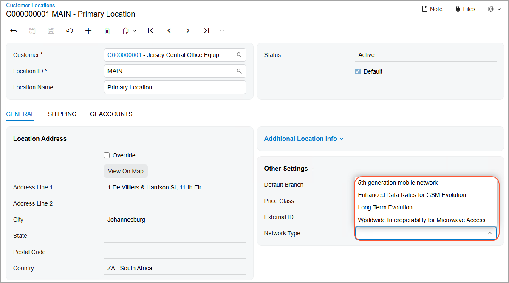
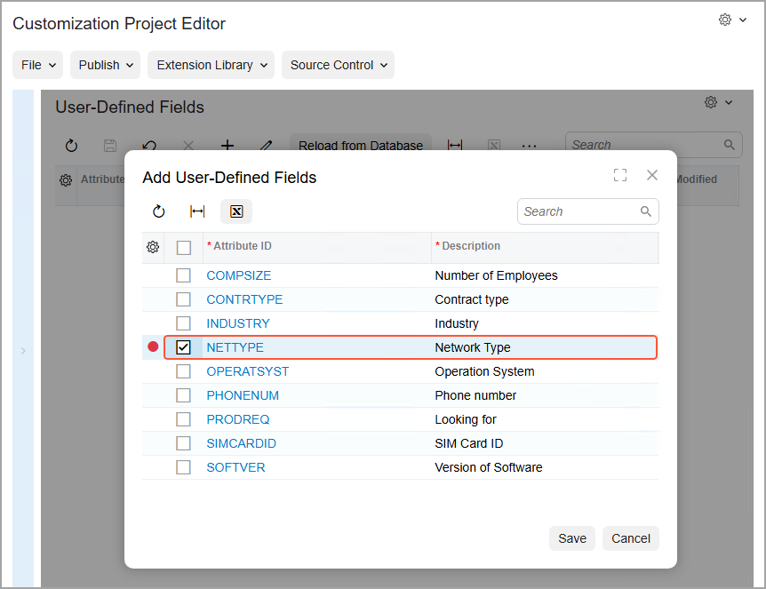

# User-Defined Fields in Customization Projects: Process Activity {#_8e840656-9dd4-46c9-95fb-46c1de7fe4bf .task}

The following activity will walk you through the process of adding a user-defined field to the [Customer Locations](../UserGuide/AR_30_30_20.md) \(AR303020\) form and then adding this field to a customization project.

## Story { .section}

Suppose that for each customer location in the system, you want the user to specify the network type that this customer is using. The box that corresponds to the network type does not yet exist in the system. You need to add it as a user-defined field and make this field part of the customization project.

## Process Overview { .section}

By using the [Attributes](../UserGuide/CS_20_50_00.md) \(CS205000\) form, you will create an attribute. In UI Configuration mode for the [Customer Locations](../UserGuide/AR_30_30_20.md) \(AR303020\) form, you will associate a user-defined field that is based on the created attribute with the form, and then add this field to the form. In the Customization Project Editor, you will then add the user-defined field to the [User-Defined Fields](../UserGuide/AU_23_00_00.md) page.

## System Preparation { .section}

Before you begin performing the steps of this activity, do the following:

1.  Prepare an Acumatica ERP instance by performing the [Customization Projects: To Deploy an Instance](CustomizationProjects_GettingStarted_Activity_CreateInstance.md) prerequisite activity.
2.  Create the *Yogifon* customization project by performing the [Customization Projects: To Create a Customization Project](CustomizationProjects_GettingStarted_Activity_CreateProject.md) prerequisite activity.

## Step 1: Defining the Attribute { .section}

To add a new attribute that holds the network type of the customer location, do the following on the [Attributes](../UserGuide/CS_20_50_00.md) \(CS205000\) form of Acumatica ERP:

1.  Add a new attribute and specify the following settings for it:
    -   **Attribute ID**: `NETTYPE`
    -   **Description**: `Network Type`

        The description will be used as the name of the element on the **User-Defined Fields** tab of the [Customer Locations](../UserGuide/AR_30_30_20.md) \(AR303020\) form.

    -   **Control Type**: *Combo*
2.  In the table, enter the values that will be available for selection in the **Network Type** combo box by adding rows and entering the settings listed in each of the following rows.

    |Value ID|Description|Sort Order|
    |--------|-----------|----------|
    |`5G`|`5th generation mobile network`|`1`|
    |`EDGE`|`Enhanced Data Rates for GSM Evolution`|`2`|
    |`LTE`|`Long-Term Evolution`|`3`|
    |`WiMAX`|`Worldwide Interoperability for Microwave Access`|`4`|

3.  On the form toolbar, click **Save**.

## Step 2: Associating the User-Defined Field with a Form { .section}

Now you will associate the user-defined field with the [Customer Locations](../UserGuide/AR_30_30_20.md) \(AR303020\) form. The field is based on the attribute that you created in the previous step. On this form, do the following:

1.  On the form title bar, click **Settings** &gt; **UI Configuration**.
2.  On the UI Configuration pane, which opens at the top of the form, click **Manage User-Defined Fields**.

    The **Manage User-Defined Fields** dialog box opens.

3.  On the table toolbar of the **Added User-Defined Fields** pane, click **Add Row**.
4.  In the lookup table for the added row, select *NETTYPE*.
5.  Click **Apply**. The dialog box is closed, and the new field \(with the specified attribute\) becomes associated with the [Customer Locations](../UserGuide/AR_30_30_20.md) form.

## Step 3: Adding the User-Defined Field to the Form { .section}

While you are still working in UI Configuration mode, do the following to add the new user-defined field to the [Customer Locations](../UserGuide/AR_30_30_20.md) \(AR303020\) form:

1.  Select the *C000000001* customer.
2.  Click the Settings button in the top-right corner of the **Other Settings** fieldset.

    The **Section Configuration** dialog box opens.

3.  In the **Available Elements** section, click the **Network Type** field under the **User-Defined Fields** node, and then click the arrow button to add the field to the **Selected Elements** pane.
4.  Click **Apply**.
5.  On the form title bar, click **Apply to All**.
6.  In the **Apply to All** dialog box, which opens, click **Overwrite Personal Configuration**.

    The new field is added to the form, and the list of its values is the same as for the underlying attribute \(see the following screenshot\).

    

7.  In the **Network Type** box, select *Long-Term Evolution*.
8.  On the form toolbar, click **Save**.

## Step 4: Adding the User-Defined Field to the Customization Project { .section}

To add the **Network Type** user-defined field to the *Yogifon* customization project, do the following:

1.  On the [Customization Projects](../UserGuide/SM_20_45_05.md) \(SM204505\) form, click *Yogifon* to open the Customization Project Editor for this customization project.
2.  In the navigation pane of the Customization Project Editor, click **User-Defined Fields**.

    The [User-Defined Fields](../UserGuide/AU_23_00_00.md) page opens.

3.  On the page toolbar, click **Add New Record**.
4.  In the **Add User-Defined Fields** dialog box, which opens, select the unlabeled check box in the row with the *NETTYPE* attribute ID, as shown in the following screenshot.

    

5.  Click **Save**.

    The dialog box closes, and a new row with the settings of the **Network Type** user-defined field \(including the associated attribute and the form ID\) appears on the [User-Defined Fields](../UserGuide/AU_23_00_00.md) page.

**Parent topic:**[Adding User-Defined Fields to Customization Projects](../CustomizationPlatform/CustomizationProjects_AddingUserDefinedFields_Mapref.md)

