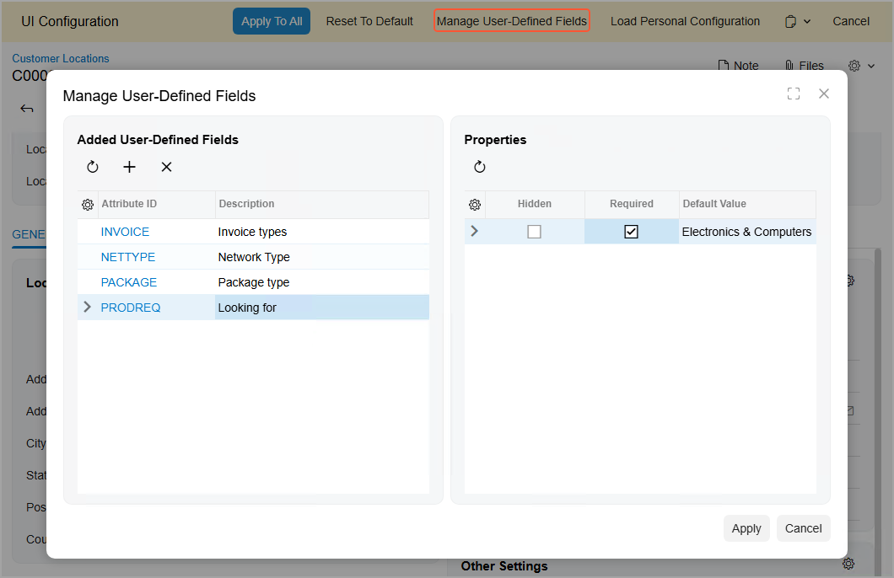
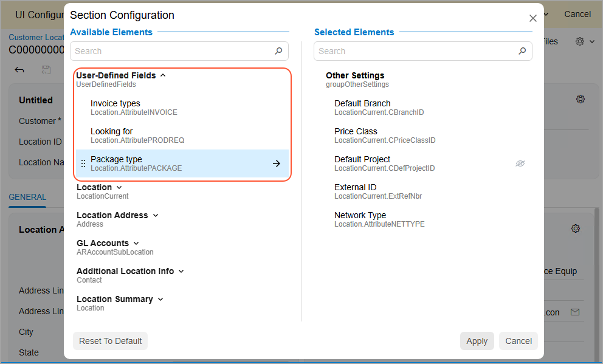

# User-Defined Fields in Customization Projects: General Information {#_3111ef0d-b56d-435b-8c9b-ff297eb4a0ed .concept}

By using the Acumatica Customization Platform, you can add boxes for fields that were already defined in the database of the Acumatica ERP instance \(see [Form Layout: General Information](CustomizationProjects_ConfiguringFormLayout_GeneralInfo.md) for details\). If you need to add elements to a form that do not exist in an out-of-the-box system, you have the ability to create *user-defined fields*. You can then transfer these user-defined fields to another instance by adding them to your customization project.

## Learning Objectives { .section}

In this chapter, you will learn how to do the following:

-   Define an attribute for a user-defined field
-   Add the user-defined field to a form
-   Add the user-defined field to a customization project

## Applicable Scenarios { .section}

You add user-defined fields to a customization project if you have made the following changes in your Acumatica ERP instance and you want to replicate these changes in another instance:

-   You have added to a form at least one element that does not exist in an out-of-the-box system.
-   Because of the user-defined fields you have added, the company has been able to gather additional information about records, and it wants to gather this information in other instances as well.

## User-Defined Fields and Attributes { .section}

A user-defined field is based on an *attribute*: a property \(such as age or industry\) that you define in Acumatica ERP so that users can specify additional information for particular entities in the system. Attributes may carry information about such factors as product brand, manufacturer, lead age, gender, or industry. For details, see [Attributes](../UserGuide/CS__con_Attributes.md).

For some entities, attributes can be assigned to an entity class and displayed on the **Attributes** tab of the corresponding data entry form. However, the functionality of using the **Attributes** tab is not available for all entities. In the latter case, attributes can be added as user-defined fields to a group of elements of a data entry form. See [User-Defined Fields](../UserGuide/CS__con_User_Defined_Fields.md) for a list of the forms that support user-defined fields.

## Managing User-Defined Fields of a Form {#section_om3_zfh_xfc .section}

Adding each user-defined field to a form involves the following steps:

1.  Selecting or creating the attribute that will be used as the user-defined field.
2.  Associating the selected field with the desired form.
3.  Adding the field as a UI element to the desired section of the form.

## Associating the Field with the Form {#section_qm3_zfh_xfc .section}

To associate a user-defined field with the form where it will be shown, you open this form and use the **Manage User-Defined Fields** dialog box \(shown in the screenshot below\). To open the dialog box, you first turn on UI Configuration mode by clicking the Settings button on the form title bar and then clicking **UI Configuration**. Then you click the **Manage User-Defined Fields** button at the top of the form.

In the **Manage User-Defined Fields** dialog box, you can perform the following actions:

-   To associate a user-defined field with the form, click the **Add Row** button in the **Added User-Defined Fields** pane and specify the ID of the attribute in the **Attribute ID** column.
-   To remove a user-defined field from a form, first click the row in the **Added User-Defined Fields** pane and then click the **Delete Row** button on the table toolbar.
-   To refresh the list of user-defined fields, click the **Refresh** button on the table toolbar of the **Added User-Defined Fields** pane.
-   To refresh the list of properties, click the **Refresh** button on the table toolbar of the **Properties** pane.
-   To denote that a field should not be displayed on the form, select the desired field and record type \(if the form supports multiple types of records\) and select the **Hidden** check box.
-   To mark a field as mandatory, select the desired field and record type \(if the form supports multiple types of records\) and select the **Required** check box.
-   To specify the field's default value, select the desired field and record type \(if the form supports multiple types of records\) and specify the value in the **Default Value** column.
-   To close the dialog box and apply the changes to the user-defined fields, click **Apply** in the lower right corner.
-   To close the dialog box without saving any changes, click **Cancel** in the lower right corner.

## Adding a Field to the Form {#section_rm3_zfh_xfc .section}

Once user-defined fields are associated with the form, you can add them to any group of elements of the form by using the **Section Configuration** dialog box \(shown in the screenshot below\). To open the dialog box, you first turn on UI Configuration mode by clicking the Settings button on the form title bar and then clicking **UI Configuration**. You then click the Settings button in the top-right corner of the target group of elements.

User-defined fields associated with the form are listed under the **User-Defined Fields** node of the **Available Elements** pane. To add a field to the group of elements, locate the field in the **Available Elements** pane and drag it to the **Selected Elements** pane.

Once you have added all the needed user-defined fields, you click **Apply** to close the **Section Configuration** dialog box. You then click **Apply to All** in the UI Configuration pane to apply the layout changes to the form and turn off UI Configuration mode.

In this way, you can customize any form to display user-defined fields.

## User-Defined Fields in a Customization Project { .section}

The user-defined fields that you have added to your instance initially exist in only this instance. If you need to have the same fields in another instance, you perform the following general actions:

1.  In the source instance, you add the user-defined fields to a customization project by using the [User-Defined Fields](../UserGuide/AU_23_00_00.md) page.
2.  In the source instance, you export this customization project.
3.  In the target instance, you import the customization project.
4.  In the target instance, you publish the customization project.

For details on how to export and import projects, see [Project Publication: General Information](CustomizationProjects_PublishingProjects_GeneralInfo.md).

**Parent topic:**[Adding User-Defined Fields to Customization Projects](../CustomizationPlatform/CustomizationProjects_AddingUserDefinedFields_Mapref.md)

