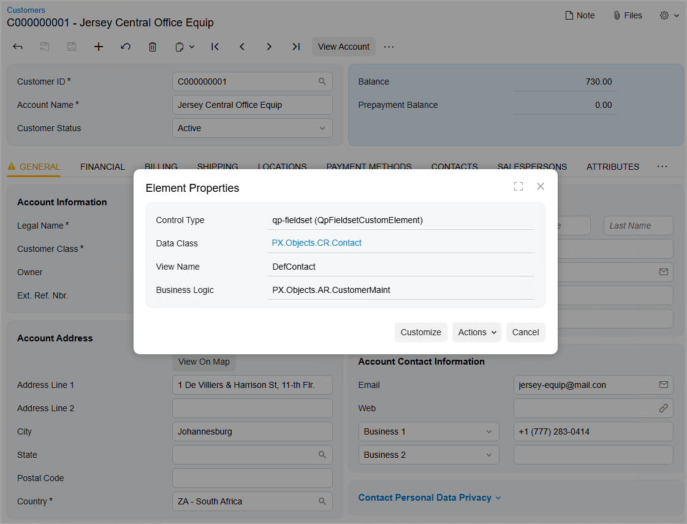
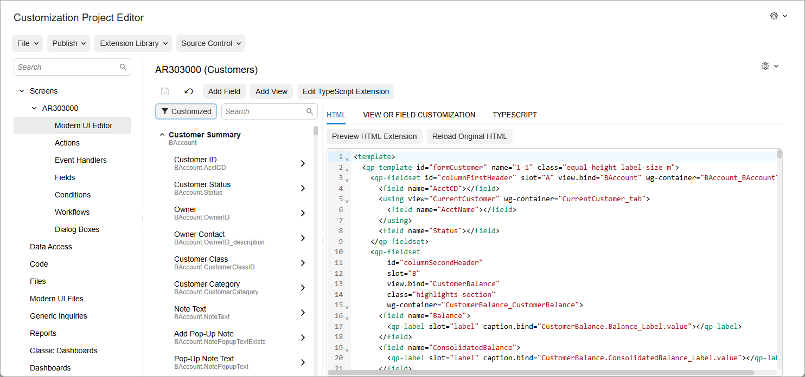
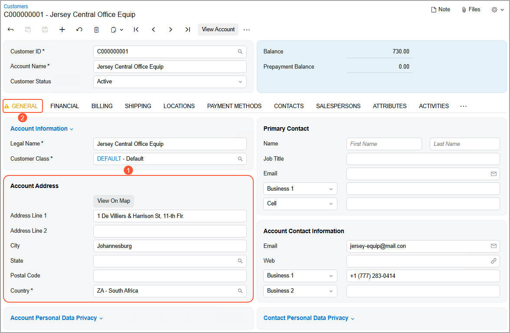
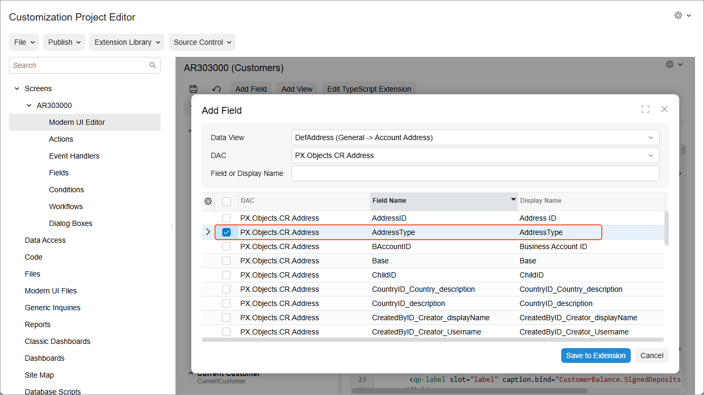
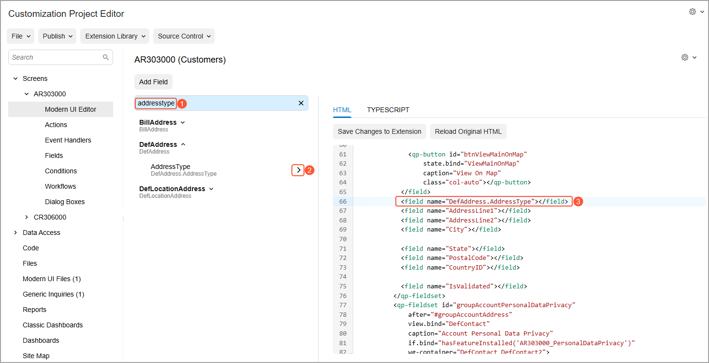
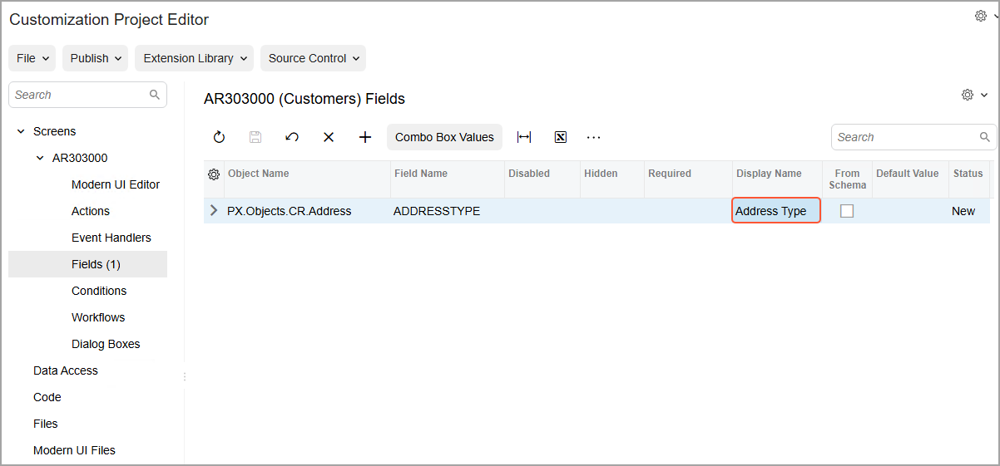
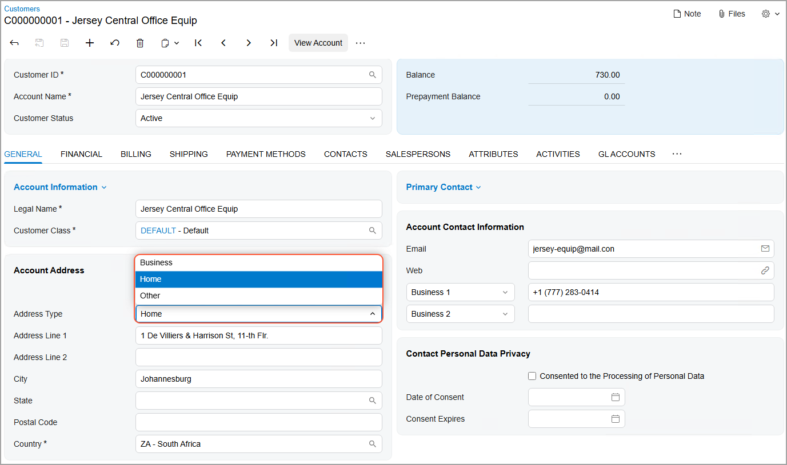

# Form Layout: To Add a Box to a Form {#_aff90be2-4fb4-41a3-b68c-5995205d6a1e .task}

The following activity will walk you through the process of adding a new box to a form.

## Story { .section}

Suppose that management has determined that Acumatica ERP would better fit the needs of your company if employees could specify the type of a customer’s address on the [Customers](../UserGuide/AR_30_30_00.md) \(AR303000\) form. The field that contains the address type is already available in the system. You need to add the corresponding box to the form.

## Process Overview { .section}

You will do the following to add a box for the customer's address type to the [Customers](../UserGuide/AR_30_30_00.md) \(AR303000\) form:

1.  By using the form as a starting point, use the [Element Inspector](../UserGuide/AU_ElementInspector.md) dialog box to open the [Screen Editor](../UserGuide/AU_20_45_20.md) page for the form.
2.  Add the field to the form on the [Modern UI Editor](../UserGuide/AU_20_10_80.md) page.
3.  Configure the added field's properties on the [Fields](../UserGuide/AU_20_10_60.md) page, and then publish the customization project.
4.  Test the changes on the [Customers](../UserGuide/AR_30_30_00.md) form.

## System Preparation { .section}

Before you begin performing the steps of this activity, do the following:

1.  Prepare an Acumatica ERP instance by performing the [Customization Projects: To Deploy an Instance](CustomizationProjects_GettingStarted_Activity_CreateInstance.md) prerequisite activity.
2.  Create the *Yogifon* customization project by performing the [Customization Projects: To Create a Customization Project](CustomizationProjects_GettingStarted_Activity_CreateProject.md) prerequisite activity.

## Step 1: Opening the Modern UI Editor Page from the Form { .section}

To start customizing a form from the form itself, open the [Screen Editor](../UserGuide/AU_20_45_20.md) page for the form by doing the following:

1.  In Acumatica ERP, on the [Customers](../UserGuide/AR_30_30_00.md) \(AR303000\) form, open the record with the *C000000001* customer ID.
2.  On the form title bar, click **Settings** &gt; **Inspect Element**.
3.  Click on the **Account Information** section in the **General** tab on the form.

    The **Element Properties** dialog box opens \(see the following screenshot\).

    

    **Tip:** As another way to open the dialog box, you can click the **General** tab while pressing Ctrl + Alt.

4.  In the **Element Properties** dialog box, click **Customize**.
5.  In the **Select Customization Project** dialog box, which opens, select the *Yogifon* project name, and click **OK**.

    The [Screen Editor](../UserGuide/AU_20_45_20.md) page opens for the [Customers](../UserGuide/AR_30_30_00.md) form.

6.  On the page toolbar, click **Save**.
7.  In the navigation pane, click **Screens** &gt; **AR303000** &gt; **Modern UI Editor**.

The [Modern UI Editor](../UserGuide/AU_20_10_80.md) page for the [Customers](../UserGuide/AR_30_30_00.md) form is shown in the following screenshot.

Notice that the name that appears on the page is *AR303000 \(Customers\)*, which corresponds to the form that you have added.

Also notice that the **Screens** node on the navigation pane can be expanded. To open the [Modern UI Editor](../UserGuide/AU_20_10_80.md) page for any form that has been added to the customization project, you expand the **Screens** node and then click the form ID beneath it.

**Tip:** You could instead start the customization of a particular form by adding the form on the [Screens](../UserGuide/AU_20_10_00.md) page, as described in Step 1 of [Form Layout: To Add a New Tab to a Form](CustomizationProjects_ConfiguringFormLayout_Activity_AddTab.md).

## Step 2: Adding the Box to the Form { .section}

In this step, you will add the box containing the address type to the **Account Address** section of the **General** tab of the [Customers](../UserGuide/AR_30_30_00.md) \(AR303000\) form. Do the following:

1.  On the [Customers](../UserGuide/AR_30_30_00.md) form, locate the **Account Address** section \(see Item 1 in the following screenshot\).

    It is located in the first column of the **General** tab \(Item 2\). Locating the section on the tab will help you to find it on the [Modern UI Editor](../UserGuide/AU_20_10_80.md) page.

    

2.  In the navigation pane of the Customization Project Editor, click **Screens** &gt; **AR303000** &gt; **Modern UI Editor**.

    The [Modern UI Editor](../UserGuide/AU_20_10_80.md) page for the [Customers](../UserGuide/AR_30_30_00.md) form opens.

3.  On the page toolbar, click **Add Field**.
4.  In the **Add Field** dialog box, which opens, specify the following settings:
    -   **Data View**: *DefAddress \(General -&gt; Account Address\)*
    -   **DAC**: *PX.Objects.CR.Address* \(specified automatically\)
5.  In the table, select the unlabeled check box in the row with the AddressType field.

    The settings should look as shown in the following screenshot.

    

6.  In the dialog box, click **Save to Extension**, and then click **Save** on the page toolbar.

    **Tip:** The system adds the `AR303000_Yogifon_generated.ts` file to the [Modern UI Files](../UserGuide/AU_20_46_00.md) page.

7.  On the [Modern UI Editor](../UserGuide/AU_20_10_80.md) page, type `AddressType` in the Search box \(Item 1 in the following screenshot\).

    The system filters the fields and displays the AddressType field in the DefAddress container.

8.  On the **HTML** tab, locate the `<field name="AddressLine1"></field>` string, and place the cursor before it.
9.  In the element tree, click the arrow button next to the new field \(Item 2\).

    The system adds the AddressType field before the AddressLine1 field \(Item 3\).

    

10. Click **Save** on the page toolbar.

    **Tip:** The system adds the `AR303000_Yogifon_generated.html` file to the [Modern UI Files](../UserGuide/AU_20_46_00.md) page.

## Step 3: Adjusting the Properties of the New Box { .section}

In this step, you will specify the name of the **Address Type** box. Do the following:

1.  In the navigation pane, click **Screens** &gt; **AR303000** &gt; **Fields**.

    The [Fields](../UserGuide/AU_20_10_60.md) page opens.

    **Tip:** In the name that appears on the page, *AR303000 \(Customers\) Fields*, *Fields* is preceded by the form ID and then the form name in parentheses.

2.  On the page toolbar, click **Add New Record**.
3.  In the **Add Field** dialog box, which opens, specify the following settings:
    -   **Container**: *DefAddress \(General -&gt; Account Address\)*
    -   **DAC**: *PX.Objects.CR.Address \(Address\)* \(specified automatically\)
    -   **Field Name**: *AddressType*
4.  Select the unlabeled check box in the row with the added field.
5.  Click **Add &amp; Close** to apply your changes.

    The dialog box is closed, and a row for the added field appears in the table on the page.

6.  In the **Display Name** column of the row for the field, enter `Address Type`, as shown in the following screenshot.

    This name will be displayed on the [Customers](../UserGuide/AR_30_30_00.md) \(AR303000\) form for the box that corresponds to the added field.

    

7.  On the page toolbar, click **Save**.
8.  To apply the changes to the instance, on the main menu of the Customization Project Editor, click **Publish** &gt; **Publish Current Project**.
9.  Wait until the *Website updated* row appears in the **Compilation** pane, and click **Close Compilation Pane**.

## Step 4: Testing the New Element { .section}

To test the box added to the [Customers](../UserGuide/AR_30_30_00.md) \(AR303000\) form in Acumatica ERP, do the following:

1.  On the [Customers](../UserGuide/AR_30_30_00.md) form of Acumatica ERP, open the record with the *C000000001* customer ID.

    **Important:** If the record is already open, refresh the page.

2.  The **Address Type** box appears in the **Account Address** section. View the list of options in this box \(see the following screenshot\).

    

**Parent topic:**[Configuring the Layout of Forms](../CustomizationPlatform/CustomizationProjects_ConfiguringFormLayout_Mapref.md)

