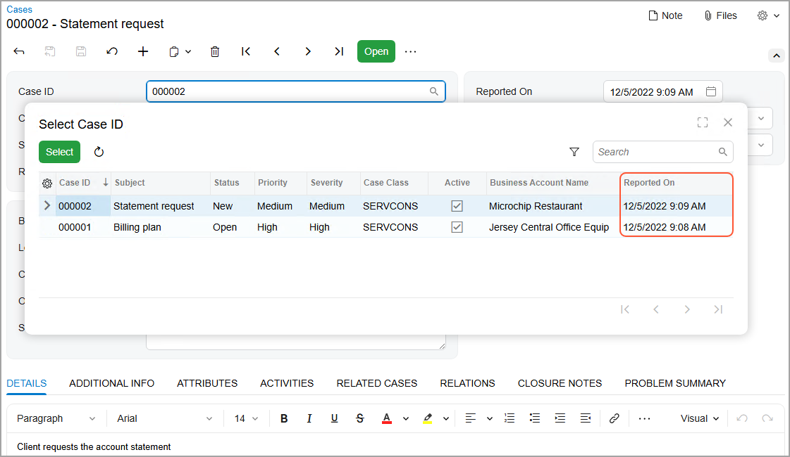

# Form Layout: To Add a Column to a Lookup Table {#_8aaa00e7-4c49-488a-80f5-3fa6896b31c5 .task}

The following activity will walk you through the process of adding a new column to a lookup table. A lookup table opens when a user clicks the magnifier button for a box that has this button, and the information in the table can help the user find and select the needed record.

## Story { .section}

Suppose that you want users to be able to select cases on the [Cases](../UserGuide/CR_30_60_00.md) \(CR306000\) form by the date on which they have been reported. You need to change the lookup table for the **Case ID** box on the form so that it contains the **Reported On** column.

## Process Overview { .section}

By using the [Data Access](../UserGuide/AU_20_30_01.md) and [Data Class](../UserGuide/AU_DataClassEditor.md) pages of the Customization Project Editor, you will add the column to the lookup table of the `CaseCD` field, which corresponds to the **Case ID** box of the [Cases](../UserGuide/CR_30_60_00.md) \(CR306000\) form. You will then publish the customization project and test the change on the form.

## System Preparation { .section}

Before you begin performing the steps of this activity, do the following:

1.  Prepare an Acumatica ERP instance by performing the [Customization Projects: To Deploy an Instance](CustomizationProjects_GettingStarted_Activity_CreateInstance.md) prerequisite activity.
2.  Create the *Yogifon* customization project by performing the [Customization Projects: To Create a Customization Project](CustomizationProjects_GettingStarted_Activity_CreateProject.md) prerequisite activity.
3.  Make sure that you have completed the [Form Layout: To Add a New Tab to a Form](CustomizationProjects_ConfiguringFormLayout_Activity_AddTab.md) prerequisite activity.

## Step 1: Adding the Column to the Lookup Table { .section}

To modify the settings of the lookup table for a box, do the following:

1.  On the [Customization Projects](../UserGuide/SM_20_45_05.md) \(SM204505\) form, click *Yogifon* to open the Customization Project Editor for this customization project.
2.  In the navigation pane, click **Data Access**.

    The [Data Access](../UserGuide/AU_20_30_01.md) page opens.

3.  In the table on the page, click the link in the row with the `CRCase` class.

    The [Data Class](../UserGuide/AU_DataClassEditor.md) page opens.

4.  On the page toolbar, click **Change Attributes of Base Field**.
5.  In the **Change Existing Field** dialog box, which opens, select *CaseCD*, and click **OK**.
6.  In the **Customized Fields** table, click the added field.
7.  On the More menu \(under **Actions**\), click **Edit Selector Columns**.
8.  In the **Customize Selector Columns** dialog box, which opens, click **Add Columns** on the table toolbar.
9.  In the **Add Columns to Selector** dialog box, which opens, type `Reported On` in the Search box. Select the unlabeled check box in the row with the *Reported On* column name, and click **OK** to close the dialog box.
10. In the **Customize Selector Columns** dialog box, to which you return, click **OK**.
11. Save your changes.

## Step 2: Testing the Added Column { .section}

Publish the customization project and test the added column as follows:

1.  On the main menu of the Customization Project Editor, click **Publish** &gt; **Publish Current Project**.
2.  Wait until the *Website updated* row appears in the **Compilation** pane, and click **Close Compilation Pane**.
3.  On the [Cases](../UserGuide/CR_30_60_00.md) \(CR306000\) form, click the magnifier button of the **Case ID** box.
4.  In the lookup table, make sure that the **Reported On** column is displayed, as shown in the following screenshot.

    

**Parent topic:**[Configuring the Layout of Forms](../CustomizationPlatform/CustomizationProjects_ConfiguringFormLayout_Mapref.md)

