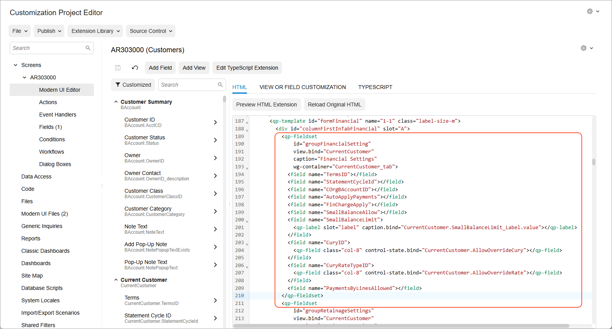
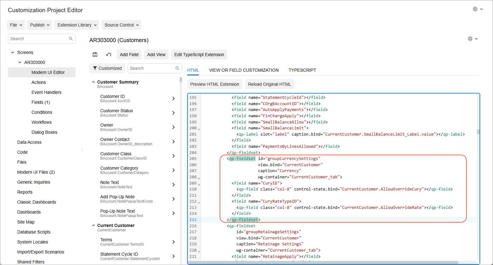
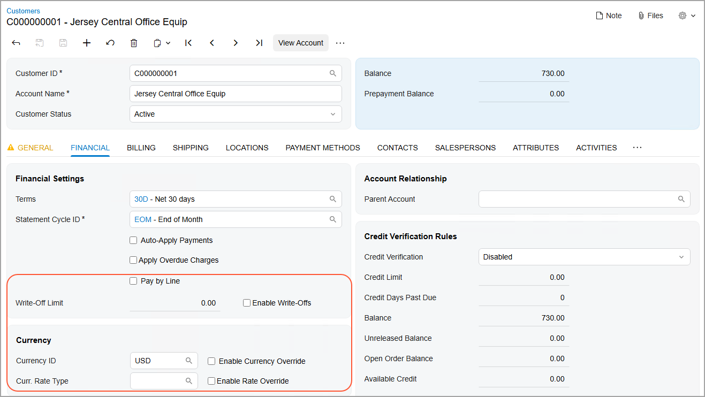

# Form Layout: To Add a Section to a Tab {#_0bcb4077-acd0-4460-93f9-4804c69769f2 .task}

The following activity will walk you through the process of adding a section to a tab of a form and then adding UI elements to this section.

## Story { .section}

Suppose that management has determined that Acumatica ERP would better fit the needs of your company if employees could find a customer's currency settings more easily on the **Financial** tab of the [Customers](../UserGuide/AR_30_30_00.md) form. You need to organize the currency-related UI elements on this tab so that they are grouped in a new **Currency** section, which should be placed below the **Financial Settings** section on the tab.

## Process Overview { .section}

On the [Screens](../UserGuide/AU_20_10_00.md) page, you will add the [Customers](../UserGuide/AR_30_30_00.md) \(CR303000\) form so that it can be customized.

You will do the following to add a new section to a tab:

1.  By using the [Modern UI Editor](../UserGuide/AU_20_10_80.md) page, you will add a new **Currency** section, and move the **Currency ID**, **Curr. Rate Type**, **Enable Currency Override**, and **Enable Rate Override** boxes to it.
2.  By using the [Modern UI Editor](../UserGuide/AU_20_10_80.md) page, you will move the **Enable Write-Offs** check box next to the **Write-Off Limit** box.
3.  By using the Customization Project Editor menu, you will publish the customization project.
4.  By using UI Configuration mode on the [Customers](../UserGuide/AR_30_30_00.md) \(CR303000\) form, you will move the **Pay by Line** check box below the **Apply Overdue Charges** box.

You will then test the new layout on the [Customers](../UserGuide/AR_30_30_00.md) \(CR303000\) form.

## System Preparation { .section}

Before you begin performing the steps of this activity, do the following:

1.  Prepare an Acumatica ERP instance by performing the [Customization Projects: To Deploy an Instance](CustomizationProjects_GettingStarted_Activity_CreateInstance.md) prerequisite activity.
2.  Create the *Yogifon* customization project by performing the [Customization Projects: To Create a Customization Project](CustomizationProjects_GettingStarted_Activity_CreateProject.md) prerequisite activity.
3.  On the **Financial** tab of the [Customers](../UserGuide/AR_30_30_00.md) \(CR303000\) form, invoke the Element Inspector for the **Enable Write-Offs** check box to learn its internal name. You will use this name \(SmallBalanceAllow\) in Step 2.

## Step 1: Modifying the List of Customized Screens { .section}

To add a section to a tab of the [Customers](../UserGuide/AR_30_30_00.md) \(CR303000\) form, you first need to add it to the list of customized screens. Do the following:

1.  On the [Customization Projects](../UserGuide/SM_20_45_05.md) \(SM204505\) form, click *Yogifon* to open the Customization Project Editor for this customization project.
2.  In the navigation pane, click **Screens**.

    The [Screens](../UserGuide/AU_20_10_00.md) page opens.

3.  On the page toolbar, click **Customize Existing Screen**.

    The **Customize Existing Screen** dialog box opens.

4.  In the **Select Screen** box of the dialog box, click the magnifier button. In the lookup table, type `CR303000` in the Search box, and double-click the *Customers* form.
5.  Click **OK** to close the dialog box.

    The [Customers](../UserGuide/AR_30_30_00.md) \(AR303000\) form is added to the list of forms on the [Screens](../UserGuide/AU_20_10_00.md) page, and the Screen Editor: CR303000 \(Customers\) page opens.


## Step 2: Adding the Section { .section}

To add a new **Currency** section to the **Financial** tab of the [Customers](../UserGuide/AR_30_30_00.md) \(AR303000\) form, do the following:

1.  Open any record on the [Customers](../UserGuide/AR_30_30_00.md) form, activate the [Element Inspector](../UserGuide/AU_ElementInspector.md), and click the **Financial** tab.
2.  In the **Element Properties** dialog box, which opens, click **Customize**.
3.  In the **Select Customization Project** dialog box, which opens, select the *Yogifon* project name, and click **OK**.

    The [Screen Editor](../UserGuide/AU_20_45_20.md) page opens for the [Customers](../UserGuide/AR_30_30_00.md) form.

4.  In the navigation pane, click **Screens** &gt; **AR303000** &gt; **Modern UI Editor**.
5.  On the HMTL tab of the editor, locate the code for the **Financial Settings** fieldset \(see the following screenshot\).

    

6.  Add the following code for the **Currency** fieldset after the code for the **Financial Settings** fieldset:

    ``` {#codeblock_ml3_gyx_vfc .language-xml}
    <qp-fieldset id="groupCurrencySettings"
     view.bind="CurrentCustomer"
     caption="Currency"
     wg-container="CurrentCustomer_tab">
      
    </qp-fieldset>
    ```

7.  In the code for the **Financial Settings** fieldset, cut the following code, and paste it in the code for the **Currency** fieldset:

    ``` {#codeblock_tg1_q32_wfc .language-xml}
    <field name="CuryID">
    <qp-field control-state.bind="CurrentCustomer.AllowOverrideCury" class="col-8"></qp-field>
     </field>
    <field name="CuryRateTypeID">
     <qp-field control-state.bind="CurrentCustomer.AllowOverrideRate" class="col-8"></qp-field>
     </field>
    ```

    The resulting code should look as follows:

    

8.  Click **Save** on the page toolbar.

## Step 3: Moving the Check Box {#section_xkd_34l_wfc .section}

To move the **Enable Write-Offs** check box to the right of the **Write-Off Limit** box, do the following:

1.  Locate the code for the SmallBalanceLimit field and update it as follows:

    ``` {#codeblock_dq4_nhl_wfc .language-xml}
    <field name="SmallBalanceLimit">
    <qp-label slot="label" caption.bind="CurrentCustomer.SmallBalanceLimit_Label.value"></qp-label>
    <qp-field control-state.bind="CurrentCustomer.SmallBalanceAllow" config-enabled.bind="false"></qp-field>
            </field>
    ```

    **Tip:** The SmallBalanceAllow is the internal name of the **Enable Write-Offs** check box.

2.  Remove the `<field name="SmallBalanceAllow"></field>` code line.

    This line is located above the code that you have just modified.

3.  On the page toolbar, click **Save**.
4.  To apply the changes to the instance, on the main menu of the Customization Project Editor, click **Publish** &gt; **Publish Current Project**.
5.  Wait until the *Website updated* row appears in the **Compilation** pane, and click **Close Compilation Pane**.

## Step 4: Adjusting the Position of the Elements { .section}

To change the position of the boxes, do the following on the [Customers](../UserGuide/AR_30_30_00.md) \(AR303000\) form:

1.  Open the record with the *C000000001* customer ID.

    **Important:** If the record is already open, refresh the page.

2.  On the form title bar, click **Settings** &gt; **UI Configuration**
3.  On the **Financial** tab, click **Settings** for the **Financial Settings** section.
4.  In the **Section Configuration** dialog box, which opens, drag the **Pay by Line** field so that it is located below the **Apply Overdue Charges** field.
5.  Click **Apply**.
6.  On the form title bar, click **Apply to All**.
7.  In the **Apply to All** dialog box, which opens, click **Overwrite Personal Configuration**.

## Step 5: Testing the Layout { .section}

On [Customers](../UserGuide/AR_30_30_00.md) \(AR303000\) form, review the layout of the **Financial** tab and make sure that the following criteria are met

-   The **Currency** section contains the following elements:
    -   The **Currency ID** box
    -   The **Curr. Rate Type** box
    -   The **Enable Currency Override** check box
    -   The **Enable Rate Override** check box
-   The **Financial Settings** section has the elements grouped as follows:
    -   The **Pay by Line** check box is located below the **Apply Overdue Charges** check box.
    -   The**Enable Write-Offs** check box is located to the right of the **Write-Off Limit** box.

The following screenshot shows the modified tab.



**Parent topic:**[Configuring the Layout of Forms](../CustomizationPlatform/CustomizationProjects_ConfiguringFormLayout_Mapref.md)

