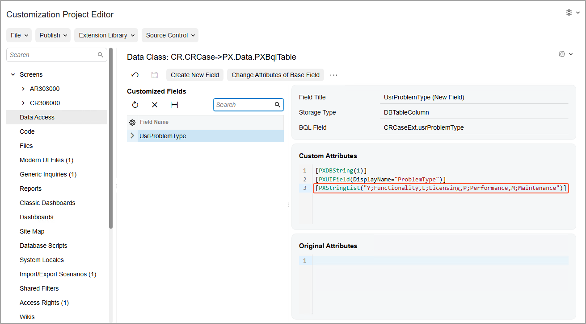
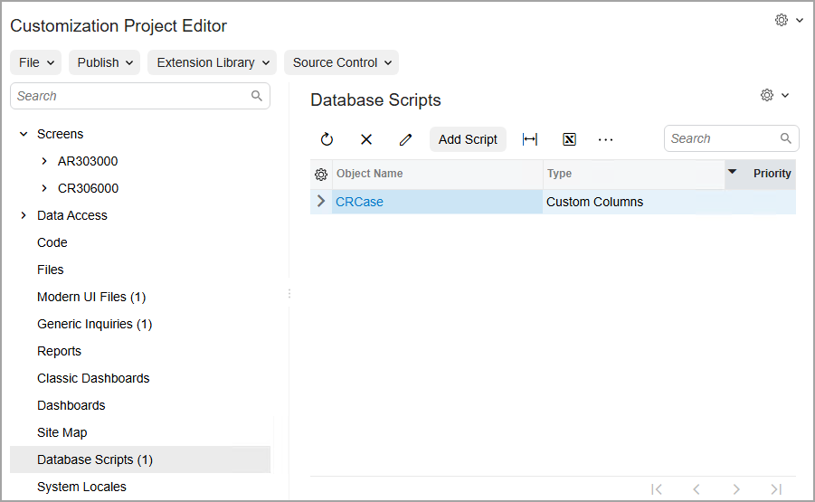
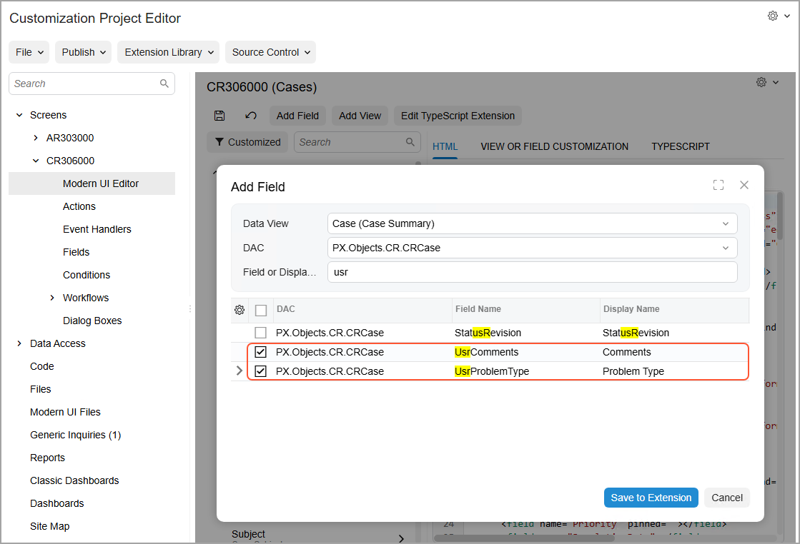
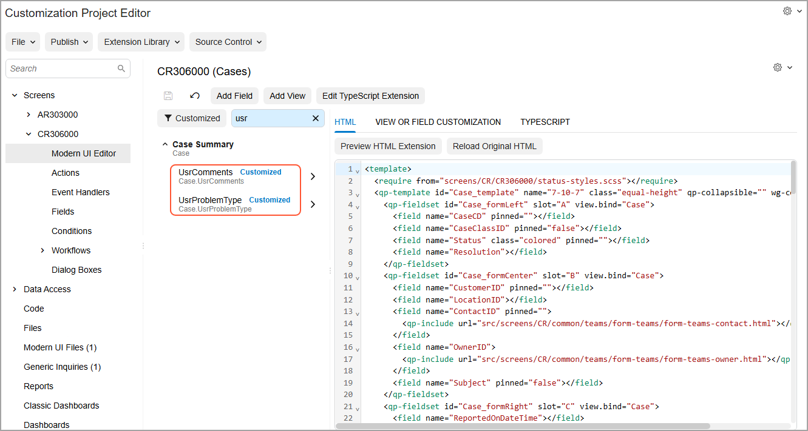
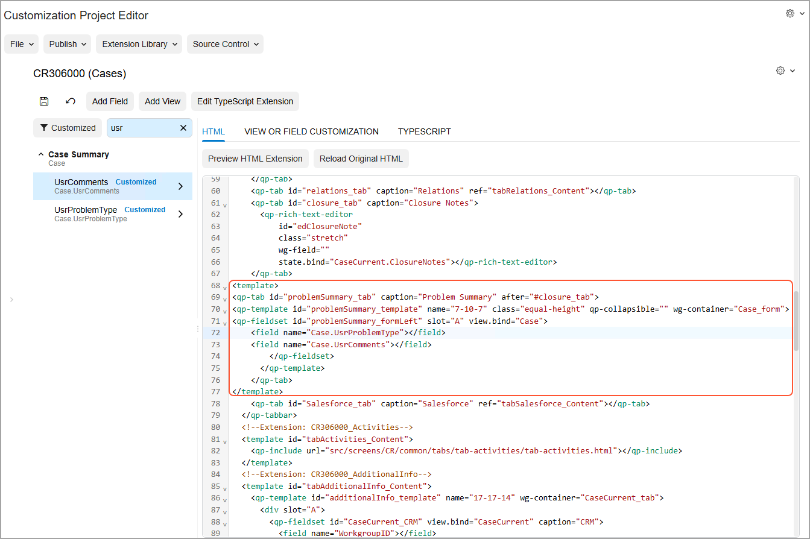
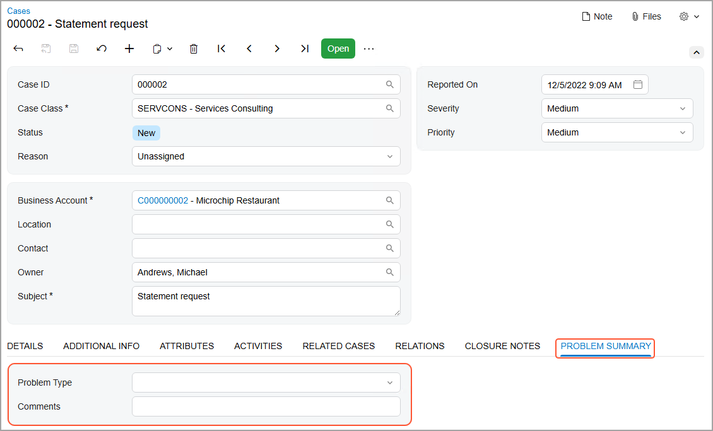

# Form Layout: To Add a New Tab to a Form {#_cbb635f4-b657-435a-9e20-dec512ba9d16 .task}

The following activity will walk you through the process of adding a new tab to a form and then adding new boxes to this tab.

## Story { .section}

Suppose that you want to add the new **Problem Type** and **Comments** boxes to the [Cases](../UserGuide/CR_30_60_00.md) \(CR306000\) form. Further suppose that you want to arrange these boxes on a separate **Problem Summary** tab \(which should be placed after the **Closure Notes** tab\). By using the added tab and boxes, the employees will be able to specify and view information related to the closure of the case \(such as the type of the problem and customer's comments\).

Because the boxes do not yet exist in the system, you need to create the underlying fields. Then you need to add the corresponding boxes to the form.

## Process Overview { .section}

On the [Screens](../UserGuide/AU_20_10_00.md) page, you will add the [Cases](../UserGuide/CR_30_60_00.md) \(CR306000\) form so that it can be customized. By using the [Data Access](../UserGuide/AU_20_30_01.md) page, you will add the fields that will underlie the new boxes on the [Cases](../UserGuide/CR_30_60_00.md) \(CR306000\) form. By using the [Modern UI Editor](../UserGuide/AU_20_10_80.md) page, you will add a new tab for this form, and add the created fields to this tab. Finally, you will publish the customization project and test the new layout.

## System Preparation { .section}

Before you begin performing the steps of this activity, do the following:

1.  Prepare an Acumatica ERP instance by performing the [Customization Projects: To Deploy an Instance](CustomizationProjects_GettingStarted_Activity_CreateInstance.md) prerequisite activity.
2.  Create the *Yogifon* customization project by performing the [Customization Projects: To Create a Customization Project](CustomizationProjects_GettingStarted_Activity_CreateProject.md) prerequisite activity.

## Step 1: Modifying the List of Customized Screens { .section}

To add a new tab on the [Cases](../UserGuide/CR_30_60_00.md) \(CR306000\) form, you first need to add the form to the list of customized screens. Do the following:

1.  Login to your instance as the *admin* user.
2.  On the [Customization Projects](../UserGuide/SM_20_45_05.md) \(SM204505\) form, click *Yogifon* to open the Customization Project Editor for this customization project.
3.  In the navigation pane of the Customization Project Editor, click **Screens**.

    The [Screens](../UserGuide/AU_20_10_00.md) page opens.

4.  On the page toolbar, click **Customize Existing Screen**.

    The **Customize Existing Screen** dialog box opens.

5.  In the **Select Screen** box of the dialog box, click the magnifier button. In the lookup table, type `CR306000` in the Search box, and double-click the *Cases* form.
6.  Click **OK** to close the dialog box.

    The [Cases](../UserGuide/CR_30_60_00.md) form is added to the list of forms on the [Screens](../UserGuide/AU_20_10_00.md) page, and the Screen Editor: CR306000 \(Cases\) page opens.


## Step 2: Adding New Fields { .section}

To add new fields, do the following in the Customization Project Editor:

1.  In the navigation pane, click **Data Access**.

    The [Data Access](../UserGuide/AU_20_30_01.md) page opens.

2.  On the page toolbar, click **Add New Record**.
3.  In the **Select Existing Data Access Class** dialog box, which opens, select *PX.Objects.CR.CRCase* by using the lookup table, and click **Select**.

    The [Data Class](../UserGuide/AU_DataClassEditor.md) page opens.

    **Tip:** Notice that the name on the page is *Data Class: CR.CRCase*, with the name of the customized DAC following the page name.

4.  On the page toolbar, click **Create New Field**.
5.  In the **Create New Field** dialog box, which opens, specify the following settings:
    -   **Field Name**: `ProblemType`

        Notice that the system changes this name to *UsrProblemType* to indicate that this is a user-created field.

    -   **Display Name**: `Problem Type`
    -   **Storage Type**: *DBTableColumn*
    -   **Data Type**: *String*
    -   **Length**: `1`
6.  Click **OK** to save your changes.

    The system creates the field and opens the [Data Class](../UserGuide/AU_DataClassEditor.md) page for it.

7.  In the **Custom Attributes** area of the Source Code pane of the page, add the `[PXStringList("Y;Functionality,L;Licensing,P;Performance,M;Maintenance")]` attribute after the *\[PXUIField\(DisplayName="Problem Type"\)\]* attribute \(see the following screenshot\).

    The `PXStringList` attribute is used when you want the field to appear as a drop-down list in the UI. In the example above, you have specified the values for the drop-down list as value-label pairs where each value and label are separated by a semicolon, such as `Y;Functionality`. Each pair is separated by a comma. Thus, this attribute will make the added field appear as a drop-down list in the UI with the following four labels, each corresponding to its specified value:

    -   *Functionality*
    -   *Licensing*
    -   *Performance*
    -   *Maintenance*
    For more details about the `PXStringList` attribute, see [PXStringListAttribute](https://help.acumatica.com/Help?ScreenId=ShowWiki&pageid=eb18681d-a07f-87ae-3738-cb6452c24260).

    

8.  Save your changes.
9.  On the page toolbar, click **Create New Field** again.
10. In the **Create New Field** dialog box, which opens, specify the following settings:
    -   **Field Name**: `Comments`

        Notice that the system changes this name to *UsrComments* to indicate that this is a user-created field.

    -   **Display Name**: `Comments`
    -   **Storage Type**: *DBTableColumn*
    -   **Data Type**: *String*
    -   **Length**: `1024`
11. Click **OK** to add the field and close the dialog box.

    The system creates the field.

12. Save your changes.
13. On the [Database Scripts](../UserGuide/AU_20_90_00.md) page, notice that the system has generated a script to add the two created fields to the database table \(see the following screenshot\).

    

14. Publish the customization project by clicking **Publish** &gt; **Publish Current Project** on the main menu of the Customization Project Editor.

    You need to publish your project before you proceed to make the system generate the specified fields, so that you can then add boxes for them to the form.


## Step 3: Adding New Fields to the List of Available Fields { .section}

To add a new tab to the [Cases](../UserGuide/CR_30_60_00.md) \(CR306000\) form, do the following in the Customization Project Editor:

1.  In the navigation pane, click **Screens** &gt; **CR306000** &gt; **Modern UI Editor**.

    The Modern UI Editor: CR306000 \(Cases\) page opens.

2.  On the page toolbar, click **Add Field**.
3.  In the **Add Field** dialog box, which opens, specify the following settings:

    -   **Data View**: *Case \(Case Summary\)*
    -   **DAC**: *PX.Objects.CR.CRCase*
    -   **Field or Display Name**: `usr`
    The system displays the fields whose names contain *usr*.

4.  Select the unlabeled check boxes in the rows with the UsrComments and UsrProblemType fields \(see the following screenshot\).

    

5.  Click **Save to Extension**.
6.  Click **Save**.

    The system adds the new fields to the list of available fields on the page.

7.  In the Search box on the page, type `usr`.

    The system displays the added fields. Notice that *Customized* is displayed to the right of each of the added fields \(see below\), which means that these are custom fields.

    


## Step 4: Adding a New Tab { .section}

In this step, you will add to the new tab the boxes that correspond to the fields you have created in Step 2. In the Customization Project Editor, do the following:

1.  On the **HTML** tab of the page, locate the following code:

    ``` {#codeblock_jw2_w2d_wfc .language-xml}
    <qp-tab id="closure_tab" caption="Closure Notes">
          <qp-rich-text-editor
              id="edClosureNote"
              class="stretch"
              state.bind="CaseCurrent.ClosureNotes"></qp-rich-text-editor>
        </qp-tab>
    ```

    This is the code for the **Closure Notes** tab. You will add the new tab after this tab.

2.  Add the following code after this code:

    ``` {#codeblock_tll_hfd_wfc .language-xml}
    <template>
    <qp-tab id="problemSummary_tab" caption="Problem Summary" after="#closure_tab">
    <qp-template id="problemSummary_template" name="7-10-7" class="equal-height" qp-collapsible="">
    <qp-fieldset id="problemSummary_formLeft" slot="A" view.bind="Case">
            </qp-fieldset>
          </qp-template>
        </qp-tab>
    </template>
    ```

    In the code above, you have used a nested `<template>` tag within which you have defined the new tab by using the `<qp-tab>` tag. You have specified the tab's caption as `Problem Summary`. This is the text that will appear as the tab's name in the UI. You have also specified the id of the **Closure Notes** tab as the value of the new tab's `after` property. This specifies that the new tab will appear after the **Closure Notes** tab in the UI. Since the new tab will contain fields and not only a table \(grid\), you have used a nested `<qp-template>` tag and specified a predefined form template in its `name` property. Finally, you have defined a fieldset, which will contain the new fields.

    For details about configuring tabs, fieldsets, and the available predefined templates, see the following resources:

    -   [Tab](../DeveloperGuide/UIDevRef_Tab_Mapref.md)
    -   [Fieldset](../DeveloperGuide/UIDevRef_Fieldset_Mapref.md)
    -   [Form Layout: Predefined Templates](../DeveloperGuide/UIDev_DesigningLayout_Templates.md)
3.  In the element tree, locate the `UsrProblemType` field.

    Place the cursor before the `</qp-fieldset>` tag, and click arrow button next to the `UsrProblemType` field to add it to the new tab.

4.  By performing similar actions, add the **Comments** field after the **Problem Type** field.

    The resulting code is shown in the following screenshot.

    

5.  On the page toolbar, click **Save**.

## Step 5: Testing the Layout { .section}

Finally, you will publish the customization project and then test the layout of the [Cases](../UserGuide/CR_30_60_00.md) \(CR306000\) form as follows:

1.  On the main menu of the Customization Project Editor, click **Publish** &gt; **Publish Current Project**.
2.  Wait until the *Website updated* row appears in the **Compilation** pane, and click **Close Compilation Pane**.
3.  On the [Cases](../UserGuide/CR_30_60_00.md) \(CR306000\) form, open the case with the *000002* ID.
4.  Go to the **Problem Summary** tab, which you have added to the form. Make sure that the tab contains the **Problem Type** and **Comments** boxes \(see the following screenshot\).

    

5.  In the **Problem Type** box, make sure that the following options are available for selection:
    -   *Functionality*
    -   *Licensing*
    -   *Performance*
    -   *Maintenance*

**Parent topic:**[Configuring the Layout of Forms](../CustomizationPlatform/CustomizationProjects_ConfiguringFormLayout_Mapref.md)

