# Form Layout: To Make System-Wide Form Configuration {#_418ae7ec-34a6-4dc6-9db6-f1a129754468 .task}

This activity will walk you through the process of loading a personal configuration of a form layout, making changes to the form’s configuration, and applying these changes system-wide—while preserving individual users' configurations.

## Story { .section}

Suppose that management has asked you to make some changes to the configuration of the [Invoices and Memos](../UserGuide/AR_30_10_00.md) \(AR301000\) form and apply these changes system-wide.

You have also reviewed the personal configuration that another user has made on this form and decided to apply this personal form configuration system-wide. While applying this configuration, however, you need to preserve other users’ personal configurations of the form.

You’ll load the user's configuration of the form, make additional changes, and apply the updated layout to all users, while preserving their personal configurations. You will then review the system-wide changes and confirm that the user's personal configuration remains intact.

## Process Overview { .section}

In this activity, you’ll do the following on the [Invoices and Memos](../UserGuide/AR_30_10_00.md) \(AR301000\) form:

1.  Load the user's personal form configuration
2.  Manage UI elements in the groups of the Summary area
3.  Pin a UI element in the group
4.  Rename the group of elements
5.  Delete a UI element from the group
6.  Change the order of tabs
7.  Change the set of visible columns in the table
8.  Apply the changes system-wide, preserving users’ personal form configurations
9.  Review the system-wide and personal changes

## System Preparation { .section}

Before you begin performing the steps of this activity, do the following:

1.  Prepare an Acumatica ERP instance by performing the [Customization Projects: To Deploy an Instance](CustomizationProjects_GettingStarted_Activity_CreateInstance.md) prerequisite activity, and sign in by using the *admin* username.
2.  Create the *Yogifon* customization project by performing the [Customization Projects: To Create a Customization Project](CustomizationProjects_GettingStarted_Activity_CreateProject.md) prerequisite activity.
3.  Make sure that you have completed the [Form Layout: To Personalize a View of a Form](CustomizationProjects_ConfiguringFormLayout_Activity_User_Interface_Personalization.md) prerequisite activity.

## Step 1: Loading the Personal Form Configuration { .section}

To load another user's personal configuration of the [Invoices and Memos](../UserGuide/AR_30_10_00.md) \(AR301000\) form, do the following on this form:

1.  Notice the order of the tabs: The **Addresses** tab is after the **Financial** tab, the **Applications** tab is the last one, and the **Commissions** tab is visible.
2.  On the form title bar, click the Settings button and then click the **UI Configuration** menu item, as shown below.

    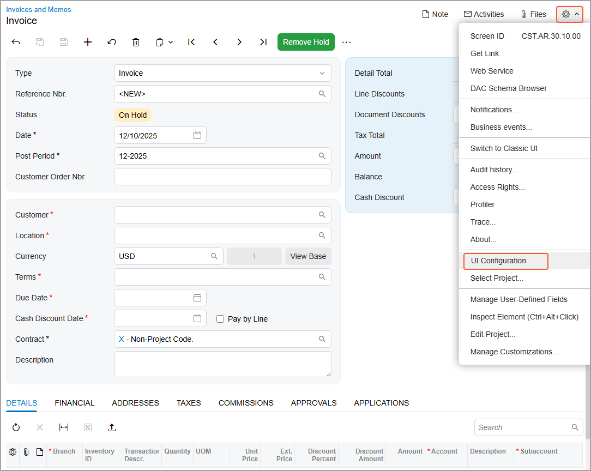

    This activates UI Configuration mode, and displays the **UI Configuration** pane at the top of the form \(see below\).

    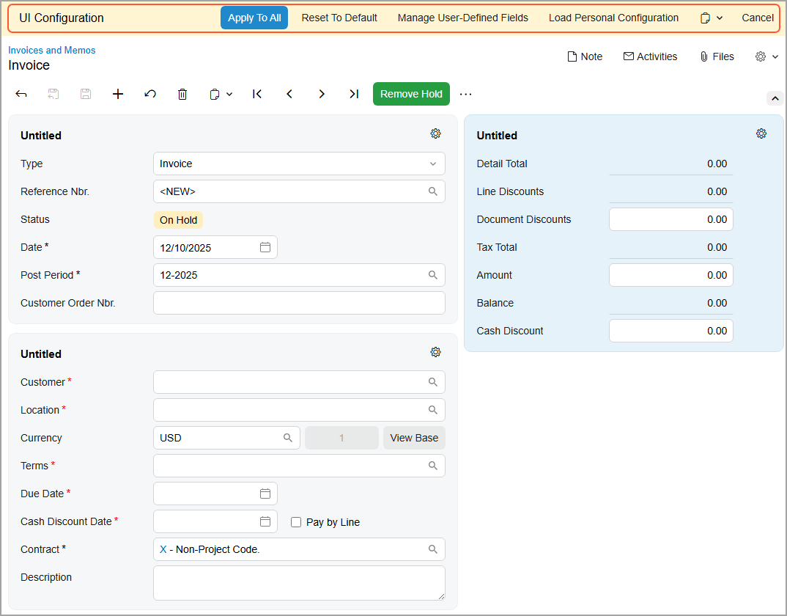

3.  In the **UI Configuration** pane, click **Load Personal Configuration**.
4.  In the **Load Personal Configuration** dialog box, which opens, select *Baker, Maxwell* in the **User** box.
5.  Click **Load**. The system loads this user's personal configuration of the form.
6.  Review the order of the tabs. Notice that the **Addresses** and **Applications** tabs are now after the **Details** tab, and the **Commissions** tab is hidden.

## Step 2: Customizing the First Group of Elements { .section}

Suppose that you were asked to do the following in the Summary area of the [Invoices and Memos](../UserGuide/AR_30_10_00.md) \(AR301000\) form:

-   Add the **Branch** box to the first group of elements
-   Pin this box so that it stays visible when the group of elements is collapsed

To make these changes, do the following:

1.  While you are still on the [Invoices and Memos](../UserGuide/AR_30_10_00.md) form in the UI Configuration mode, click the Settings button in the upper-right corner of the first group of elements in the Summary area \(see below\).

    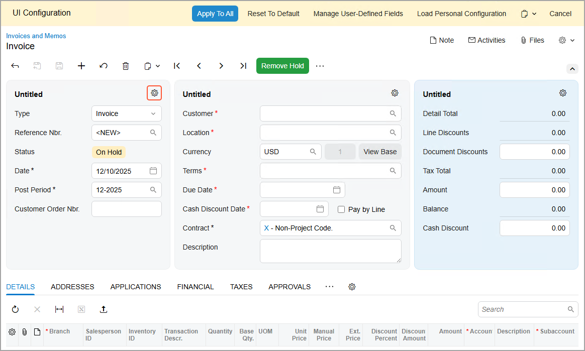

2.  The **Section Configuration** dialog box opens.

3.  In the **Available Elements** pane of the dialog box, click **Branch** \(in the **Financial** &gt; **Link to GL** group\), and then click the arrow that appears to the right of its name, as shown below.

    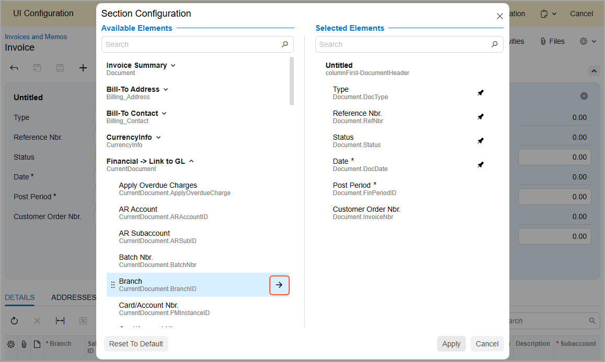

    The system moves **Branch** to the end of the list in the **Selected Elements** pane.

4.  Click the Pin icon next to **Branch** \(shown below\). This ensures that the **Branch** box will remain visible when the group of elements is collapsed.

    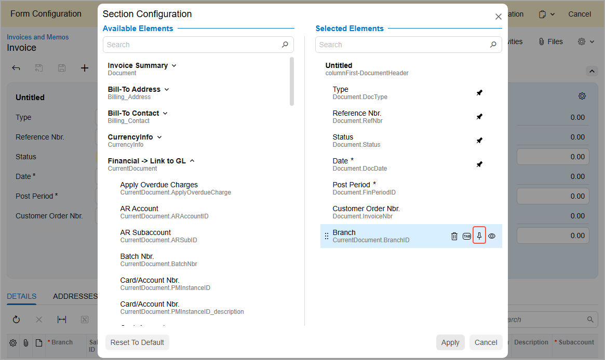

5.  Click **Apply**.

    The **Branch** box appears in the first group of elements, as shown below.

    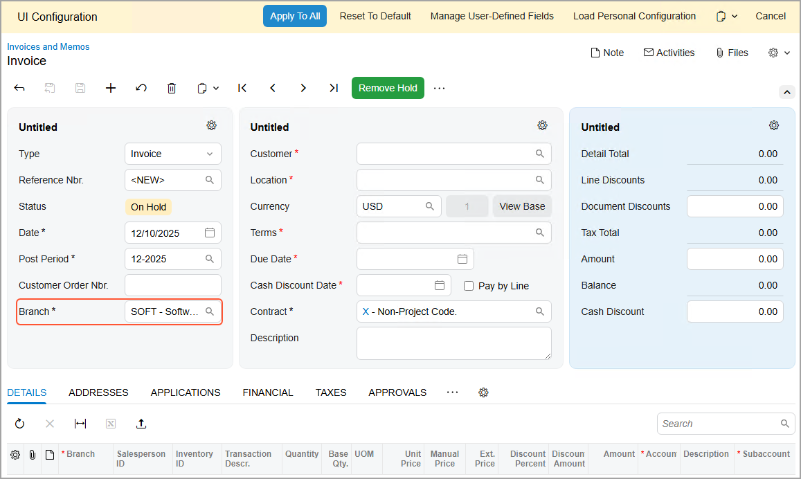

## Step 3: Customizing the Second Group of Elements { .section}

Suppose that you were asked to add the **Base Currency ID** box to the second group of elements after the **Cash Discount Date** box. Do the following:

1.  While you are still on the [Invoices and Memos](../UserGuide/AR_30_10_00.md) form in the UI Configuration mode, click the Settings button in the second group of elements.
2.  In the **Available Elements** pane of the **Section Configuration** dialog box, type `Base Currency ID` in the Search box.

    The **CurrencyInfo** group appears.

3.  In this group, click **Base Currency ID**, and then click the arrow next to its name.

    The system adds **Base Currency ID** to the end of the list in the **Selected Elements** pane.

4.  Drag **Base Currency ID** immediately after **Cash Discount Date**, and click **Apply**.

    The **Base Currency ID** box appears in the second fieldset after the **Cash Discount Date** box, as shown below.

    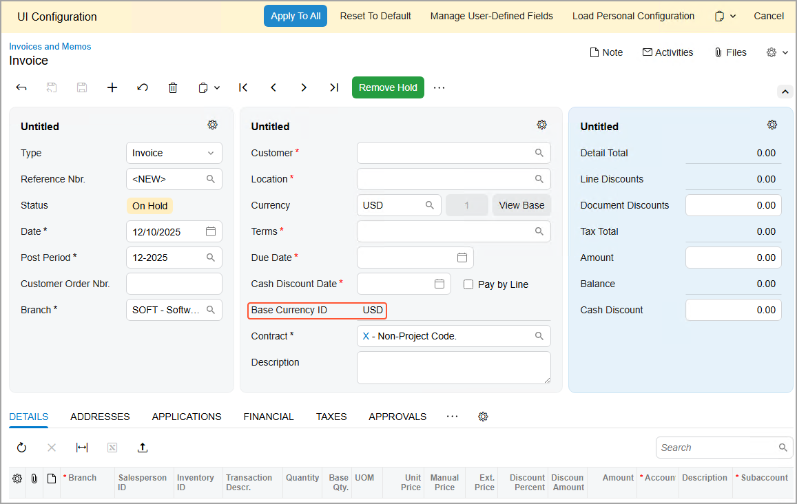

## Step 4: Customizing the Third Group of Elements {#section_s2m_35x_4hc .section}

Suppose that you were asked to rename the third group of elements in the Summary area of the [Invoices and Memos](../UserGuide/AR_30_10_00.md) \(AR301000\) form to **Total**. Do the following:

1.  While you are still on the [Invoices and Memos](../UserGuide/AR_30_10_00.md) form in the UI Configuration mode, click the Settings button in the third group of elements.
2.  In the **Selected Elements** pane of the **Section Configuration** dialog box, hover over **Untitled** and click the Edit button, which appears to the right of it.
3.  In the editing area, type `Total`.
4.  Click **Apply**.

    The name of the third group of elements changes, as shown below.

    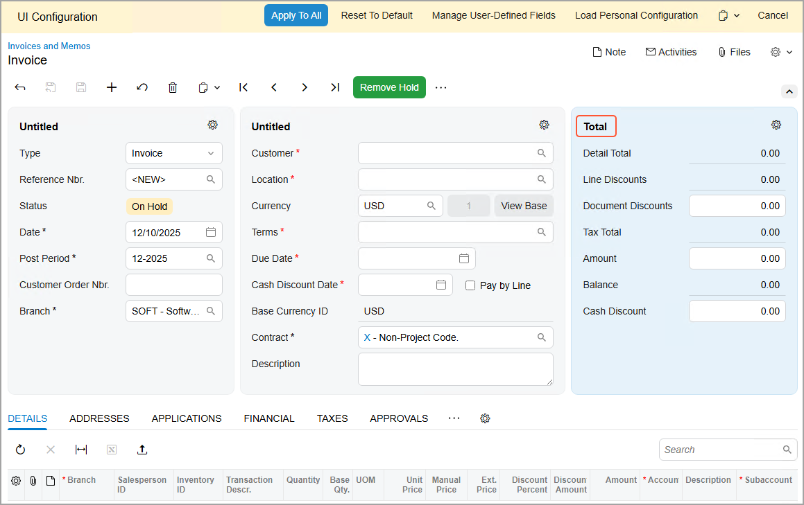

## Step 5: Changing Tabs’ Order and Managing Columns {#section_j5v_mvx_4hc .section}

Suppose that you were asked to apply the following changes system-wide on the [Invoices and Memos](../UserGuide/AR_30_10_00.md) \(AR301000\) form:

-   Move the **Taxes** tab after the **Details** tab
-   Hide the **Applications** tab
-   Add the **Warehouse** column to the table on the **Details** tab and hide the **Tax Category** column

To make these changes, do the following:

1.  While you are still on the [Invoices and Memos](../UserGuide/AR_30_10_00.md) form in the UI Configuration mode, drag the **Taxes** tab to place it immediately after the **Details** tab.
2.  Drag the **Applications** tab to the More button and then move it to the **Hidden Tabs** section that appears below the More button \(see below\).

    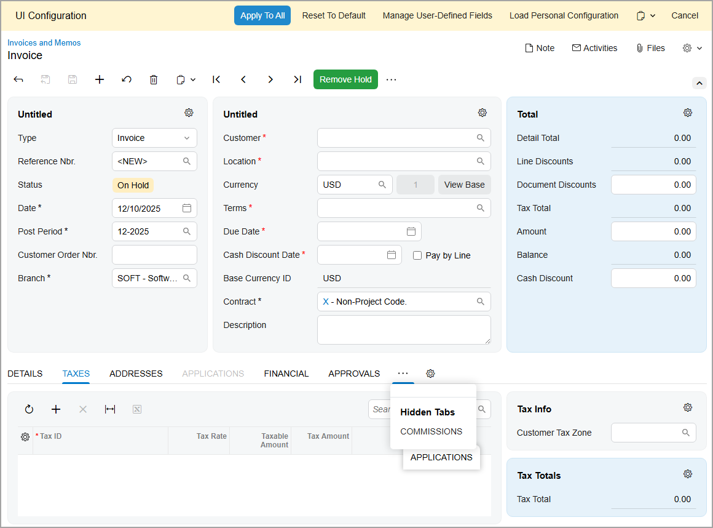

3.  In the upper-left corner of the table toolbar of the **Details** tab, click the Settings button. The Column Configuration dialog box opens.
4.  Select the check box for **Warehouse**.
5.  Clear the check box for **Tax Category**.
6.  Click **OK**.

    The system adds the **Warehouse** column \(see below\). Notice that the **Tax Category** column is not displayed.

    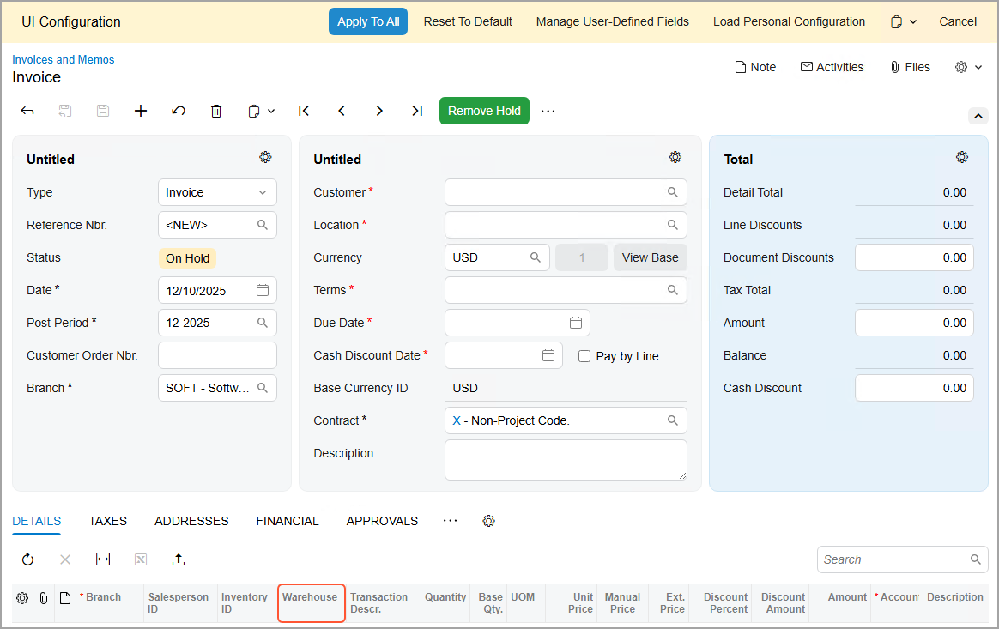

## Step 6: Applying the Changes System-Wide {#section_grr_rvx_4hc .section}

To apply the changes on the [Invoices and Memos](../UserGuide/AR_30_10_00.md) \(AR301000\) form system-wide, do the following while you are still on this form in Form Configuration mode:

1.  Click **Apply to All** in the **UI Configuration** pane at the top of the form.
2.  In the **Apply to All** dialog box, which opens, click **Preserve Personal Configuration** \(shown below\).

    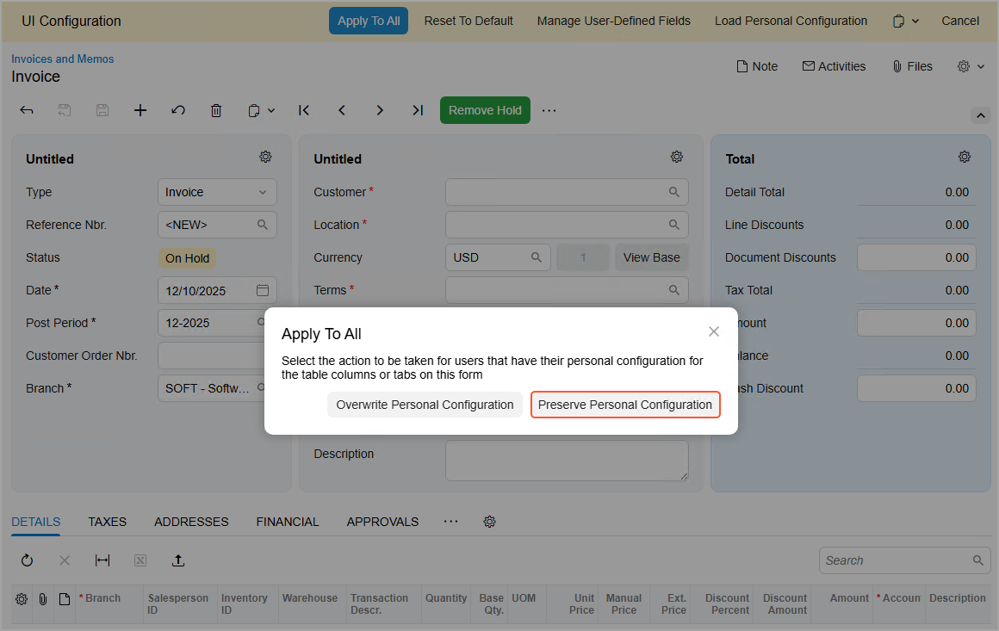

    The system applies the changes \(except for users with their own configuration of the form\) and closes the UI Configuration pane.

3.  Sign out of the system.

## Step 7: Reviewing the System-Wide Changes { .section}

Now suppose that you are Maxwell Baker. After the system administrator has applied the system-wide changes on the [Invoices and Memos](../UserGuide/AR_30_10_00.md) \(AR301000\) form, you need to review the form and verify that your personal configuration of it has been preserved. Do the following:

1.  Sign in to the system by using the *baker* username.
2.  Open the [Invoices and Memos](../UserGuide/AR_30_10_00.md) \(AR301000\) form and add a new record.
3.  Review the first group of elements in the Summary area to confirm that the **Branch** box is there.
4.  Click the arrow icon in the upper-right corner of the area to collapse it.

    The groups collapse and show only pinned UI elements, including the **Branch** box in the first group of elements.

5.  Review the third group of elements to confirm that it’s named **Total**.
6.  Review the order and visibility of the tabs. They should be in the same order that you previously configured:
    -   The **Taxes** tab should be after the **Financial** tab—not after the **Details** tab.
    -   The **Commissions** tab is hidden.
7.  On the **Details** tab, confirm that the table contains the following columns:
    -   The **Warehouse** column that has been added in the system-wide configuration.
    -   The **Manual Price** column that has been added in your personal configuration.
8.  On the **Addresses** tab, review the appearance of the **Bill-To Contact** and **Bill-To Address** sections. They should be collapsed while the other sections of the tab are expanded.

As a system administrator and customizer, you loaded the personal configuration of the form and made other changes to it. Then you applied all the changes, including the personal configuration, system-wide while preserving users’ personal configurations. As a user, you reviewed the applied system-wide changes and verified that your personal configuration had not changed.

**Parent topic:**[Configuring the Layout of Forms](../CustomizationPlatform/CustomizationProjects_ConfiguringFormLayout_Mapref.md)

