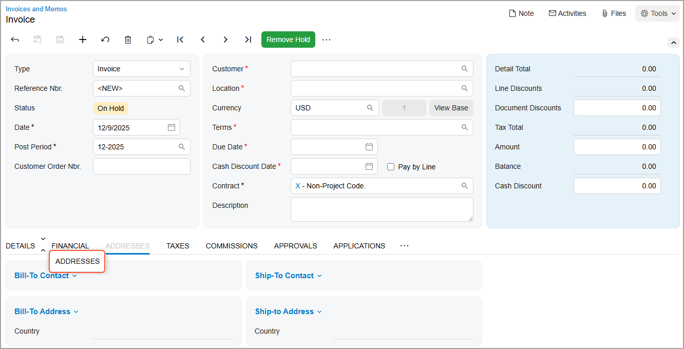
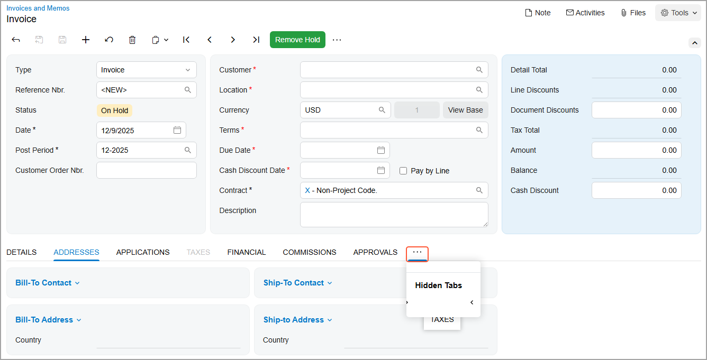
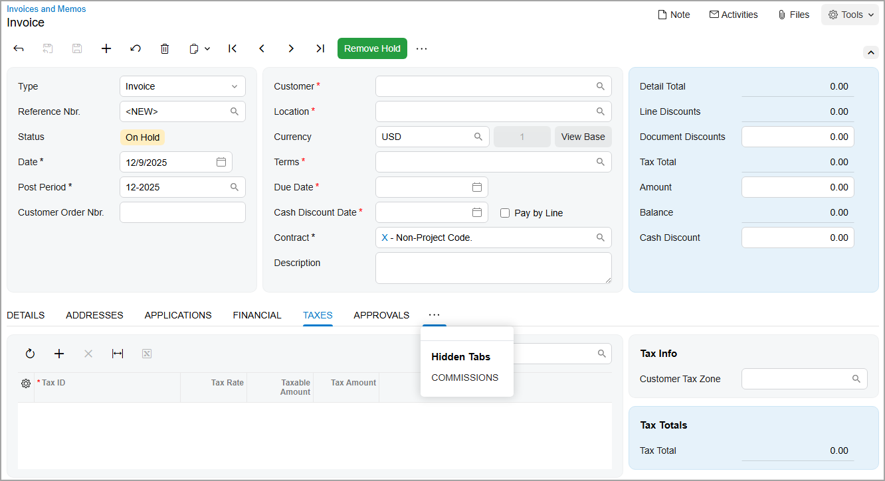
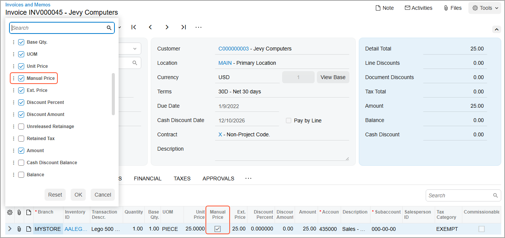
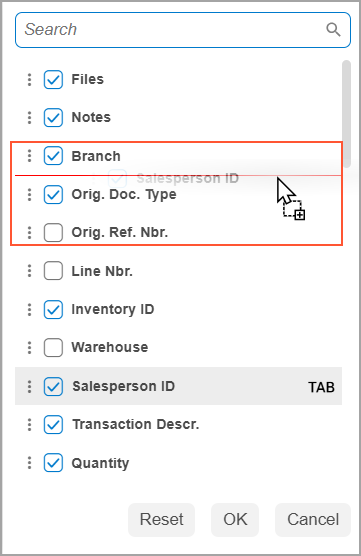
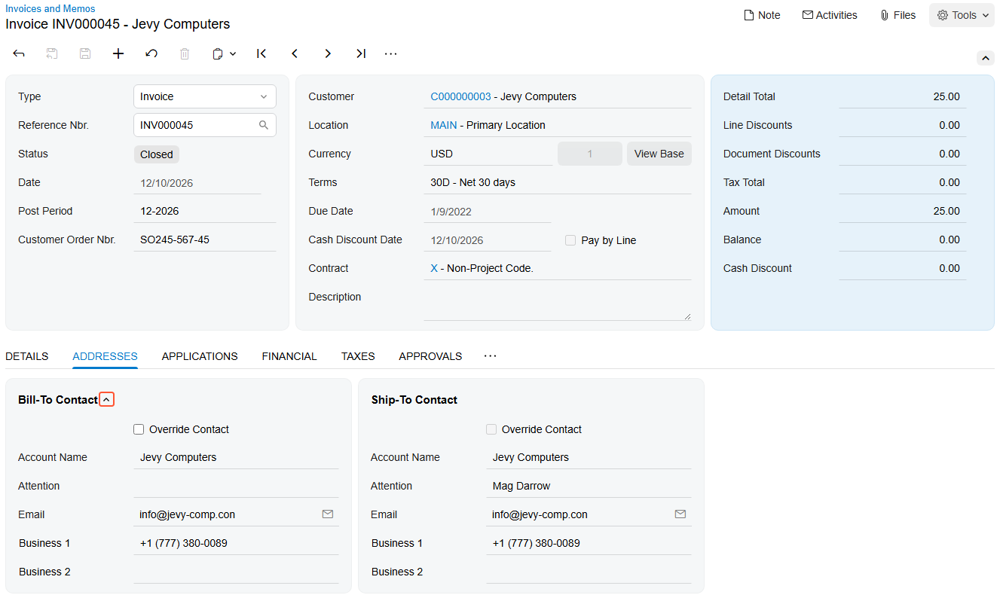
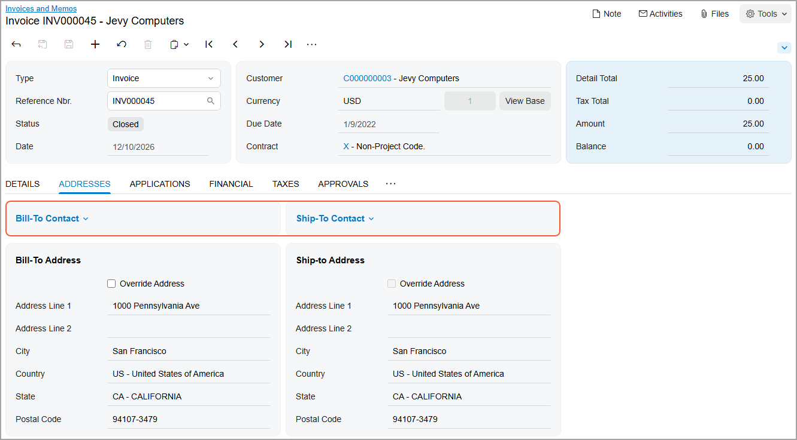

# Form Layout: To Personalize a View of a Form {#_d7c8a108-74ff-4b47-af6f-9199ed752ebd .task}

This activity will walk you through the process of personalizing the user interface on a data entry form.

## Story { .section}

Suppose that you often use the [Invoices and Memos](../UserGuide/AR_30_10_00.md) \(AR301000\) form. You need to personalize this form to better fit the needs of your company.

## Process Overview { .section}

In this activity, you’ll do the following on the [Invoices and Memos](../UserGuide/AR_30_10_00.md) \(AR301000\) form:

1.  Reorder the most frequently used tabs
2.  Hide the tabs that you don’t use in your work, and then show one of them again
3.  Customize the set and order of columns in the table by using the Column Configuration dialog box
4.  Manage the appearance of groups of elements on the tab

## System Preparation { .section}

Before you begin performing the steps of this activity, do the following:

1.  Prepare an Acumatica ERP instance by performing the [Customization Projects: To Deploy an Instance](CustomizationProjects_GettingStarted_Activity_CreateInstance.md) prerequisite activity.
2.  Create the *Yogifon* customization project by performing the [Customization Projects: To Create a Customization Project](CustomizationProjects_GettingStarted_Activity_CreateProject.md) prerequisite activity.
3.  Sign in to the system by using the following credentials:

    -   **Username**: `baker`
    -   **Password**: `setup`
    Change the password when the system prompts you to do so.

## Step 1: Reordering Tabs { .section}

To change the order of tabs and move the most frequently used ones to the front, do the following:

1.  On the [Invoices and Memos](../UserGuide/AR_30_10_00.md) \(AR301000\) form, add a new record.
2.  Drag the **Addresses** tab after the **Details** tab, as shown below.

    

3.  Drag the **Applications** tab after the **Addresses** tab.

## Step 2: Changing Tabs’ Visibility { .section}

Suppose that you seldom use some tabs and decide to hide two of them. Later, you realize that you need one of these tabs more frequently than you originally thought, so you decide to show it again. To change the visibility of tabs, do the following while you are still on the [Invoices and Memos](../UserGuide/AR_30_10_00.md) \(AR301000\) form:

1.  Drag the **Taxes** tab to the More button and then move it to the **Hidden Tabs** section that appears on the screen \(see below\).

    

2.  Similarly, drag the **Commissions** tab to the **Hidden Tabs** section.
3.  To show the **Taxes** tab again, click the More button. Then drag the **Taxes** tab from the **Hidden Tabs** section and after the **Financial** tab \(see below\).

    

## Step 3: Managing Table Columns by Using the Column Configuration Dialog Box { .section}

Suppose that you want to personalize the columns on the **Details** tab of the [Invoices and Memos](../UserGuide/AR_30_10_00.md) \(AR301000\) form as follows:

-   Add the **Manual Price** column to the table so that you know whether the price for each service was changed manually
-   Hide the unneeded **Commissionable** column.
-   Change the column order by moving the **Salesperson ID** column after the **Branch** column

To customize the set and order of these columns, do the following while you are still on the [Invoices and Memos](../UserGuide/AR_30_10_00.md) \(AR301000\) form:

1.  Open the record with the *INV000045* reference number.
2.  Go to the **Details** tab.
3.  In the upper-left corner of the table toolbar, click the Settings button. The Column Configuration dialog box opens.
4.  Select the check box for the **Manual Price** column.
5.  Click **OK**.

    The **Manual Price** column is added to the table \(as shown below\).

    

6.  On the table toolbar, click the Settings button again.
7.  In the Column Configuration dialog box, which opens, clear the check box for the **Commissionable** column.
8.  Click **OK**. The unneeded columns have been removed from the table.
9.  Click the Settings button.
10. In the Column Configuration dialog box, find the **Salesperson ID** column. Drag it upward and place it immediately after the **Branch** column, as shown below.

    

11. Click **OK**

## Step 4: Customizing Fieldsets { .section}

Suppose that during your work, you don’t need the information displayed in the **Bill-To Contact** and **Bill-To Address** sections of the **Addresses** tab of the [Invoices and Memos](../UserGuide/AR_30_10_00.md) \(AR301000\) form. To collapse these sections, do the following while you are still on this form:

1.  Go to the **Addresses** tab.
2.  Hover over the **Bill-To Contact** section.
3.  Click the arrow icon that appears to the right of the section name, as shown below.

    

    The **Bill-To Contact** section collapses.

4.  Hover over the **Ship-To Address** section.
5.  Again click the arrow icon that appears to the right of the section name. The section collapses, as shown below.

    

    **Tip:** To expand a collapsed section, click the arrow icon.

**Parent topic:**[Configuring the Layout of Forms](../CustomizationPlatform/CustomizationProjects_ConfiguringFormLayout_Mapref.md)

