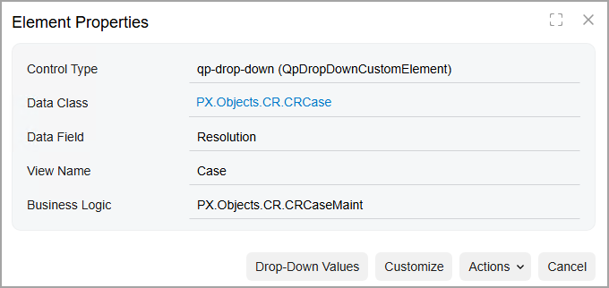
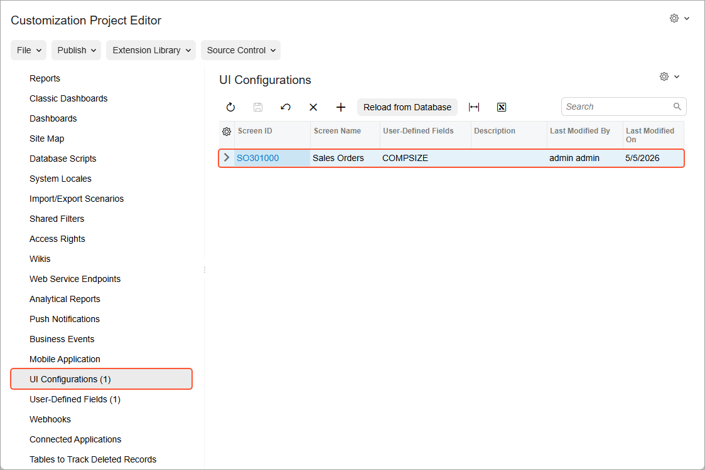

# Form Layout: General Information {#_1880667b-d7a4-40e9-a1d4-d83afd5eec15 .concept}

Customization projects often include the addition of UI elements and the underlying data fields to a form, and the modification of these elements. You can also change the way elements are arranged on the form: You can add tabs and sections to group similar elements and move elements to different parts of the form.

## Learning Objectives { .section}

In this chapter, you’ll learn how to do the following:

-   View the properties of an element on the form
-   Manage tabs on a form
-   Manage table columns
-   Adjust groups of elements on a form
-   Apply a user’s configuration system-wide
-   Create tabs for a form
-   Create boxes and add these boxes to the new tabs
-   Add columns to the lookup tables of the boxes on a form

## Applicable Scenarios { .section}

You modify the form layout in the following cases:

-   You need to add to a form new elements, such as boxes and check boxes.
-   You need to remove certain elements from the form because they are not needed.
-   You need to change the position of elements on the form or group the elements into sections.
-   You want to filter records on the form by using certain values in the lookup table, and the default lookup table does contain the needed values.

## Configuration of the Form Layout { .section}

You configure the layout of a form in two ways:

-   By switching to the UI Configuration mode on this form
-   By adding this form to a customization project

For details on how to configure form layout without adding this form to a customization project, see [Form Layout: User and System-Wide Configuration](CustomizationProjects_ConfiguringFormLayout_User_Site_Wide_Personalization.md).

The Customization Project Editor provides more tools to modify the form layout. You use this approach when you need to make changes that are not possible in the Form Configuration mode. You add a form to the customization project in either of the following ways:

-   By adding the form to the list of customized screens on the [Screens](../UserGuide/AU_20_10_00.md) page of the Customization Project Editor.
-   By invoking the [Element Inspector](../UserGuide/AU_ElementInspector.md) dialog box for the needed element or area of the form. From the dialog box, you click **Customize** and select the customization project.

You then use the [Modern UI Editor](../UserGuide/AU_20_10_80.md) page of the Customization Project Editor to change the positions of certain elements on the form, and add elements that exist in the system but are not displayed on the form by default. You use the [Data Access](../UserGuide/AU_20_30_01.md) and [Data Class](../UserGuide/AU_DataClassEditor.md) pages to add to the form new elements that do not exist in the system.

**Tip:** In Acumatica ERP, *form* is used to refer to the page the user works with. It is described as a *screen* in the Customization Project Editor to differentiate the underlying screen you are modifying from the resulting form a user works with in Acumatica ERP.

For details on how to configure the form layout in the code, see [Form Layout: General Information](../DeveloperGuide/UIDev_DesigningLayout_GeneralInfo.md).

## Use of the Element Inspector { .section}

You use the [Element Inspector](../UserGuide/AU_ElementInspector.md) to start the customization of a UI element that you inspect on a particular Acumatica ERP form. To activate the [Element Inspector](../UserGuide/AU_ElementInspector.md), you click **Settings** &gt; **Inspect Element** on the form title bar. You then click the element that you want to inspect on the form. This opens the **Element Properties** dialog box \(shown in the following screenshot\).

The dialog box displays various properties of the UI element that you clicked, such as its control type, data access class, data field, data view, business logic controller, actions, and drop-down control values. These properties define the visual appearance and business logic of the element. By clicking different buttons and menu commands in the **Element Properties** dialog box, you can view the source code of the element or start customizing it on the Screen Editor page. For more information, see [Modern UI Editor: General Information](../DeveloperGuide/UIDev_ModernUIEditor_GeneralInfo.md) and [UI Customization Development: General Information](../DeveloperGuide/UIDev_Customization_GeneralInfo.md).

## Adding Form Configurations to the Customization Project {#section_bms_dnd_hhc .section}

In Acumatica ERP, users can easily personalize forms to meet their needs, and administrators can perform system-wide configuration. A *form configuration* is a set of these changes to a particular form. You can incorporate any form configuration in a customization project as a *UI configuration*. You do this by using the [UI Configurations](../UserGuide/AU_23_00_10.md) page of the Customization Project Editor.

A form configuration \(and the corresponding UI configuration\) can include such changes as the following on the Acumatica ERP form:

-   The visibility and order of tabs
-   In tables, the visibility, order, width, and tab stops of columns
-   Boxes’ visibility, order, tab stops, and visibility in collapsed state
-   The captions of groups of elements \(fieldsets\); you can also add and remove their available elements
-   The addition of user-defined fields to a form and the location of each field

Below you can see an added UI configuration for the [Sales Orders](../UserGuide/SO_30_10_00.md) \(SO301000\) form.

You may have previously configured user-defined fields and added them to groups of elements while personalizing the form. These fields are automatically added to the [User-Defined Fields](../UserGuide/AU_23_00_00.md) page of the Customization Project Editor when you add the form configuration on the [UI Configurations](../UserGuide/AU_23_00_10.md) page. For details on how to add user-defined fields, see [User-Defined Fields in Customization Projects: General Information](CustomizationProjects_AddingUserDefinedFields_GeneralInfo.md).

**Parent topic:**[Configuring the Layout of Forms](../CustomizationPlatform/CustomizationProjects_ConfiguringFormLayout_Mapref.md)

