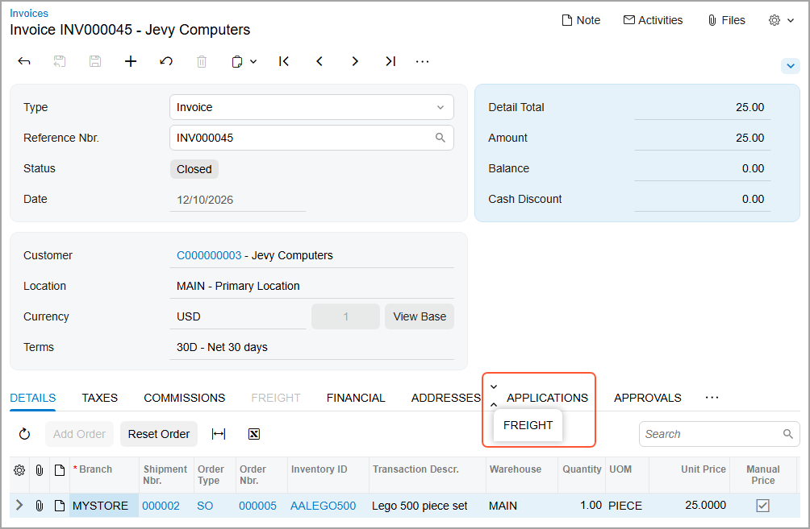
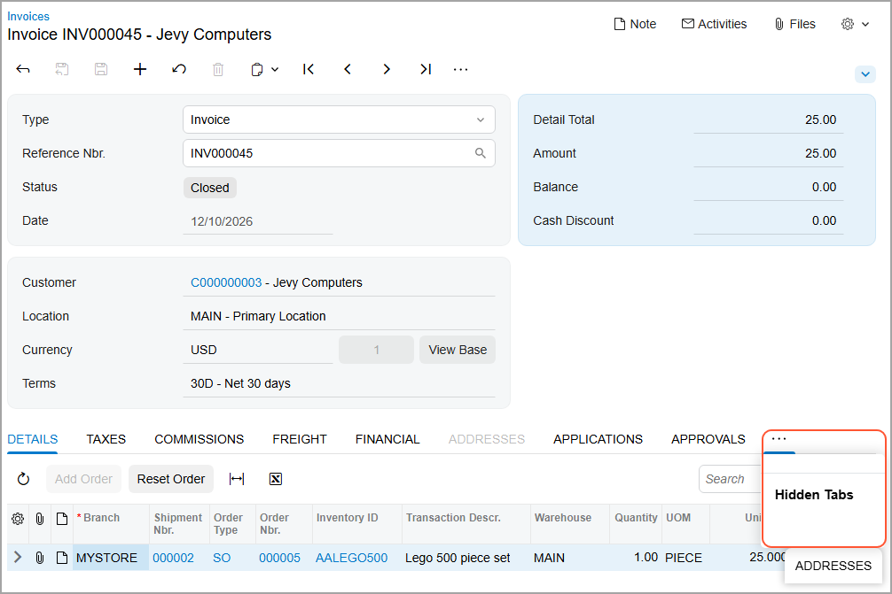
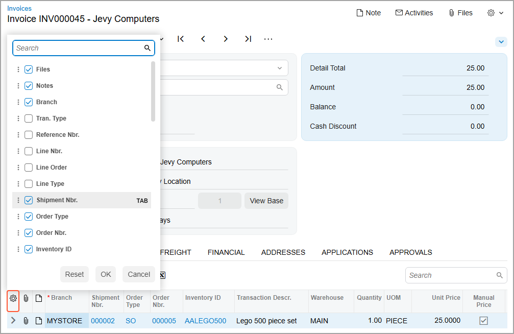
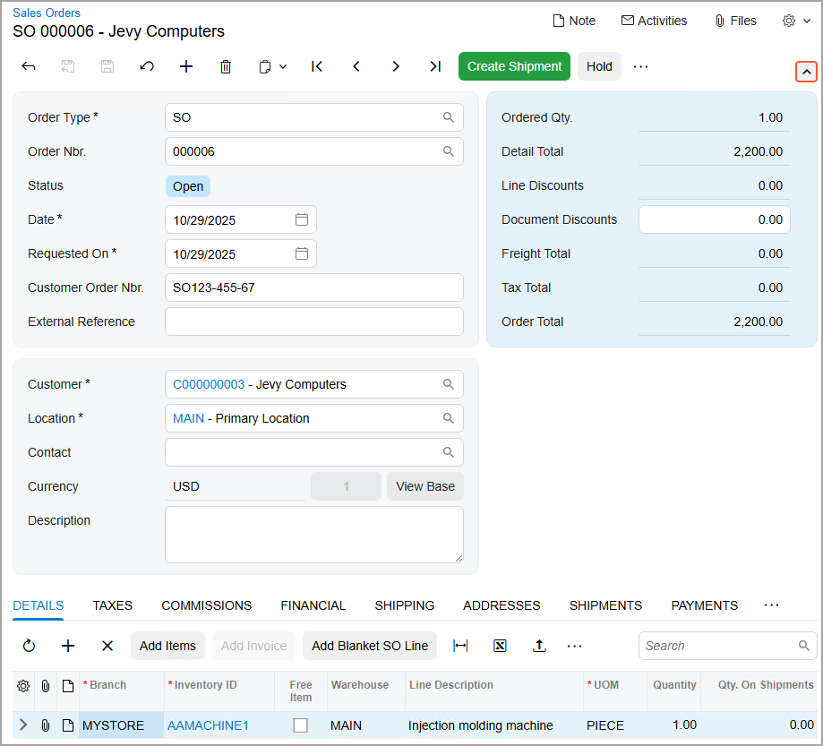
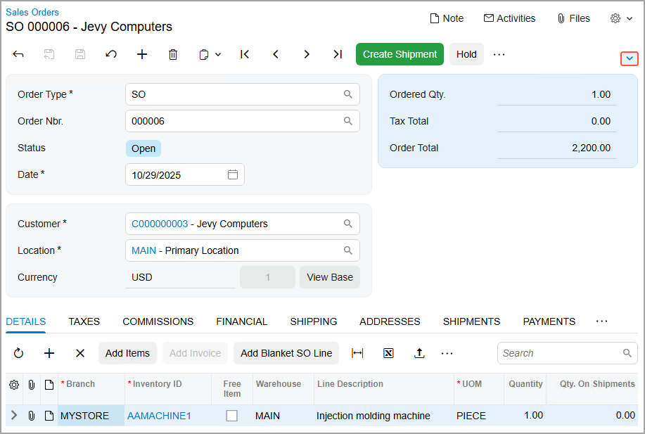

# Form Layout: User and System-Wide Configuration {#_a37d2254-ba25-4864-98c3-0ea19eb1a83d .concept}

By using functionality of the Modern UI, you can easily customize the layout of forms. This topic describes various ways that you can adjust the user interface for your own user accounts. Personal layouts of forms are retained between sessions and apply only to your user account.

If you have the appropriate privileges, you can modify and customize the overall appearance of Acumatica ERP forms, including both standard and custom forms. Additionally, you can set a default form layout for the entire site. You can perform this system-wide configuration only if your user account is assigned both the *Administrator* and *Customizer* roles.

Any system-wide modifications you make will be shared among all system users. When you apply these changes, you can choose to either keep or override any personal configurations that system users have made.

## Configuration of Form Layout { .section}

In Acumatica ERP, you can adjust the layout of any form to meet your needs. Specifically, you can do the following:

-   Reorder, hide or display tabs
-   Change the set of UI elements in the groups in the Summary area of the form
-   Manage the order and visibility of table columns
-   Collapse and extend groups of elements on tabs

When you have adjusted the layout of a particular form, your individual settings for the layout of this form are automatically saved to the server and applied in all your future user sessions. These changes are available to you on any browser or device and are applied to your user account only. Also, these changes are applied to only the specific form that you changed; they are not applied to any other forms. For details, see [Form Layout: To Personalize a View of a Form](CustomizationProjects_ConfiguringFormLayout_Activity_User_Interface_Personalization.md).

If you have both the *administrator* and *customizer* user roles assigned to your user account, you can customize the layout of the form and apply it for all users. Additionally, you can apply any user’s personal configuration—along with any needed changes—system-wide. For details, see [Form Layout: To Make System-Wide Form Configuration](CustomizationProjects_ConfiguringFormLayout_Activity_System_Wide_Personalization.md).

## Order and Visibility of Tabs { .section}

You can change the order of tabs and hide or display individual tabs to fit your business needs.

To reorder a tab, you click and hold the tab name and then drag it to the needed position \(as shown below\).

To hide a tab, you click and hold the tab name, drag it first to the More button \(\) and then to the **Hidden Tabs** section, which appears on the form \(as shown below\).

To display a hidden tab, click the More button and then drag the tab name from the **Hidden Tabs** section to the needed position.

## Managing Table Columns {#section_wp5_cxy_4hc .section}

For each table, you can manage the set of columns to be displayed by using the Column Configuration dialog box. To open the dialog box, you click the Settings button \(\) in the upper-left corner of the table \(see below\).

In this dialog box, you can:

-   Hide or display a column by clearing or selecting the check box next to its name.
-   Modify the order of the columns by dragging the column name to the needed position in the list.
-   Change whether the column should receive focus when you press Tab by hovering over the column name and clicking **Tab** to change its state. This causes the word to be crossed out or appear normal.
-   Apply the column configuration by clicking **OK**.
-   Cancel the column customization by clicking **Cancel**.
-   Reset the customization and restore the default layout of the table by clicking **Reset**.

## Managing Groups of Elements {#section_jn4_2xy_4hc .section}

In Acumatica ERP, a *fieldset* is a set of related UI elements visually grouped with color blocks on a tab or in the Summary or Selection area of a form. You can collapse and expand each fieldset to display fewer or more elements. The collapsed or expanded state of the groups of elements is retained for your user account between sessions.

To expand or collapse a fieldset, click the arrow icon on the form toolbar, as shown below.

**Parent topic:**[Configuring the Layout of Forms](../CustomizationPlatform/CustomizationProjects_ConfiguringFormLayout_Mapref.md)

